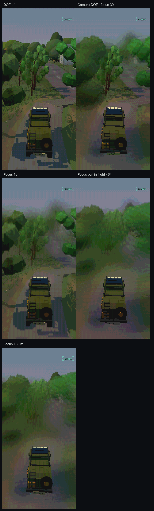
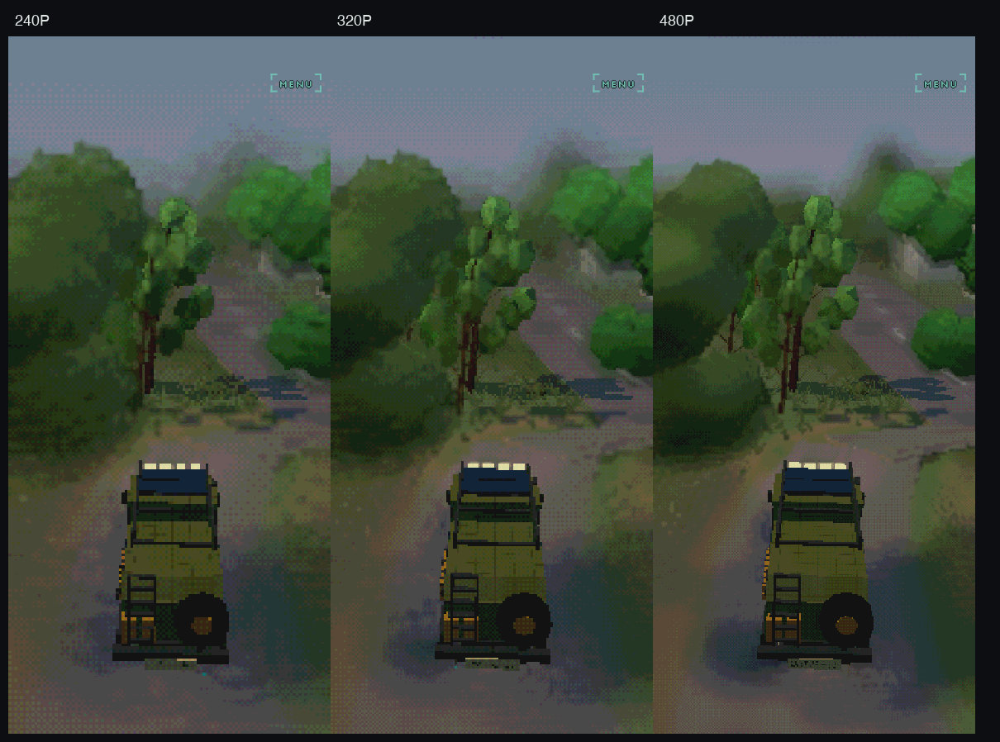
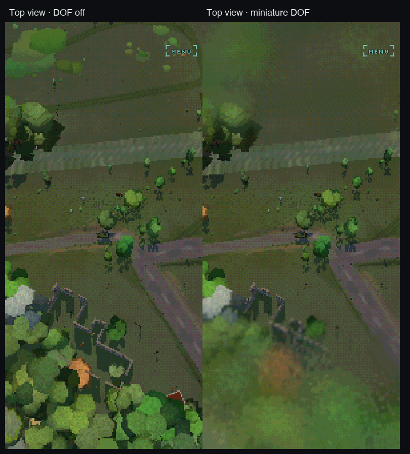

# Depth-aware real-time depth of field

Implemented on `codex/realtime-dof` from upstream commit `bfd31407`.

Drive now has a bounded, near/far-separated depth-of-field pipeline at the art
resolution. It keeps the existing depth reconstruction and the atmospheric
`softTex`, but no longer treats a fixed blurred image as a variable circle of
confusion.

## Result

### Camera focus and focus pull

The truck remains protected by the scene-alpha mask while the landscape uses a
real signed blur radius. The lower frames move focus from 15 m through an
in-flight pull to 150 m.



### Art-resolution comparison

The maximum radius is expressed in art pixels, so the lens retains the same
visual scale at 240P, 320P and 480P rather than becoming a screen-resolution
post effect.



### Miniature mode over land and water

Miniature mode keeps the existing tilted world-space focus plane, but feeds its
signed distance into the new variable-radius filter. The top-view comparison
also exercises the shoreline and depth-writing water path.



## Pipeline

1. The scene renders at the selected art resolution with its existing depth
   texture and no-blur alpha mask.
2. Motion blur, when enabled, runs first. It now preserves the alpha mask rather
   than replacing it with one.
3. The existing four-pass half-resolution Gaussian still builds `softTex` for
   fog-of-war, optional atmospheric blur and the horizon.
4. A half-resolution preparation pass reconstructs world position and writes:
   foreground CoC, background CoC, and protected coverage.
5. A circular background gather accepts only samples with background CoC, which
   prevents foreground colour from leaking through a sharp silhouette.
6. A separate foreground gather asks whether each sampled foreground pixel's
   own blur disc reaches the output pixel. Its alpha expands coverage beyond the
   original silhouette.
7. The composite applies far blur, then expanded near blur, before atmosphere,
   bloom, grade, palette quantisation, dithering and scanlines.

The dedicated chain is skipped completely in `OFF`. It costs three additional
full-screen passes when active; the existing atmospheric passes are unchanged.

## Focus models

| Mode | Focus geometry | Target |
|---|---|---|
| OFF | none | no dedicated passes |
| CAMERA | plane perpendicular to camera forward | rendered centre subject or explicit metric distance |
| MINIATURE | existing tilted world-space plane | viewing ray's ground intersection |

Camera autofocus reuses the existing asynchronous luma/depth readback. It takes
the median valid depth from the centre 3×3 cells, falls back to the camera aim
point when the centre is sky, and damps changes to avoid edge chatter. Explicit
distance changes use the same damped focus pull.

## Controls

The RENDER rack adds:

| Dial | Options | Meaning |
|---|---|---|
| DEPTH OF FIELD | OFF / CAMERA / MINIATURE | selects focus geometry |
| DOF QUALITY | LOW / MED / HIGH | 6 / 10 / 16 circular gather taps |
| APERTURE | NARROW / STOCK / WIDE / MAX | 4 / 7 / 11 / 15 art-pixel maximum radius |
| FOCUS TARGET | AUTO / 15M / 30M / 60M / 150M / FAR | camera-mode subject or distance |

`TILT SHIFT` remains independent and controls the miniature band's width and
strength. The URL equivalents are `?dof=`, `?dofq=`, `?aperture=` and
`?focus=`. `__dof()` exposes live mode, target/current focus distance, target
source, radius, quality, pass count and camera-radius samples. `__dofbuf()`
reads back the three intermediate targets for shader diagnosis.

## Evidence

The headed/Metal harness completed with zero page errors.

- Camera DOF changed 34.1% of screenshot colour channels versus OFF.
- The 15 m to 150 m focus change affected 34.4%.
- Miniature mode changed 25.0% of the top/water frame.
- At 15 m focus, the prep target carried 64.4% far CoC and 24.3% near CoC.
- At 150 m focus, it carried 22.0% far CoC and 69.2% near CoC.
- The protected alpha mask occupied about 8.8% of the chase frame.
- Chase pass count moved from 5 to 8; the top view moved from 6 to 9.
- CoC distributions remained consistent at 240P, 320P and 480P.

Capture command:

```sh
HEADED=1 OUT=cells/drive/docs/images/dof-2026-09-17 \
  node cells/drive/devtools/focus-ab.mjs
```

The harness waits on completed game frames, not wall-clock delays. This matters
because the untouched upstream commit clears its 320P render target under
SwiftShader while 240P and 480P render normally; Metal renders all three. That
is a pre-existing headless-driver artifact, so the documented resolution sheet
uses the harness's real-GPU mode.

## Remaining edge cases

- Transparent materials that do not write depth still inherit the depth of the
  surface behind them. Water is covered by the example above, but particles,
  glass and overlays still need material-by-material policy if they become
  visible failures.
- DOF uses the current depth texture after motion-blurred colour. Fast combined
  shutter/DOF silhouettes should remain in the regression matrix.
- The circular gather is deliberately bounded and sparse. A larger aperture
  should add taps or a second filtering tier rather than only increasing radius.
- Mobile GPU timing is not inferred from desktop Metal or SwiftShader. The pass
  count and quality dial are in place; device timings still determine the
  shipped quality default.
