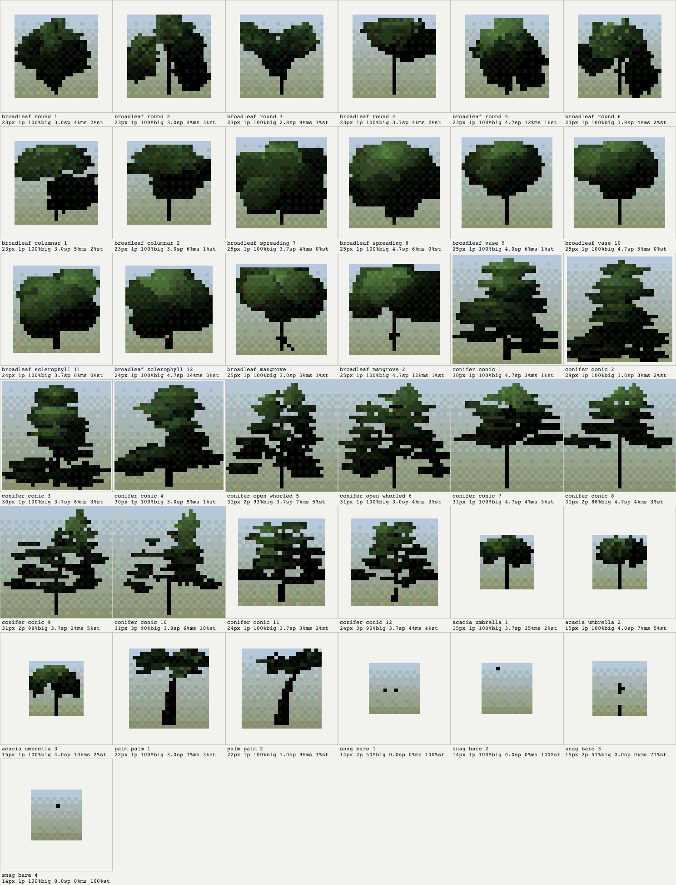
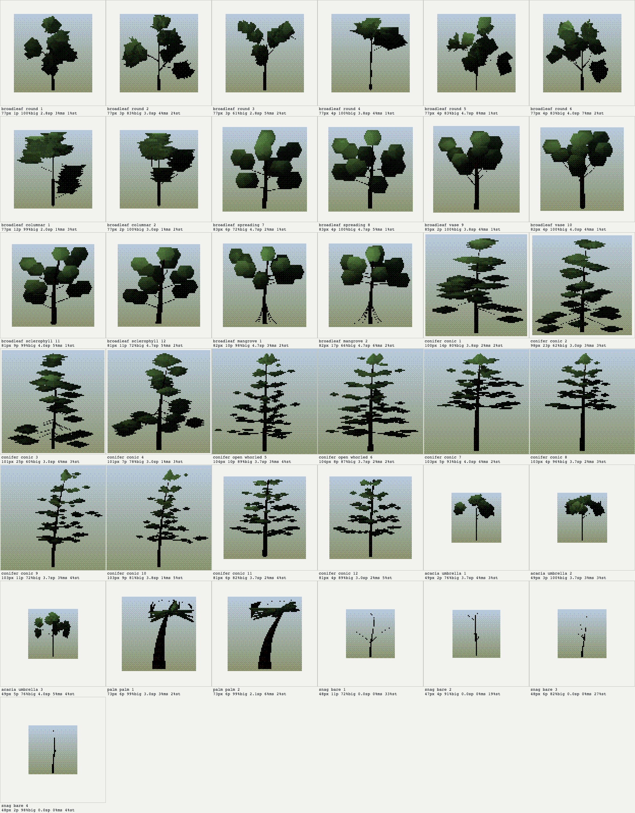
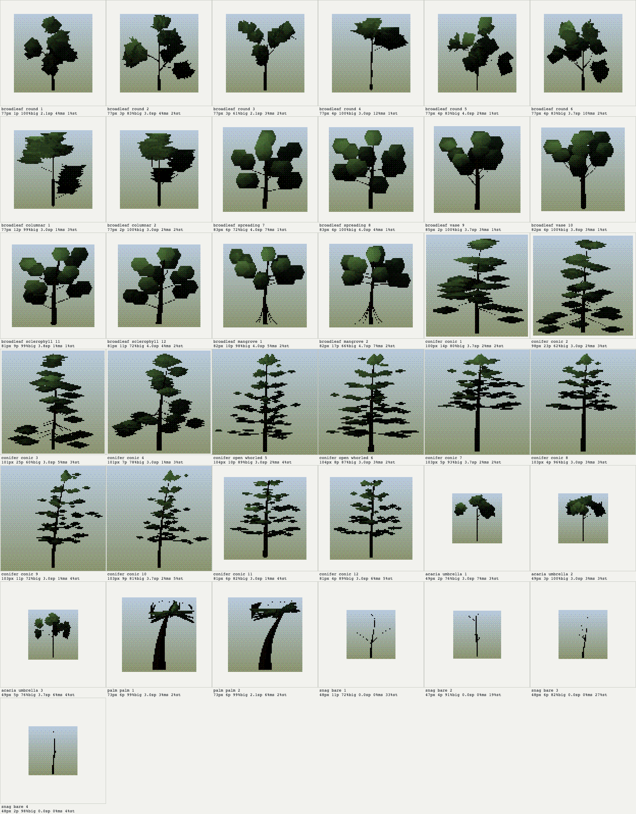
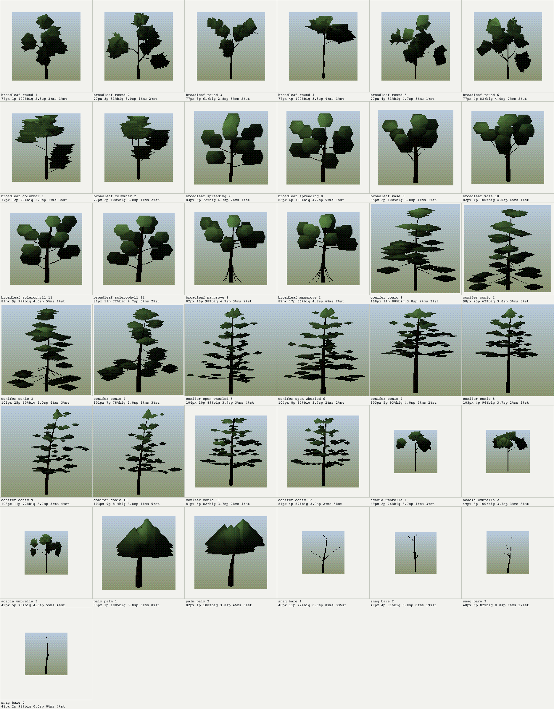
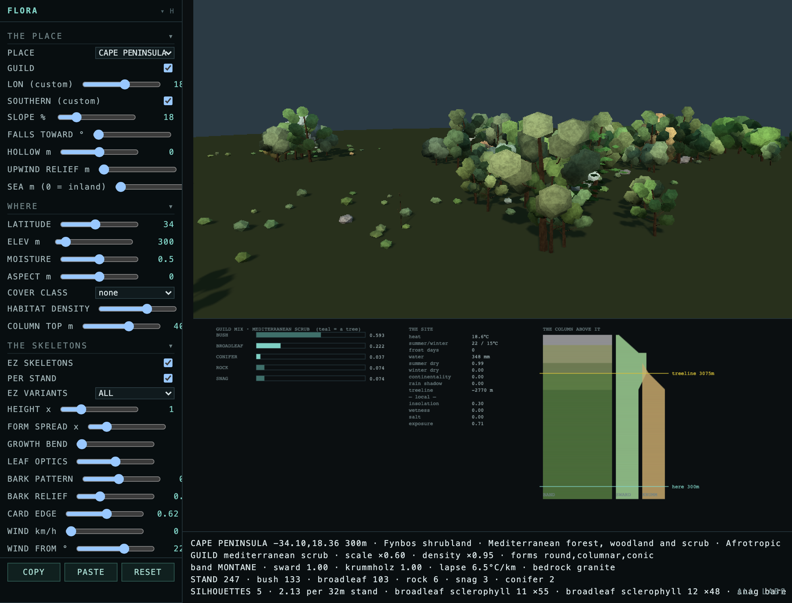
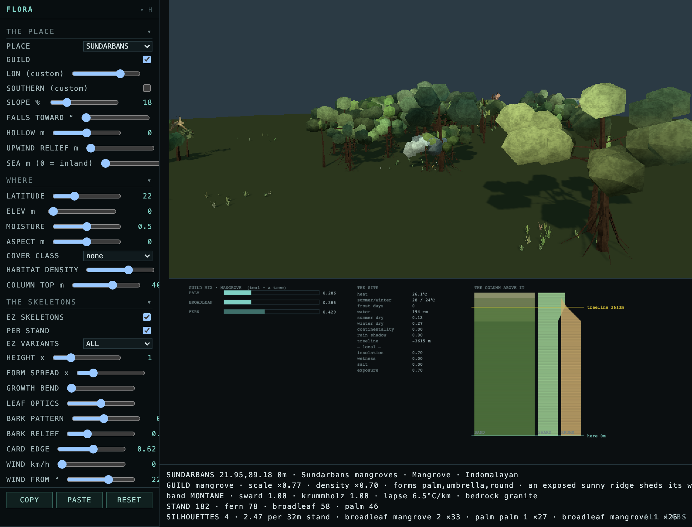
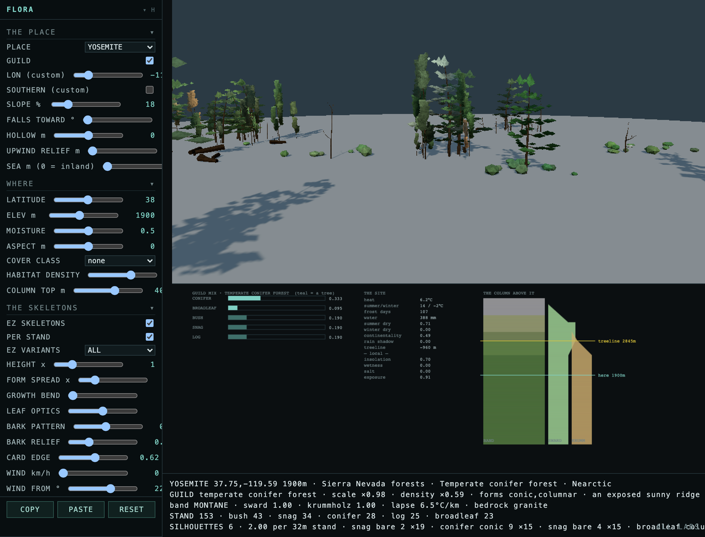
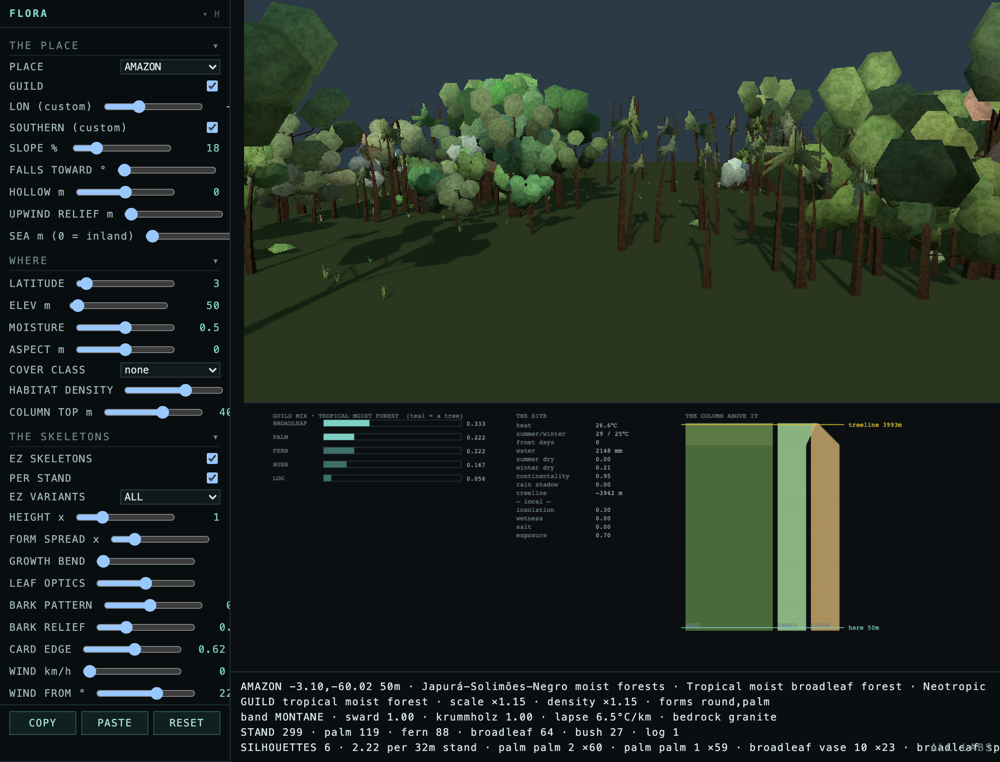
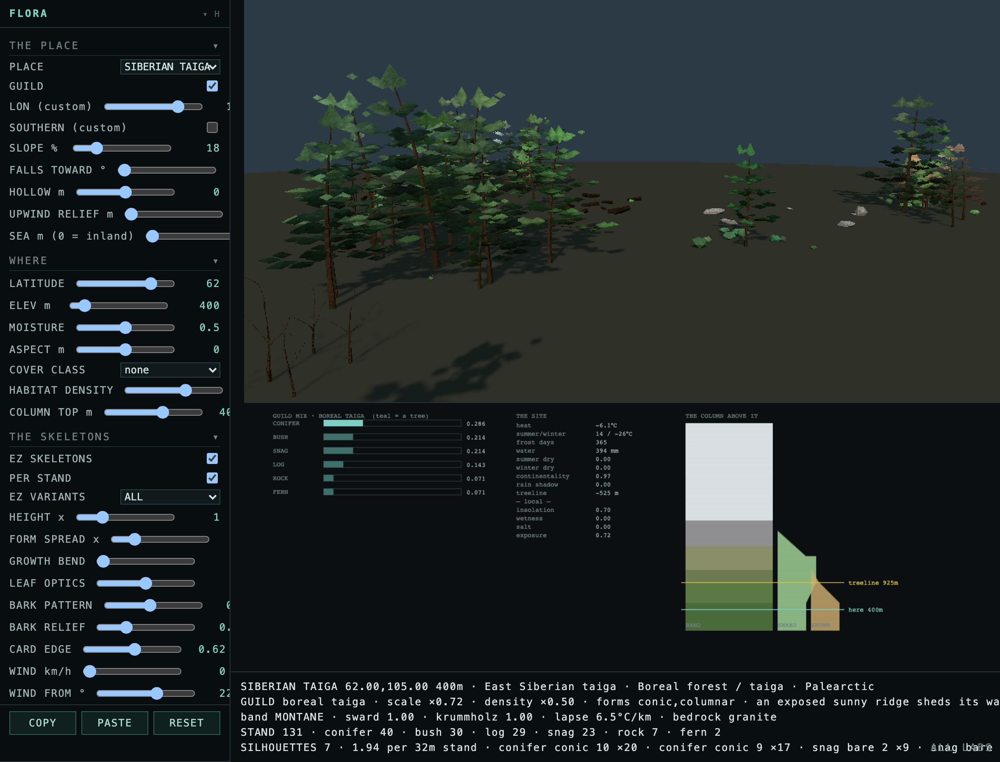

# Climate-shaped tree visuals

Implemented on `codex/tree-visuals`, rebased onto upstream commit `beaaaa4c`
(`the palm's crown was 0.09 of the tree across, and width was measuring the
lean`).

The result combines three layers that previously operated independently:

1. a wider botanical atlas;
2. site-driven selection of architecture and phenotype;
3. family-specific leaf and wood shading on the shared instanced material.

The production atlas grows from 29 to 37 variants. At the game's 200 m control
distance, 32 of 37 pass the silhouette/contrast/stipple gate. The failures are
the second palm, whose fronds remain too tonally flat at that distance, and the
four snags, whose branches are fundamentally sub-pixel.

## Contact sheets

Every sheet uses the shipping 320-row art frame, no MSAA, 14-level
quantisation, Bayer-4 dither, and an 8-degree sun.

### Current atlas at 200 m

The distance merge has closed each crown onto its own silhouette. This is the
honest sheet for what a roadside wood carries, rather than a modelling
close-up.

### Current atlas at 60 m

The close sheet exposes the actual geometry: broadleaf bough groups, mangrove
prop roots, open conifer whorls, damage/exposure phenotypes, and the rebased
palm fronds.

### Bespoke surface disabled

`?ezleaf=0&ezbump=0` retains the same geometry and bark colour field, but
removes authored crown-light bands, leaf transmission, and bark-normal relief.
At 60 m the enabled material generally adds 2–3 luma values and roughly
0.3–0.5 palette steps of internal crown separation without changing the
silhouette.

### Palm geometry control

`?ezpalm=0` restores the old ball-per-anchor crown. The old palms are one solid,
bright component at 758/684 triangles. The rebased palms are six visible frond
components, retain 99% of their silhouette in the largest connected mass, and
cost only 618/558 triangles.

The pre-expansion 29-variant sheet is retained as
[`tree-forms-upstream-e8.png`](docs/tree-visuals-2026-09-16/tree-forms-upstream-e8.png).
It predates both the climate-shaped broadleaves and upstream's corrected palm
recipe.

## Geometry and botanical variation

The refined bake adds two seeded variants for each new broadleaf habit:

| Habit | Form | Site affinity | Drawn triangles |
|---|---|---|---:|
| spreading | round | temperate grassland | 447 |
| vase | round | wet temperate forest | 395 |
| sclerophyll | round | dry-summer / Mediterranean | 447 |
| mangrove | umbrella | saline ground | 583 |

These are large, coherent crown masses rather than many tiny leaf cards. The
existing distance closure still turns them into stable far silhouettes, while
the near sheet retains holes, branching rhythm, and distinct outlines.

Conifer architecture is split into genotype and phenotype:

- open whorled is a district-scale growth habit;
- high crown is caused by stand competition;
- wind shaped is caused by exposure;
- broken leader is a rare individual damage event.

Site phenotypes are deliberately excluded from district palettes. Otherwise a
whole district could accidentally become “the broken-leader species.”

## Climate and habitat selection

The world and flora lab call the same pure selectors:

- mangrove biome or saline site → mangrove broadleaf;
- wet site → vase habit;
- dry summer or low water → sclerophyll;
- grassland biome → spreading habit;
- exposed conifer site → wind-shaped phenotype;
- closed, wet conifer stand → high crown;
- rare deterministic event → broken leader.

District seeds still choose a small characteristic palette, stand seeds choose
within it, and individual seeds choose sibling geometry or a causal phenotype.
The full chain reaches every genotype while keeping a stand coherent.

## Leaf shader

Every variant receives a constant `aEzSurf` profile:

`leaf transmission, crown tone strength, bark fissure, bark rings`

That lets one batched material distinguish broad leaves, needles, leathery
sclerophyll, palm fronds, acacia, and bare snags.

The crown shader adds:

- three coherent light bands aligned to the live sun;
- family-specific back-light transmission;
- the existing measured sky-exposure and crown-envelope normals;
- the existing distance-driven silhouette closure.

The lighting remains structural rather than texture-mapped: foliage does not
need bitmap UVs because the crown's measured envelope, sky exposure, and family
profile are the useful coordinates.

## Wood shader and generated mapping

Wood does dynamically generate its mapping. The fragment shader derives a
cylindrical coordinate from the decoded skeleton position:

- angle around the trunk supplies the furrow direction;
- skeleton height supplies longitudinal bark flow or palm rings;
- coherent 3D noise breaks repetition;
- the same procedural field colours the bark and perturbs the lighting normal.

That last property is important: visual texture and lighting relief cannot
slide apart because they are two readings of one field.

This is currently whole-skeleton cylindrical mapping, not a branch-local frame.
It is strong on trunks and major stems; a future bake could carry branch axis
and radius attributes for genuinely branch-local bark on lateral limbs.

## Controls

The in-game **TREES** rack now exposes:

| Dial | Stock | Effect |
|---|---:|---|
| LEAF OPTICS | 1.0 | authored crown tones and transmitted sun |
| BARK PATTERN | 0.72 | procedural bark colour contrast |
| BARK RELIEF | 0.42 | normal perturbation from the bark field |

The flora lab exposes the same live uniforms. Exact URL controls are:

- `?ezleaf=0..2`
- `?ezbark=0..2`
- `?ezbump=0..2`
- `?ezpalm=0`
- `?ezedge=0..1`

URL values are reapplied after persisted settings, so a captured A/B does not
depend on the browser profile that took it.

## Habitat examples

### Cape Peninsula — sclerophyll

### Sundarbans — mangrove prop roots and palms

### Yosemite — exposed conifers and damage

### Amazon — wet broadleaf habits and palms

### Siberian taiga — exposed boreal forms

## Upstream review and remaining critique

Upstream drift consisted of one commit and was directionally correct. It fixed
the palm bake's ruler, reduced whole-tree lean, lengthened the actual frond
branches, and decoded each anchor as a tapered heart-to-tip blade. The rebase
was textually clean and the combined browser census is clean.

Remaining visual work:

- palm 2 carries only one palette step of internal form at 200 m; a
  palm-specific edge floor or broader ribbon section is preferable to a global
  brightness lift;
- snag branches remain too thin for the art frame and need a pixel-floor,
  silhouette hull, or impostor treatment;
- tropical moist forest still shares the general wet/vase vocabulary rather
  than having a true emergent rainforest habit;
- branch-local bark coordinates require branch-frame data from the bake.

## Validation

- primary TypeScript config: clean;
- GLSL reserved-word scan: clean;
- switch registry: 101 switches, clean;
- guild ecology tests: clean;
- deterministic tree refill/performance check: 20/20 byte-identical;
- tree-stand browser census: all assertions pass, zero page errors;
- allocated tree instance slots remain 92% below the old per-family-cap model.
