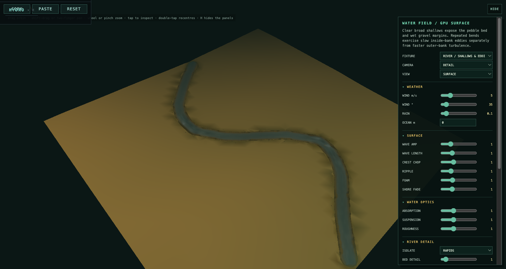
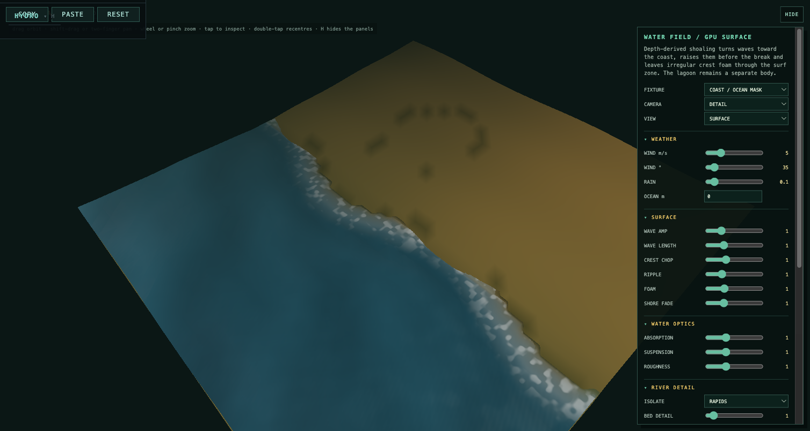
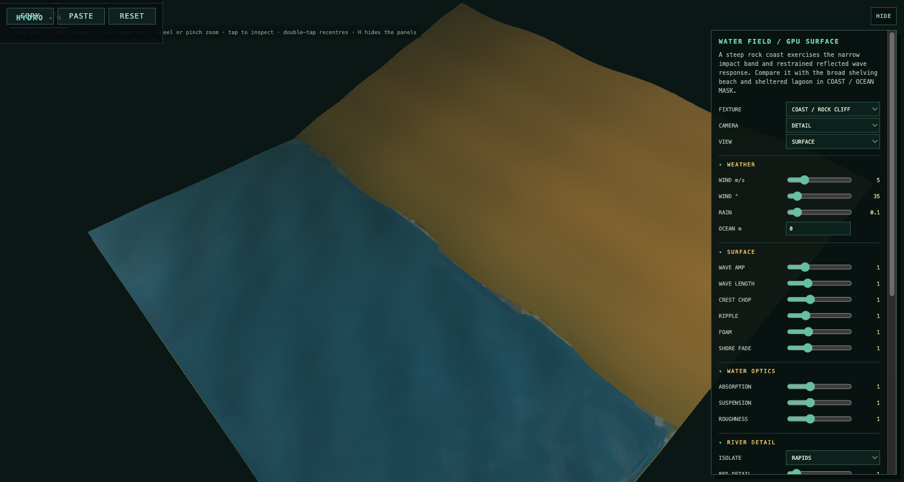

**The biggest visual improvement would come from making hydro’s existing detail behave as one coherent material.** It already has a substantial feature set; several layers currently use different assumptions about depth, motion, lighting and scale. Those disagreements can make detailed water still read as an animated surface laid over the landscape.

I reviewed the current shader, material, system, shoreline and field-building code. This remains read-only. The findings below are source-level observations; visual impact and performance still need controlled in-game comparisons.

**What is already worth preserving**

The existing system has good foundations:

* Actual wave displacement and horizontal crest motion.
* River coordinates that follow bends rather than sliding textures across world axes.
* Coastal travel-time and exposure fields.
* Separate standing-water, flowing-water, surf and waterfall variants.
* Procedural sediment, gravel, cobbles and point bars.
* Eddies, rapid tongues, boil patterns and downstream energy persistence.
* Rain rings, vehicle disturbance and retained wake history.
* Shared bank material treatment and scene lighting.
* Quantisation and dithering left to the global post-process.

I would preserve these capabilities. The next iteration should give them clearer physical and artistic roles.

**1. Motion coherence is the first major opportunity**

The river shader has several independently moving patterns. Reading their spatial and temporal coefficients gives these nominal downstream pattern speeds:

| Pattern               | Implied speed |
| --------------------- | ------------: |
| Small river ripple    |      1.27 m/s |
| Surface grain         |      4.17 m/s |
| Broad surface streaks |      30.0 m/s |
| Foam streaks          |     15.88 m/s |
| Foam breakup pattern  |      5.24 m/s |

These are **pattern speeds, not measurements of river velocity**. Waves legitimately propagate differently from floating material. Nevertheless, broad streaks and foam that should help the viewer perceive current are moving at very different rates, largely independent of the resolved current.

That can produce a river with plenty of animation but no convincing sense of water travelling through it.

I would explicitly separate:

* **Bed-anchored structure:** standing waves, obstacle fronts, persistent rapid locations.
* **Transported material:** foam, sediment, floating fragments and surface streaks.
* **Propagating waves:** ripples travelling relative to the current.
* **Transient events:** impacts, rain and vehicle disturbances.

Keep the existing river-space coordinates. Add a coherent transport coordinate or phase derived from travel time along the reach. Do not reintroduce `position - localVelocity × time` with spatially varying velocity: that would recreate the stretching and discontinuities earlier work removed.

The visual goal is specific: **a standing wave stays over its obstruction while foam crosses it, stretches downstream and disperses.**

**2. Reflections should connect water to your actual sky**

Currently, reflected environment colour is principally a blend between zenith and horizon colours, selected using the surface’s facing angle. The shader adds a broad sun glint separately.

This creates sky-coloured water, but cannot reproduce the shapes of your clouds, a dark hillside, or the changing bright opening in a storm.

Given how much attention you have invested in the sky, this is probably the highest-value new visual capability.

My preferred progression:

1. Evaluate a shared, inexpensive sky approximation in the **reflected viewing direction**.
2. Include broad cloud structure and sun/moon direction.
3. Blur that environment response according to surface roughness.
4. Later add nearby terrain silhouettes or selective scene reflections.

A small sky-only environment texture, updated gradually, could share the sky’s appearance without rendering the entire world again. Its update cadence must preserve continuous lighting transitions.

I would also replace the current artistic Fresnel curve—approximately 8–46% before the river multiplier—with a dielectric baseline and an explicit artistic control. Water’s normal-incidence reflectance is about 2%; reflection increases strongly toward grazing angles. Roughness should broaden that reflection, rather than simply making every river less reflective. [PBRT’s dielectric reflection treatment](https://pbr-book.org/3ed-2018/Reflection_Models/Specular_Reflection_and_Transmission), [rough dielectric model](https://pbr-book.org/4ed/Reflection_Models/Rough_Dielectric_BSDF).

This does **not** mean turning everything into a mirror. Quiet pools should occasionally become reflective enough to contrast with the broken reflections of working water.

**3. Depth and optical character need a cleaner model**

There are already several depth concepts:

* Field depth.
* A coastal wave-depth proxy.
* Smoothed visual depth.
* A procedural river trough.
* A further point-bar adjustment.
* Bed visibility and colour attenuation.

Some are useful approximations. The problem is that they can collectively depict shallow gravel where the physical supporting surface remains much deeper.

The shader’s point bars are currently visual alterations of the water column. As the terrain work progresses, large bars and shelves should become shared terrain features. The shader should then supply their fine mineral detail.

There are also two specific inconsistencies:

* The palette attenuation coefficient changes from `0.85` to `0.30` as turbidity increases. That makes the shallow-to-deep palette transition **slower**, despite the accompanying comment saying silt shortens visibility. The separate bed-visibility calculation moves in the opposite direction.
* An overhead-view multiplier darkens water by increasing visual depth. That is an artistic camera correction, not an optical path calculation, and can make the material change character between cab and drone.

I would define three independent properties:

| Property             | What the player sees                               |
| -------------------- | -------------------------------------------------- |
| Absorption           | Which colours disappear through the water column   |
| Suspended scattering | Milky, silty or sediment-coloured water            |
| Surface roughness    | Sharp reflections versus broad, broken reflections |

Turbidity should not simultaneously stand in for all three.

This would support genuinely different water: clear dark pools, pale mineral suspension, brown floodwater, tannin-stained ponds and clear shallow streams.

**4. Detail should resolve in art pixels, not just metres from the camera**

The current distance gates contain a concrete mismatch.

`nearWater` ends at approximately **875 metres**. The bed has a separate fade intended to extend farther, but its entire evaluation sits inside `if (nearWater)`. At that boundary, its own distance fade is still fully active.

Consequently, otherwise-visible broad bed structure can be removed abruptly by the outer gate.

More generally, distance alone is insufficient across cab, chase and drone views. A feature’s visibility depends on projection, viewing angle and the internal rendering resolution.

I would introduce three explicit detail bands:

* **Body:** pools, wave sets, sediment plumes, broad gravel bars.
* **Structure:** riffles, foam tongues, eddies, shoaling and reflection breakup.
* **Skin:** capillary ripples, individual rain rings, fine gravel and tiny foam fragments.

Each should fade according to its projected footprint. Procedural frequencies should also be filtered using screen-space derivatives; the current shader uses derivatives for macro normals, but does not systematically band-limit its procedural detail.

The important principle is to **retain the aggregate appearance when individual details become unresolved**. Fine waves should become roughness, not simply disappear into perfectly smooth water. Broad bed patches should remain after individual pebbles disappear.

Separating geometric waves from sub-mesh normal detail is an established approach; the useful next step here is making their transitions consistent with your particular pixel pipeline. [GPU Gems: effective water simulation](https://developer.nvidia.com/gpugems/gpugems/part-i-natural-effects/chapter-1-effective-water-simulation-physical-models).

**5. Foam needs sources, transport and age**

Current foam is more sophisticated than generic white noise: it has energy gates, reach masks, connected rapid tongues and downstream persistence. But much of its exact placement is still selected by procedural noise.

The next improvement is to give foam identifiable causes:

* A submerged obstruction.
* A constriction.
* A shallow crest.
* A waterfall landing.
* A breaking ocean wave.
* The vehicle.

Then let it change character:

**fresh aeration → connected streaks → broken patches → sparse remnants.**

Existing downstream energy persistence helps locate disturbed reaches, but is not the same as foam moving and ageing.

A low-cost first version could use source distance and river travel time. A more ambitious near-field version could retain a small GPU texture containing foam density and age, updated at a lower rate than rendering.

I would reserve that stateful simulation for nearby, important water. Distant water can continue using analytic approximations.

One useful code correction belongs here: the fragment shader’s depth-based energy reduction is described as a river correction, but is applied without a flowing-water gate. It therefore also changes standing-water detail. That deserves an isolated A/B before further foam tuning.

**6. Oceans need different coastal behaviours**

The coastal machinery is already substantial, but its missing-bathymetry proxy effectively assumes a shelving profile:

```glsl
waveDepth = max(depth, shoreDistance * 0.06);
```

That is understandable as a fallback. It is not a good universal description of beaches, harbours and cliff coasts.

Similarly, exposure currently reduces several breaking/detail responses while broad swell displacement deliberately retains its amplitude. The code’s explanation that harbours are quiet because waves do not break is too broad: sheltered water can also have strongly attenuated incoming swell.

I would separate **swell transmission**, **local wind-wave generation** and **breaking response**, then use explicit coastal profiles:

| Coast               | Desired behaviour                                                     |
| ------------------- | --------------------------------------------------------------------- |
| Shelving beach      | Progressive shoaling, breaking bands, advancing and retreating wash   |
| Steep shingle shore | Narrower, more abrupt breaking and fast drainage                      |
| Rock platform       | Water moving through channels and lingering in pools                  |
| Cliff               | Limited run-up distance, impact disturbance and reflected wave energy |
| Sheltered inlet     | Attenuated swell with locally generated wind texture                  |

Preserve the travel-time field. Extend the evidence it consumes rather than replacing it with more shoreline noise.

**7. The waterline should remember recent events**

The current bank treatment already varies soil, mud, gravel and rock. Much of its wetness, however, is a function of distance from water and procedural patches.

The more expressive version would distinguish:

* Currently submerged ground.
* Recently washed ground.
* Persistently damp ground.
* Dry mineral deposits.
* Biological growth.

A wave should retreat and leave a darkened surface that fades gradually. A reservoir should have a readable drawdown band. Rock should retain wet streaks in cracks; mud should hold broad damp patches; gravel should drain unevenly.

That calls for shared wetness state between terrain and hydro. A shader confined to the water surface cannot convincingly leave a mark on exposed land.

For the abandoned world, restrained water stains, mineral deposits and growth around old culverts and retaining walls would carry a great deal of environmental storytelling.

**8. Interactions would benefit from evidence that persists**

The retained eight-point vehicle trail is a useful starting point. I would extend its expressive range before adding numerous unrelated effects:

* Clear water over gravel: sharp disturbance, little sediment.
* Shallow mud: a delayed sediment plume after the truck passes.
* Deeper water: broader, longer-lived surface disturbance.
* Leaving the water: the wake continues while new disturbance stops.
* Turning: asymmetrical disturbance around the vehicle.

Rain also has an identifiable procedural limitation: one expanding ring is placed at each three-metre cell centre, with staggered timing. Up close, this can reveal regular spacing.

Jitter impact positions, vary event timing and ring size, and convert unresolved rain impacts into aggregate surface roughness. A storm should change the material’s overall response as well as add visible rings.

Waterfalls already have accelerating strand coordinates and landing foam. Their next major improvement is controlled breakup: irregular sheet thickness, occasional gaps, a persistent impact boil, and limited nearby spray. Keep spray tightly budgeted; the surface should carry most of the impression.

**The larger direction I would choose**

I would organise hydro around a small set of recognisable water behaviours, all driven by shared environmental data:

| Behaviour            | Dominant visual cues                              |
| -------------------- | ------------------------------------------------- |
| Quiet pool           | Reflections, visible bed, occasional disturbance  |
| Steady run           | Coherent transport, long surface lanes            |
| Shallow riffle       | Bed-anchored facets with foam passing through     |
| Rapid                | Connected aerated tongues, strong local variation |
| Backwater            | Slow circulation and accumulation                 |
| Sediment-heavy reach | Plumes and muted bed visibility                   |
| Exposed coast        | Swell sets, shoaling and breaking                 |
| Sheltered coast      | Reduced swell and local wind texture              |

These should blend continuously. They would also provide more useful authoring controls than independently increasing foam, turbulence, ripples and wave amplitude.

A scene should gain expressiveness partly through **contrast**: a quiet reflective pool makes the adjacent rapid feel powerful. Making every surface busier would erase that contrast.

**Concrete implementation priorities**

| Priority | Work                                                                    | Main dependencies / cost                      |
| -------- | ----------------------------------------------------------------------- | --------------------------------------------- |
| First    | Correct detail gates, separate energy responses, audit optical controls | Mostly shader-local                           |
| First    | Give transported river patterns coherent motion                         | Shared transport parameters                   |
| Next     | Reflect the actual sky and cloud structure                              | Shared sky evaluation or environment texture  |
| Next     | Add projected-size filtering and roughness compensation                 | Camera/pixel metrics and shader work          |
| Next     | Make rapid and foam sources follow bed/obstacle evidence                | Additional field data                         |
| Next     | Couple large bars, shelves and bank materials to terrain                | Your larger substrate work                    |
| Later    | Persistent foam, sediment and shoreline wetness                         | Bounded simulation textures                   |
| Later    | Selective scene reflections and nearby spray                            | Additional passes; device profiling essential |

For validation, I would use fixed camera moves through a clear pool, the Senqu reach, a shallow ford, a rapid, a reservoir edge, a beach and a cliff coast. Compare cab, chase and drone views under clear noon, overcast, low sun and night.

The acceptance criteria should include **motion coherence, absence of detail popping, stable pixel-scale appearance and GPU cost**—not just whether a still screenshot contains more detail.

---

## Implementation outcome — 18 September 2026

The `First` and `Next` tranches above are now implemented. The two explicitly
`Later` tranches remain intentionally bounded follow-up work rather than being
silently approximated with more stateless noise.

| Brief item | Implemented result |
| ---------- | ------------------ |
| Motion coherence | One river travel coordinate now carries surface lanes, grain and foam. Riffle/rapid facets remain bed-anchored, while ripples remain propagating waves and impacts remain transient. |
| Actual sky reflection | Hydro and the production sky share one cloud-field evaluator. Water evaluates it in the reflected view direction, with sun/moon and roughness-aware broadening. Fresnel starts at 2% head-on. |
| Independent optics | Absorption, suspended scattering and surface roughness are independent controls. Turbidity now shortens, rather than lengthens, the attenuation path; camera elevation no longer changes physical depth. |
| Projected detail | Body, structure, skin and broad-bed bands use projected metres per pixel. Fine unresolved waves retire into roughness; broad bed structure is no longer nested under the old near-water gate. |
| Foam causality | Energy rise, shallow crests, constrictions, waterfall toes and the vehicle supply foam/disturbance evidence. Downstream age changes connected aeration into broken remnants. |
| Terrain-owned bars | Signed bend curvature is carried into both main-thread and worker terrain channel segments. The inside bank receives a bounded physical shelf; the water shader now supplies only the fine mineral skin instead of faking a shallower supporting bed. |
| Coastal behavior | Swell transmission, local wind generation and breaking are separate. Beach, shingle, rock-platform, cliff and sheltered-inlet profiles now have distinct depth proxies, break depths, shore reach and swash widths. |
| Waterline memory | Retreating surf leaves two lagged wet phases on exposed terrain. This is bounded analytic memory; a persistent wetness texture remains in the `Later` tranche. |
| Interactions | Vehicle history retains wake and delayed soft-bed sediment, rain positions/cadence are jittered and unresolved drops become roughness, and waterfall strands/landing disturbance persist. |

### Fixed-view examples

The shallow-river fixture uses the same signed-curvature shelf rule as the
production terrain kernel:



The shelving beach retains a broad, progressive breaker and wash band:



The rock-cliff fixture constrains the response to a narrow impact edge and adds
a restrained reflected component instead of extending beach run-up inland:



### Verification

- TypeScript client and complete workspace builds pass.
- Hydro, coast, resolution, dry-field, render-cutover, terrain-crossing,
  substrate self-containment and GLSL-reserved-word tests pass.
- The complete lab browser suite passes with zero page errors.
- The current Hydrograph build links all material variants with zero browser
  console errors.
- Fixed 180-frame Hydrograph samples at the same viewport measured about
  8.31–8.32 ms mean, 9.2–9.3 ms p95 and 9.4 ms maximum for the beach, cliff
  and shallow-river fixtures. These are browser-harness frame intervals, not
  isolated GPU timings.
- The broader fixture-world run still has four vegetation-mesh assertions
  unrelated to hydro; its terrain, road and ground-cover checks pass.

### Deliberately deferred `Later` work

- A bounded near-field simulation texture for persistent foam density/age,
  sediment and shoreline wetness.
- Selective nearby terrain/structure reflections and tightly budgeted spray.

Those additions require explicit device profiling and should not be folded
into the current analytic shader merely to make the checklist appear closed.
