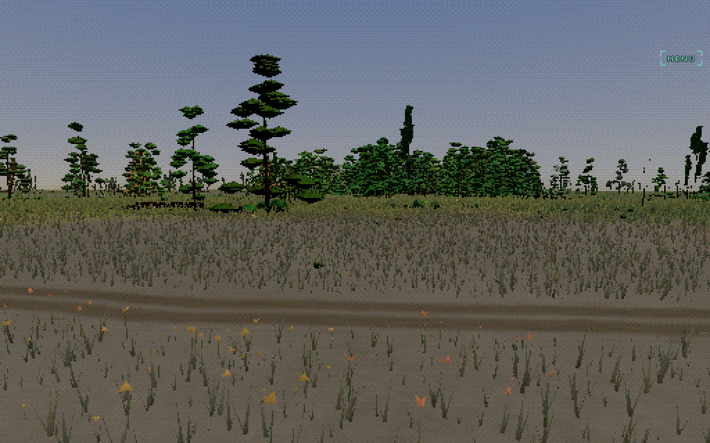
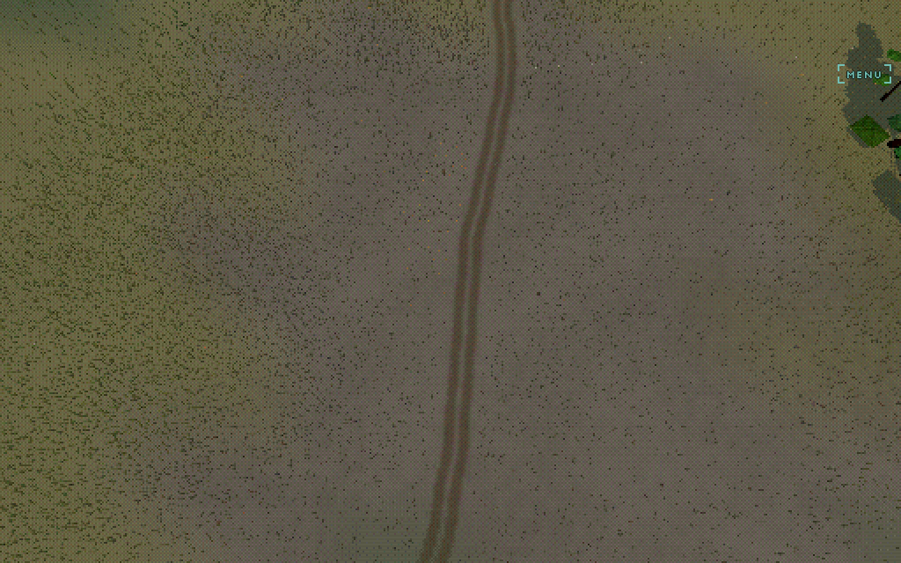
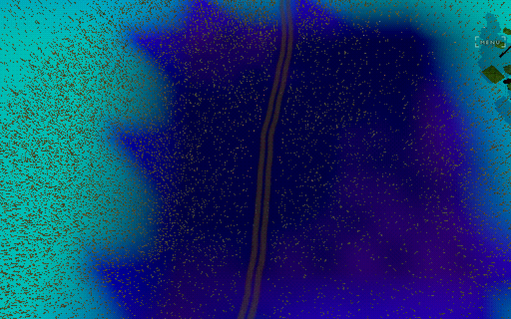
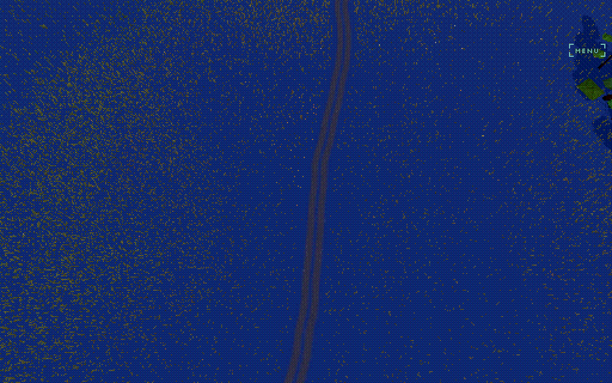
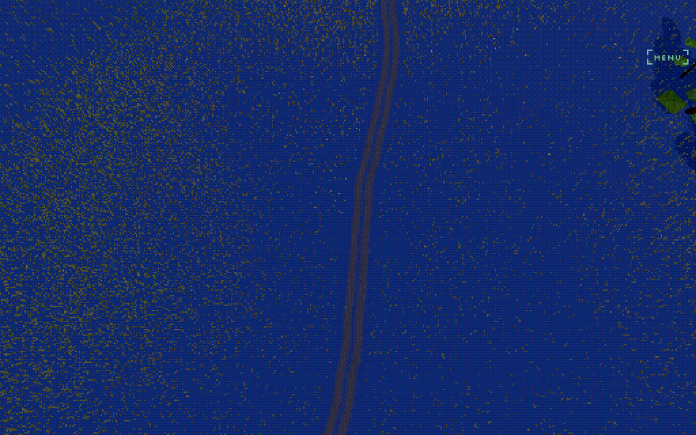
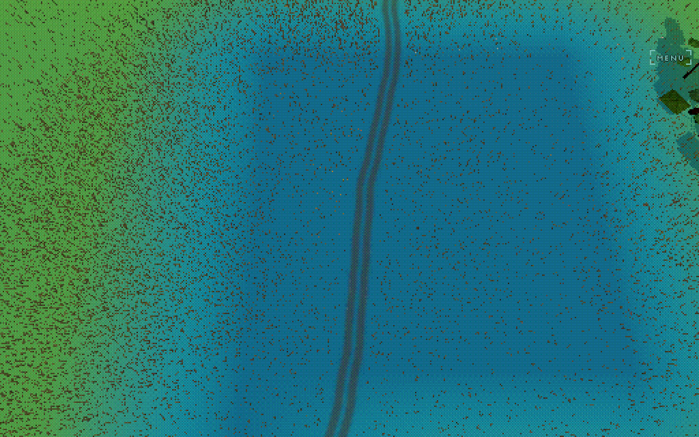
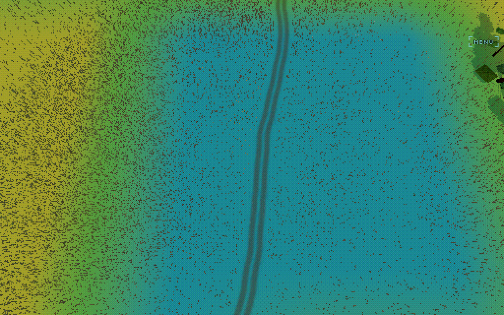
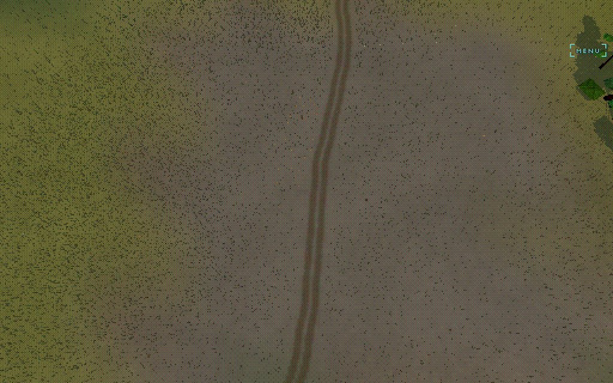
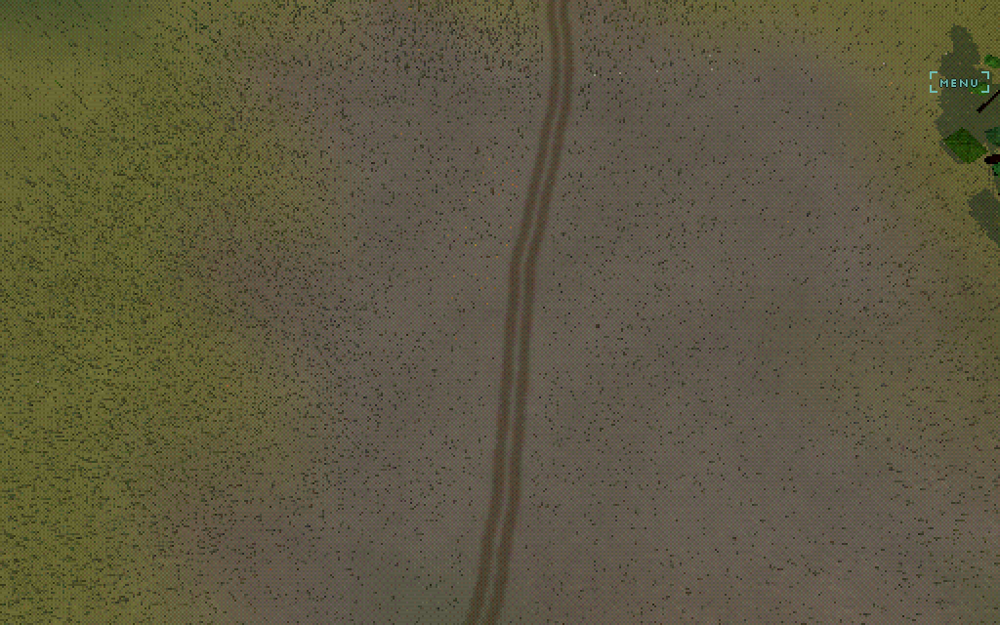
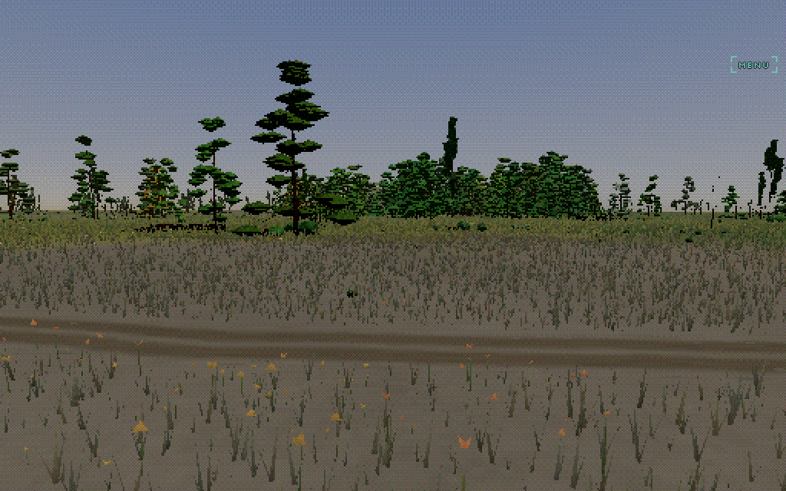

# Geomorphic substrate and material rendering

Captured from `dd4d9957` on 2026-09-15 with the deterministic
`at-yosemite` fixture. Every comparison below was made in one settled browser
boot with the clock, weather, terrain, vegetation and streaming order held
constant.

The broader road/water authority migration is documented in
[`../SUBSTRATE-MIGRATION.md`](../SUBSTRATE-MIGRATION.md). This document focuses
on the ground's geomorphic field and how that field becomes colour, texture,
lighting relief and vegetation.

## What the implementation does

The renderer does not classify each fragment directly as rock, soil or grass.
The terrain build first derives a low-frequency geomorphic field from the DEM:

1. native-pixel height range and peak gradient preserve narrow cliffs that a
   block mean would erase;
2. slope, curvature and local relief describe exposure and accumulation;
3. a gutter around each tile lets morphology and debris transport cross tile
   boundaries;
4. downslope transport places debris below exposed faces;
5. soil depth, moisture potential, grass potential, rock family and fall-line
   direction are retained as separate evidence.

`buildSubstrateCells` in
[`client/substrate-field.ts`](../client/substrate-field.ts) packs those values
into two byte textures. They are produced with the terrain packet and retained
by the same substrate tile revision, so rendering and CPU consumers do not
invent parallel geological answers.

At render time, the shader:

- bilinearly reads the field;
- adds an 18 m world-space domain displacement so exposed rock and mantle form
  patches rather than 33 m lattice cells;
- expresses independent bedrock, mantle and grass shares;
- composites bedrock, deposited mantle, visible rock and vegetation in
  depositional order;
- gives rock and mantle their own band-limited structure;
- hands the 0.25 m detail band, and part of the 1 m band, from the generic
  cover-driven cascade to the material that now owns it.

The shares are deliberately not a partition. Grass can cover rock, mantle can
sit over rock, and bedrock remains latent beneath vegetation.

```text
DEM + neighbouring heights
          |
          v
 exposure / debris transport / soil / moisture / grass / family / fall line
          |
          +----------------------+-----------------------+
          |                      |                       |
          v                      v                       v
 terrain fragment          sward density/form     diagnostics and probes
 colour + structure        + ground tint          same packed field
          |
          v
 material relief + DEM residual + mesh normal -> lighting
```

## Shipping appearance



The ordinary chase frame combines the terrain palette, generic broad-scale
detail, geomorphic material expression, vegetation and global pixel-art post.
The material is not intended to read as a decal or a texture atlas. Its job is
to make neighbouring ground respond differently because it was formed
differently.

The chart view makes that variation easier to compare:

| Substrate enabled, shipping strength | Substrate disabled, same frame |
| --- | --- |
|  |  |

The full-frame comparison moves 17.86% of pixels by more than three luminance
levels, with a mean luma delta of 2.53/255. The effect is therefore present
without replacing the underlying palette or landform.

## Material shares



The live `substrate` ground view paints the shader's own expressed shares:

- red: exposed bedrock;
- blue: mantle/regolith;
- green: grassy cover.

This view is generated inside the terrain fragment shader. It is not a CPU
reconstruction, so it is the most direct witness of what the final material
composite believes.

## The geomorphic field

Each diagnostic uses the same lit terrain and replaces only its ground colour
with a blue-to-red value ramp.

| Exposure | Debris |
| --- | --- |
|  |  |

Exposure is strongest on steep, locally prominent ground and on narrow
high-gradient features preserved from the native DEM. Debris follows transport
and accumulation rather than simply duplicating exposure.

| Soil depth | Grass potential |
| --- | --- |
|  |  |

The Yosemite fixture shows the intended causal progression: the exposed side
loses mantle; deeper soil and stronger grass potential appear away from the
face. Vegetation can conceal rock in the final expression, but it no longer
decides whether the underlying landform is geological exposure.

## Texture scale and the half-metre handoff

Rock and mantle generate procedural structure in world space and in a frame
aligned to the field's fall line. They do not depend on an authored image UV:

- broad material variation uses world-ground coordinates;
- directional bedding, joints and rills use downslope/across-slope axes;
- footprint filtering (`fwidth`) fades structure before it aliases;
- the material's microstructure owns the approximately 0.1–0.5 m band where
  mineral surface is expressed;
- the old generic cascade octave stands down by the same live handoff value.

| Material microstructure off | Material microstructure at 2× inspection strength |
| --- | --- |
|  |  |

The amplified comparison moves 4.69% of the frame by more than three luminance
levels. `2×` is an inspection setting, not the shipping recommendation.

## Lighting and mapping

There are two complementary lighting-detail paths:

1. **DEM residual normal.** `normalMapBytes` in
   [`client/terrain-kernel.ts`](../client/terrain-kernel.ts) subtracts the
   gradient represented by the mesh from the fine DEM gradient. The shader
   samples this residual with `vNormalMapUv`, the terrain geometry's own
   tile-continuous UV, and composes it onto the interpolated mesh normal.
2. **Material relief.** Rock and mantle tone builders return a separate scalar
   relief value containing bedding, joints, clasts, lobes, rills and
   microstructure—but not broad colour variation. Screen derivatives of that
   same scalar are converted through a surface-gradient basis and added to the
   normal.

So the shader does not dynamically manufacture a conventional texture UV for
lighting. It uses stable mesh UVs for DEM residual data and world/fall-line
procedural coordinates for material structure. The important coupling is that
material lighting is differentiated from the same relief signal that produced
the visible structure, rather than from an unrelated normal texture.

| Material relief off | Material relief at 4× inspection strength |
| --- | --- |
|  |  |

The 4× comparison moves 4.96% of pixels by more than three luminance levels.
The shipping relief strength is `0.35`; the amplified frame exists to reveal
where the lighting path contributes.

## Sward integration

The sward reads the same substrate field rather than recreating a material
classifier. Mineral expression reduces density, shortens surviving tufts and
reduces flowering, while the field texture's mineral channel also supports
stones and bank vegetation.

WorldCover remains evidence for the base vegetation rate, but its approximately
30 m nearest-neighbour pixels are no longer literal grass rectangles. A warped
nine-tap neighbourhood turns the class boundary into a continuous prior while
water and snow retain hard zeroes.

| Nearest cover-class sampling | Warped neighbourhood evidence |
| --- | --- |
|  |  |

On this capture, the synchronous 96×96 sward sweep measured 24.7 ms with raw
nearest sampling and 33.4 ms with neighbourhood evidence under the local
SwiftShader harness. These are correctness-harness CPU timings, not phone GPU
frame timings.

## Live controls

The current controls are developer probes, not normal menu dials:

```js
// Whole material expression: 0 is an exact same-frame control, 1 ships, 2 inspects.
__tdetail({ sub: 0 });
__tdetail({ sub: 1 });
__tdetail({ sub: 2 });

// Patch wavelength in metres.
__tdetail({ dom: 8 });
__tdetail({ dom: 18 });   // shipping
__tdetail({ dom: 40 });

// Material lighting relief: 0..4, shipping 0.35.
__tdetail({ relief: 0 });
__tdetail({ relief: 0.35 });
__tdetail({ relief: 1.4 });

// Half-metre material/cascade handoff: 0..2, shipping 1.
__tdetail({ micro: 0 });
__tdetail({ micro: 1 });
__tdetail({ micro: 2 });

// Fine DEM residual over the geometry normal: 0..4, shipping 1.
__tdetail({ nrm: 0 });
__tdetail({ nrm: 1 });

// Field witnesses.
__groundview('substrate');
__groundview('exposure');
__groundview('debris');
__groundview('soil');
__groundview('grass');
__groundview('off');

// WorldCover evidence used by the sward.
__swardev(0);
__swardev(1);
```

If this becomes a player-facing control, one **MATERIAL EFFECT** dial should
normally move `sub`, `relief` and `micro` together while leaving `dom` as an
art-direction setting and `nrm` as terrain fidelity. Exposing five independent
controls would make it easy to create internally inconsistent combinations,
such as colour without its lighting relief or material microstructure without
the cascade handoff.

## Current review follow-ups

Two implementation details should be corrected before treating the controls as
fully production-safe:

- the per-tile residual-normal cache is keyed only by tile even though residual
  generation depends on terrain mesh resolution; changing the live terrain
  resolution can therefore reuse a residual generated for the previous mesh;
- engineered cut faces increase expressed rock and mantle after the generic
  octave handoff has been calculated, so those faces can retain both owners of
  the same fine-detail band.

The focused substrate-field test also needs its old “1 m octave untouched”
assertion updated to match the intentional partial 1 m handoff.

## Reproducing the evidence

From `cells/drive`:

```sh
node devtools/substrate-doc-shots.mjs
```

Optional environment variables:

```sh
FIX=at-campsbay OUT=/tmp/substrate-doc node devtools/substrate-doc-shots.mjs
```

The script writes fourteen PNGs, fails on browser/page errors, and changes
every diagnostic live after one deterministic world has settled.
