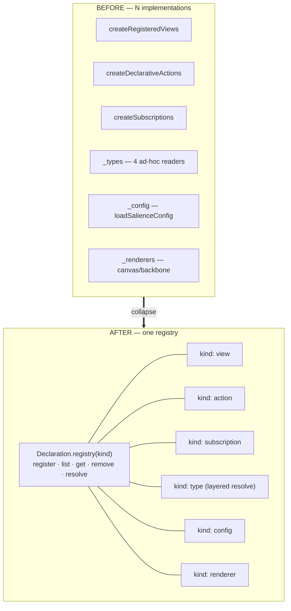

# ADR-0001 — The Declaration registry

- **Status:** Accepted — the registry landed 2026-06-19 (see the log); the agent-facing
  surface completed 2026-07-09 as **C1 of the second wave (ADR-0068**, `declare/declarations/
  undeclare/evaluate`**)**. Reconciled by the 2026-07-09 ledger scan.
- **Date:** 2026-06-19
- **Context doc:** [`docs/architecture/breathe.md`](../breathe.md) — Wave 6 (the
  contraction), Wave 5 (Resolution), Wave 10 (the evaluate boundary).
- **Sequence:** this is **contraction #1** of the migration. It is purely
  behaviour-preserving and unblocks the rest:

  | # | Contraction | Depends on | Lands as |
  |---|---|---|---|
  | **1** | **Declaration registry** (this ADR) | — | ADR-0001 |
  | 2 | Type as one object (facets) | 1 | ADR-0002 |
  | 3 | Reference projection (rules) | 2 | ADR-0003 |
  | 4 | Projection pipeline | 1–3 | ADR-0004 |
  | 5 | (Resolution is delivered *inside* #1 for layered kinds) | — | — |

---

## Context

Six concepts are the same primitive — *"a fact at `_<ns>/<id>` the runtime reads
to configure itself"* — implemented N times (breathe.md Wave 6, grounded):

- **Three already have a registry object**, written three times with the same shape:
  `createRegisteredViews` (`services/workspace/views.ts`),
  `createDeclarativeActions` (`services/workspace/actions.ts`),
  `createSubscriptions` (`services/workspace/subscriptions.ts`) — each
  `register · list · remove · [evaluate|invoke|match]`.
- **Four are read ad hoc** (no registry): `_types/<type>` (re-parsed in four places —
  `gateway buildTypes`, `workspace backbone`, `workspace remember`, `home resolve`),
  `_renderers/<type>`, `_config/salience` (`state.loadSalienceConfig`), and
  `_home/layout` (home client `peek`/`remember`).

The cost is concrete: adding a declaration kind, or changing how one resolves
(canonical ← override), means touching several unrelated files. The `_types`
resolution alone is duplicated in `gateway/service.ts:buildTypes` and
`workspace/handlers.ts:remember`.



## Decision

Introduce **`Declaration.registry(kind)`** in `platform/runtime` — one pure
component over the `StateStore` that owns a declaration's **lifecycle and
resolution**, parameterised by a **kind descriptor**. Every existing registry and
ad-hoc reader becomes a *caller*.

**Crucial boundary (do not over-unify):** the registry unifies *storage +
resolution* only. It does **not** unify **evaluate** — a View's query/reduce/CEL, an
Action's guarded writes, a Subscription's match — those stay kind-specific functions
that operate on an *already-resolved* Declaration (breathe.md Wave 10). The registry
hands you the decl; the kind decides what running it means.

### Shape

```ts
// platform/runtime/declarations.ts  (pure; over StateStore)

interface DeclarationKind<D> {
  ns: string;                 // '_views/', '_types/', '_config/', …
  factType: string;          // 'view' | 'action' | 'subscription' | 'type-decl' | …
  /** Validate + normalise a raw value into D (parse errors surface at register). */
  parse(value: unknown): D;
  /** Singleton kinds (config, layout) fix the id; others take it from the key. */
  singletonId?: string;
  /** Optional layered resolution (Type: canonical ← slice override). Default: identity. */
  resolve?(scope: string, id: string, slice: D | null, ctx: ResolveCtx): Promise<D | null>;
}

interface DeclarationRegistry<D> {
  register(scope: string, id: string, value: unknown, identity?: Identity): Promise<D>;
  list(scope: string): Promise<Array<{ id: string } & D>>;
  get(scope: string, id: string): Promise<D | null>;          // slice fact, parsed
  resolve(scope: string, id: string, ctx?: ResolveCtx): Promise<D | null>; // + layering
  remove(scope: string, id: string, identity?: Identity): Promise<{ ok: true }>;
}
```

`register` writes a fact at `${ns}${id}` typed `factType` (the existing behaviour);
`list` is `query({ prefix: ns })`; `get` is `peek` + `parse`; `remove` is
`supersede`; `resolve` applies the kind's layering (the one home for Wave 5).

### Kind descriptors (the whole zoo, as data)

| Kind | ns | factType | parse | resolve (layering) |
|---|---|---|---|---|
| `view` | `_views/` | `view` | existing `views.ts` validator | identity |
| `action` | `_actions/` | `action` | existing `actions.ts` validator | identity |
| `subscription` | `_subscriptions/` | `subscription` | existing validator | identity |
| `type` | `_types/` | `type-decl` | `parseTypeDecl` | **canonical (`cells.describeTypes`) ← slice** |
| `renderer` | `_renderers/` | `renderer` | passthrough | identity |
| `config` | `_config/` | `config` | `parseSalienceConfig` (`state.ts`) | instance-default ← slice |

`_home/layout` is the same pattern but **home-cell-local** (read client-side via
`mcpCall`), so it adopts the descriptor + a thin client binding in a follow-on, not
in the workspace runtime. `_doc/*` and `_grants/_groups` are **not** declarations
(Wave 6 hold-outs: Reference and Grant respectively) and are out of scope.

## Migration (strangler-fig — no big bang)

Each step ships independently and is reversible:

1. **Add `Declaration.registry` + kind descriptors** in `platform/runtime`, exported
   from the index. Pure; no caller changes yet.
2. **Re-implement the three registry objects as thin wrappers** over
   `registry(kind)`, keeping their exact public method names/signatures
   (`createRegisteredViews(state).list` → `registry(viewKind).list`). Handlers don't
   change; the existing view/action/subscription tests must stay green — this *is* the
   equivalence proof for the registries.
3. **Route the ad-hoc readers through `registry(kind)`**, one at a time, each behind
   its own parity test:
   - `state.loadSalienceConfig` → `registry(configKind).resolve(scope, 'salience')`;
   - `workspace.remember`'s `typeDeclsFor + get(_types/…)` merge → `registry(typeKind).resolve`;
   - `gateway buildTypes`'s canonical+slice merge → `registry(typeKind).list/resolve`;
   - the backbone's `_types` read → the same `resolve`.
4. **Collapse** the now-duplicate `_types` resolution: `buildTypes` and `remember`
   call the *same* `registry(typeKind).resolve`. (This deletes the duplication ADR-0002
   builds on.)

No data migration: the on-disk facts are unchanged; only the readers move.

## Behaviour-preservation test (the gate)

The contraction may not merge until a **parity harness** is green
(`tests/declaration-registry.test.ts`):

- **Registry parity** — for `view/action/subscription`, against a fixture slice, assert
  `registry(kind).{list,get}` deep-equals the legacy `createRegistered*(state).{list,…}`,
  and `register`/`remove` round-trips match (same revision/supersede effects).
- **Resolution parity** — for `type`, assert `registry(typeKind).resolve` deep-equals the
  current `gateway buildTypes` merge *and* `remember`'s `typeDeclsFor + get` merge for a
  fixture of `{ canonical describeTypes } × { slice _types overrides }`, including the
  precedence (slice wins) and the schema facet used by `schemaHints`.
- **Config parity** — `registry(configKind).resolve('salience')` deep-equals
  `loadSalienceConfig` for present / absent / malformed `_config/salience`.

Parity is asserted on *outputs*, so it certifies behaviour-preservation regardless of
internal refactor.

## Consequences

**Positive**
- One place to add or change a declaration kind; the census's "type missing a facet"
  becomes a registry-level concern, not scattered conditionals.
- Wave 5 **Resolution** lands here (the `resolve` hook) — no separate contraction.
- The `_types` resolution stops being duplicated across gateway + remember + backbone.
- Agents gain a uniform surface (`declarations(kind)`), and ADR-0002 (Type facets) +
  the home form-editor read schema through this one path.

**Negative / risks**
- The registry must faithfully reproduce subtle per-kind behaviour at **register**
  (validation/CAS, e.g. views' parse-at-registration); mitigated by step-2 wrappers +
  the existing kind tests.
- `resolve` for `type` needs the canonical vocabulary (`cells.describeTypes`) — it
  carries the existing process cache (`typeDeclsFor`); no new cross-service dependency
  (`workspace.allow(cells)` already granted).
- Temptation to fold **evaluate** in. Explicitly rejected (Wave 10 boundary) — evaluate
  stays kind-specific.

## Out of scope (later ADRs)
- Reference projection / the lossy-graph fix (ADR-0003, breathe Wave 7).
- The unified Projection pipeline and `$graph` discovery surface (ADR-0004, Waves 4/15).
- `_home/layout` client binding (follow-on to this ADR).

## Open questions
1. Does any kind need **CAS on register** beyond what `remember` already offers? (Audit
   `registerView/Action` for `ifRevision` use before wrapping.)
2. Should `list` for `type` return canonical ∪ slice (the `$types` view) or slice-only
   (today's `query _types`)? Proposal: add `resolve`-backed `listResolved` for the merged
   view, keep `list` slice-only so existing callers are unchanged.

## Implementation log

- **2026-06-19** — `createDeclarationRegistry` + `DeclarationKind` landed
  (`platform/runtime/declarations.ts`). **subscriptions** and **views** are now thin
  wrappers (`subscriptionKind` / `viewKind`); their evaluate sides (`matches`/`resolveParams`;
  `evaluate`/CEL) are untouched. Parity proven in `tests/declaration-registry.test.ts`; full
  suite green (287).
- **actions — exception now closed (ADR-0014 row 1).** Originally kept bespoke because
  `register` returns a conflict-surfacing `RegisterResult` and errors are a typed
  `ActionInvokeError`. The Eliminate-phase teardown routed its **storage** step
  (validate→put→list→get→supersede) through `createDeclarationRegistry` — exactly the "extract
  just its storage step" refinement anticipated here — while the evaluate-adjacent parts
  (contested detection, `ActionInvokeError`, the interpreter) stay bespoke, honouring the
  storage-vs-evaluate boundary. So every declaration kind now shares the one storage lifecycle.
- **2026-06-19 — type-kind resolve unified (first non-no-op).** Extracted
  `mergeTypeDecl(canonical, slice)` (`platform/runtime/type-schema.ts`) — the per-facet
  merge (slice wins). `remember` (workspace) and `buildTypes` (gateway) now both call it,
  replacing two *divergent* merges: `remember` shallow-merged, but the gateway
  *wholesale-replaced* (a slice `_types/<type>` overriding only `icon` dropped the canonical
  `handlers`/`schema`). Unified on the per-facet form (ADR-0002's resolution). Behaviour-
  identical on the live slice (no slice `_types/*` overlaps a cell-declared type); the change
  is a dedup + latent-bug fix. Unit-tested (`mergeTypeDecl`); suite 289 green. **Requires a
  CDK deploy** (touches gateway + workspace).
- **`_config/salience` — out of the handler registry.** It is read *inside* the salience
  runtime (`state.loadSalienceConfig`, over the raw `StateStore` during `createObservedState`),
  not by a handler, so it can't route through an `ObservedState`-level registry without a
  cycle. It already is the minimal form (`store.get` + `parseSalienceConfig`); it adopts the
  *descriptor pattern* conceptually but keeps its direct read. Recorded so the map stays honest.
