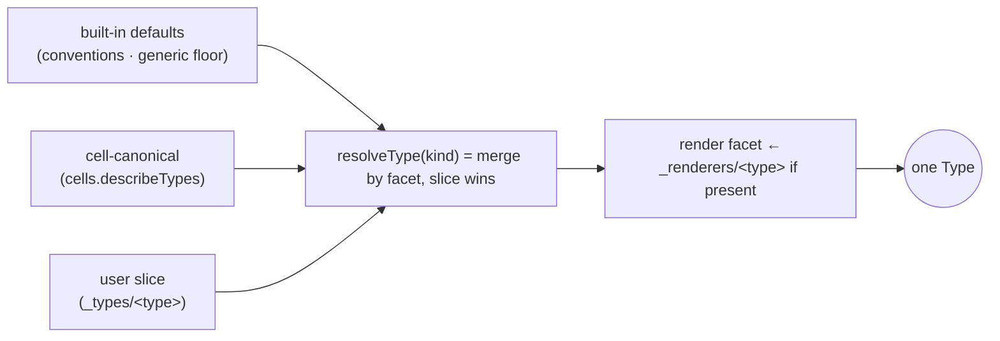

# ADR-0002 — Type as one object (facets)

- **Status:** Proposed
- **Date:** 2026-06-19
- **Context:** [`breathe.md`](../breathe.md) Wave 2 (the contraction) + Wave 9 (the
  shape/keyPattern facets feed the Reference grammar).
- **Depends on:** [ADR-0001](./0001-declaration-registry.md) — the Type is the
  `type` *kind* of the Declaration registry; this ADR defines its **value shape**
  and folds the parallel `_renderers`/prose-schema/home-conventions into it.

---

## Context (grounded)

"Type" is one concept stored in four homes:

1. `_types/<type>` — icon / label / manager / handlers (`platform/runtime/state.ts:547`,
   served by `gateway buildTypes`).
2. `_renderers/<type>` — the inline-draw renderer, a *separate* registry canvas reads.
3. prose `schema` — a value map `{ field: "type? — prose" }` (parsed by
   `parseTypeSchema`, `platform/runtime/type-schema.ts`).
4. home **conventions** — `DEFAULT_TYPE_DECLS` (`services/home/client/type-decls.ts` /
   `cells/home/client/...`) and the built-in fallbacks in `vocab.ts`.

Four sources answer one question — *"what is this kind of fact, how do I show / edit /
construct it, and who owns it?"* — and each consumer re-assembles them differently
(`gateway $types`, `home resolve`, `backbone`, `remember`).

## Decision

A **Type** is one Declaration value with four **facets**. Everything that is "about a
kind of fact" is a facet; there is no second registry.

```ts
interface Type {
  kind: string;                 // the type name (= the _types/<kind> id)
  manager?: string;             // owning cell address (→ backbone managedBy)

  // shape — what its facts contain (validation · form · Reference inputs)
  shape?: {
    fields?: FieldSpec[];       // canonical; prose `schema` parsed into this (ADR boundary)
    keyPattern?: string;        // e.g. "_doc/(doc)/(block)" — consumed by ADR-0003
  };

  // present — how a fact of this kind looks
  present?: {
    icon?: string;
    label?: string;             // a value path
    render?: { hint?: string; renderer?: string; embed?: string };
  };

  // verbs — what can be done, and where (the Affordance table; already in vocab.ts)
  handlers?: Partial<Record<Intent, TypeHandler[]>>; // open|edit|create|render|embed|preview
}
```

`_renderers/<type>` becomes the **backing fact of the `present.render.renderer` facet** —
still stored where canvas writes it, but *resolved through the Type*, not as a parallel
concept. Prose `schema` is parsed into `shape.fields` (ADR-0001's `parse` for the type
kind). `DEFAULT_TYPE_DECLS` becomes the **defaults layer** of resolution.

### Resolution (the `type` kind's `resolve`, from ADR-0001 / Wave 5)



`registry(typeKind).resolve(scope, kind)` returns this merged `Type`. Per-facet merge
(not whole-object replace), so a slice override of `icon` doesn't drop the canonical
`handlers`.

## Migration (strangler, after ADR-0001 lands)

1. **Define `Type` + `resolveType`** (over `registry(typeKind).resolve`), assembling the
   four facets. Pure; add unit coverage.
2. **Point consumers at `resolveType`**, one at a time, each behind parity:
   - `gateway buildTypes` → returns `resolveType`-shaped Types (the `$types` payload gains
     `shape`/`present`/`handlers`, supersedes the flat shape — additive, old keys retained);
   - `home` `resolve(fact, intent)` reads `Type.handlers` (already its shape in `vocab.ts`);
   - `backbone` `managedBy ← Type.manager`, `rendersWith ← Type.present.render.renderer`;
   - `remember` `schemaHints ← Type.shape.fields` (replaces the inline `describeTypes + get`
     merge — now `resolveType`);
   - `canvas` renderer lookup → `Type.present.render`.
3. **Retire** the duplicated assembly: `_renderers` reads go through the Type;
   `DEFAULT_TYPE_DECLS` becomes the defaults layer, shrinking toward empty as cells declare.

No data migration: `_types/*`, `_renderers/*`, and prose schemas stay on disk; only the
*assembly* moves into `resolveType`.

## Behaviour-preservation test (gate)

`tests/type-resolve.test.ts`:
- **Resolve parity** — for a fixture of `{ defaults × canonical × slice × renderer }`,
  `resolveType(kind)` deep-equals the union today's consumers compute (icon/label/handlers
  from `$types`, fields from `parseTypeSchema`, render from `_renderers`), including
  per-facet precedence (slice wins, facet-granular).
- **Affordance parity** — `tests/type-vocab.test.ts` (the existing 15 `resolve(fact,intent)`
  cases) stays green when fed `resolveType` output.
- **Backbone/remember parity** — `managedBy`/`rendersWith` edges and `schemaHints` outputs
  are identical to ADR-0001's results (this ADR only changes *where* manager/fields/render
  come from, not their values).

## Consequences

**Positive**
- One object answers "what is this kind"; the census's *unmanaged / undeclared* tiers become
  *Types missing a facet* (no `manager`, no `shape`) — a single completeness check.
- The home **form editor** reads `Type.shape.fields` through the same path as `remember`'s
  validation — schema declared once, used for validate + form + agent `create`.
- Establishes `shape.fields` (with `ref` markers) and `shape.keyPattern` — the **inputs
  ADR-0003** turns into Reference rules.

**Negative / risks**
- The `$types` payload shape changes (gains facets). Mitigated: keep the flat
  `icon/label/manager/handlers` keys alongside the nested facets for one release so existing
  clients don't break; flip the home client over, then deprecate the flat keys.
- `_renderers` resolution-through-Type must match canvas's current direct read; covered by
  render parity.

## Out of scope
- Reference rules from `shape` (ADR-0003).
- Whether `_renderers/*` facts eventually move *into* the `_types/<type>` value (a later data
  migration); this ADR only resolves them *through* the Type.
