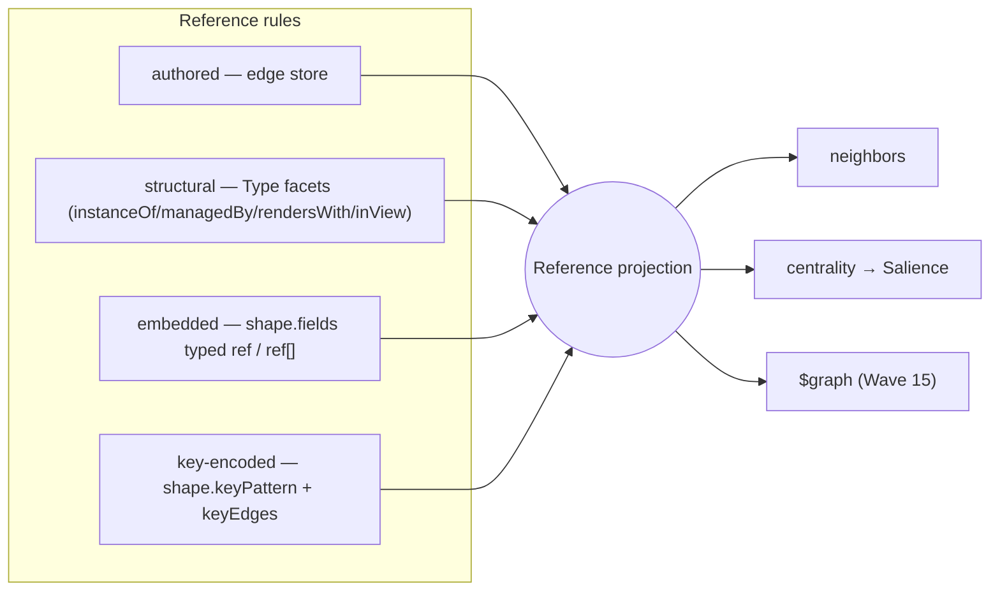

# ADR-0003 — Reference as a projection (declared rules)

- **Status:** Accepted — the Reference projection IS the live edge substrate: the derived
  backbone + key-encoded rules ship in `platform/runtime/state.ts` and every later edge ADR
  builds on it (0009 strengths, 0046/0054 placements, 0069 `edges`, 0075 the walk).
  Reconciled by the 2026-07-09 ledger scan.
- **Date:** 2026-06-19
- **Context:** [`breathe.md`](../breathe.md) Wave 3 (the contraction) + Wave 7 (the
  *grounded finding*: the graph is lossy) + Wave 9 (the rule grammar).
- **Depends on:** [ADR-0002](./0002-type-as-one-object.md) — the rules are declared
  on a Type's **`shape`** facet (`fields` with `ref` markers, `keyPattern`).

---

## Context (grounded — the graph is lossy today)

A "reference" exists in **four** representations, but only **two** reach
`neighbors`/`centrality`:

| Representation | Where it lives | In the graph? |
|---|---|---|
| authored | `workspace.link` → `store.putEdge`; merged in `state.signalsFor` | ✅ stored |
| structural | `deriveBackboneEdges` (read-time, `platform/runtime/state.ts`) | ✅ derived |
| **embedded** | `claim.support[]` in the value (`cells/machine/index.ts:435`); `machine` `value.arrows: [{from,rel,to}]` | ❌ **stranded** |
| **key-encoded** | `_doc/<docId>/<blockKey>` membership (`cells/lit/index.ts:137`) | ❌ **stranded** |

A claim's evidence, a machine's arrows, and a doc's membership are genuine relations
the substrate *already stores* — yet `neighbors` can't traverse them and `centrality`
can't count them. This isn't only tidiness: the graph is **missing real edges**.

## Decision

The Reference graph is a **projection** fed by declared **rules**. `deriveBackboneEdges`
stops being the only deriver and becomes *one rule* (`structural`); two more rules read
data already on the Type's `shape` facet. Authored edges are the rule whose source is the
edge store.



**Invariant kept:** the *authored* graph — what `links`, `changes`, and
`attention.unlinked` report — stays **authored-only**. Derived edges (structural,
embedded, key-encoded) surface in `neighbors`/centrality flagged `derived: true`, exactly
as the backbone does today, so the "not woven in yet" weave signal is preserved.

## The rule grammar (data on `shape`, ADR-0002)

```ts
interface RefField extends FieldSpec {
  type: 'ref';
  list?: boolean;     // ref[] — each element is an edge target
  rel?: string;       // edge relation (default: the field name)
}

interface Type {
  shape: {
    fields?: FieldSpec[];          // a field with type:'ref' is an embedded rule
    keyPattern?: string;           // "_doc/{doc}/{block}" — capture groups in {…}
    keyEdges?: Array<{ from: string; rel: string; to: string }>; // groups or literals
  };
}
```

- **embedded** — for fact `F` of type `T`, for each `ref` field `f`: for each key `K` in
  `value[f.name]` (an array when `f.list`, else the single value), emit `F —(f.rel ?? f.name)→ K`.
  Example: `claim.support: { type:'ref', list:true, rel:'supports' }` →
  `claim —supports→ <each evidence key>`.
- **key-encoded** — parse `F.key` against `keyPattern`; bind `{groups}`; for each `keyEdge`,
  emit the edge with groups/literals substituted. Example: `doc-order` declares
  `keyPattern:"_doc/{doc}/{block}"`, `keyEdges:[{from:"{block}", rel:"inDoc", to:"{doc}"}]` →
  `<block> —inDoc→ <doc>`.

No-dangle (as today): an emitted edge is dropped unless its target key is present in scope —
so `claim.support` pointing at a not-yet-imported fact simply doesn't draw until it exists.

## Migration (after ADR-0002; each rule independently shippable)

1. **Generalise the vocabulary thread.** `deriveBackboneEdges` already receives
   `typeManagers` (the canonical type→manager map). Generalise to a resolved
   **type → { manager, fields, keyPattern, keyEdges }** map (one `resolveType` per type from
   the cached `describeTypes`), so the rules have what they need with no new cross-service call.
2. **Embedded `ref` rule (highest payoff first).** Add the rule to `deriveBackboneEdges`;
   declare `claim.support` as `ref[]` (rel `supports`) on its type. `claim —supports→ evidence`
   appears in `neighbors`/centrality immediately — the Wave-7 recovery, concretely.
3. **Key-encoded rule.** Declare `keyPattern`/`keyEdges` on `doc-order` (managed by lit);
   `block —inDoc→ doc` appears. Docs become traversable as collections (Wave 7 / breathe's
   "collection = membership References").
4. **Machine arrows.** Two options, decide in review: (a) an embedded *edge-list* rule (a field
   that is `[{from,rel,to}]`), or (b) `define_machine` projects arrows → authored `link` edges at
   write time (simpler, makes them first-class authored). Lean (b) — the machine graph *should*
   be authored.
5. **`$graph` discovery (Wave 15).** Once the projection is unified, expose `read("$graph")`
   returning the projection — the missing third self-model surface beside `$catalog`/`$types`.

No data migration for embedded/key-encoded: the values/keys already exist; only the *rules*
(a few Type-`shape` declarations) are new.

## Behaviour-preservation test (gate)

`tests/reference-rules.test.ts`:
- **Backbone parity** — with no `ref`/`keyPattern` declared, `deriveBackboneEdges` output is
  byte-identical to today (structural rule unchanged).
- **Embedded** — a `claim` with `support:['kb/a','kb/b']` (both present) yields exactly
  `claim—supports→kb/a`, `claim—supports→kb/b`, flagged derived; a `support` key absent from
  scope is dropped (no-dangle).
- **Key-encoded** — `_doc/d1/b1` with the `doc-order` pattern yields `b1—inDoc→d1`.
- **Authored untouched** — `links`/`changes`/`attention.unlinked` still report authored edges
  only (derived rules don't leak into the weave signal).
- **Centrality** — a claim's `support` edges raise its (and the evidence's) degree, via the same
  `buildSignals` path the backbone already feeds.

## Consequences

**Positive**
- Recovers real relations the substrate already stores (claim evidence, doc membership, machine
  graph) into one traversable graph — the concrete Wave-7 win.
- `deriveBackboneEdges` becomes one rule among declared rules; new relations are *declared on a
  Type*, never hand-coded.
- Sets up `$graph` — the substrate fully describing itself (Fact via `peek`/`query`, Declaration
  via `$catalog`/`$types`, Reference via `$graph`).
- A claim's `confidence` + recovered `support` edges make the world-model direction (claims as a
  graph of evidence) actually navigable.

**Negative / risks**
- Rule application is per-fact × per-rule; bounded (rules come only from declared Types, and the
  embedded/key-encoded rules touch only facts of those types). Measure on the live slice.
- A `ref` mis-declared on a high-fan-out field could add many edges; mitigate with the no-dangle
  rule + the same `BACKBONE_STRENGTH` discount so authored links still dominate centrality.
- Parsing `keyPattern` needs a tiny, total matcher (no regex injection — patterns are
  cell-declared data, but validate `{group}` syntax at type registration).

## Out of scope
- The unified Projection pipeline + `$graph` *command* wiring (ADR-0004 / a follow-on).
- Auto-inferring `ref` from prose schemas (`"string[] — fact keys"`); refs are **declared**
  explicitly (`type:'ref'`), not guessed.

## Open questions
1. Should embedded `ref` edges be **bidirectional-discoverable** (evidence shows "supports → claim"
   inbound) — yes, the projection is directional but `neighbors(dir:'in')` already surfaces it.
2. Machine arrows: embedded edge-list rule vs. authored-at-write (lean authored). Decide in review.
3. Does `keyEdges` need CEL/templating beyond `{group}` substitution? Start with plain
   substitution; revisit only if a real case needs more.
