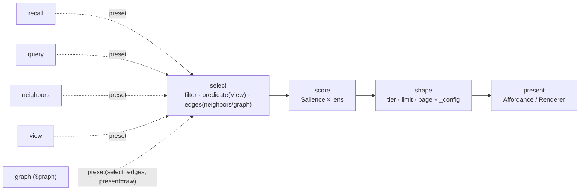

# ADR-0004 — The Projection pipeline (and `$graph`)

- **Status:** Accepted — `$graph` landed as the first slice (see the log); the pipeline
  (`select → score → shape → present`) then materialised across ADR-0048 (tiering),
  0050/0051 (score), and completed as **C2 (ADR-0071**, one read by candidate source**)**.
  Reconciled by the 2026-07-09 ledger scan.
- **Date:** 2026-06-19
- **Context:** [`breathe.md`](../breathe.md) Wave 4 (the pipeline) + Wave 15 (the
  self-model / `$graph`).
- **Depends on:** ADR-0001 (Resolution), ADR-0003 (the Reference projection `$graph`
  reads).

---

## Context (grounded)

`recall`, `query`, `neighbors`, `view`, and now `graph` are separate command bodies
that are really **one pipeline** with different stage settings:

```
select (filter / predicate / edges) → score (Salience × lens) → shape (tier/limit/page × config) → present (Affordance/Renderer)
```

Under the hood they already share `signalsFor` / `wrap` / `shapeEntries` /
`callSalience` (`platform/runtime/state.ts`), so the pieces exist; what's missing is
naming them as a pipeline and exposing the **Reference** projection as a read — the
self-model had `$catalog` (capabilities) and `$types` (vocabulary) but **no graph**.

## Decision

1. **`$graph` (done).** Expose the Reference projection — authored edges + the
   derived rule edges (ADR-0003) — as `workspace.graph` and the gateway shorthand
   `read("$graph")`. This is `state.graph(scope, { typeRules })` =
   `store.listEdges ∪ deriveBackboneEdges`. The substrate now describes itself in all
   three: **Fact** (`peek`/`query`), **Declaration** (`$catalog`/`$types`),
   **Reference** (`$graph`).
2. **Name the pipeline (incremental).** Frame the read paths as presets of
   `select → score → shape → present`; refactor opportunistically (they already
   share the stages) so each command is a thin preset, not a parallel body. No
   behaviour change — a *naming/During-refactor* contraction, gated by the existing
   read tests.



## Implementation log

- **2026-06-19 — `$graph` landed.** `ObservedState.graph` (`platform/runtime/state.ts`),
  `workspace.graph` command + descriptor, gateway `$graph` target. Returns authored +
  derived edges (derived flagged). Suite green (295). Deployed with ADR-0003.

## Remaining (incremental, low-risk)
- Express `recall`/`query`/`neighbors` as explicit stage presets over one internal
  pipeline function (pure refactor; the stages already exist).
- Fold the generic fallback viewer + `resolveType` affordance into the `present` stage
  so every read path presents identically (ties to ADR-0002's client work).

## Behaviour-preservation
- `$graph` is additive (a new read). Authored `links`/`changes`/`attention` unchanged.
- The pipeline-naming refactor must leave `recall`/`query`/`neighbors`/`view` outputs
  byte-identical (existing tests are the gate).

## Consequences
- The self-model is complete: an agent can walk **capabilities → vocabulary → data →
  graph** uniformly, all as `read`.
- `$graph` makes the ADR-0003 recovery *observable* in one call (a claim's `supports`
  edges, doc membership, the backbone) instead of per-key `neighbors`.

## Out of scope
- A paged/filtered `$graph` (start with the whole projection; add `prefix`/`rel`
  filters if a slice's edge count warrants it).
