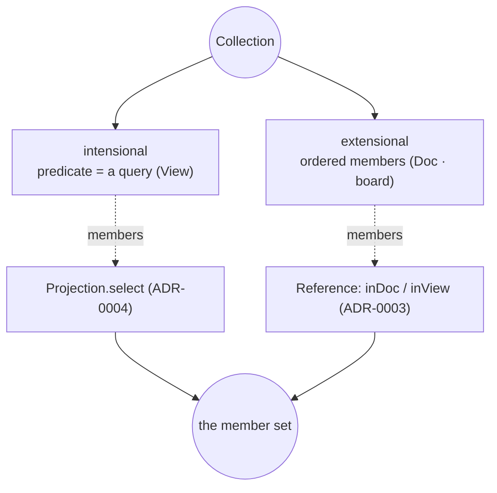

# ADR-0005 — Collections (intensional + extensional, one primitive)

- **Status:** Proposed (next-but-one; queued behind ADR-0003/0004)
- **Date:** 2026-06-19
- **Context:** [`breathe.md`](../breathe.md) — "a Collection is a set of facts:
  intensional (a query) or extensional (explicit membership edges)."
- **Depends on:** ADR-0003 (membership is a `Reference` — `inView`/`inDoc`).

---

## Context (grounded)

A "set of facts" is expressed several ways that are really one idea:

| Mechanism | Membership | Where |
|---|---|---|
| **View** | intensional — a `query` predicate (type/tag/prefix/CEL) | `_views/<id>` (`services/workspace/views.ts`) |
| **Doc** | extensional — explicit ordered members via `_doc/<doc>/<block>` decorations | `cells/lit` (`lit/index.ts:137`) |
| Tag | intensional — facts carrying a tag | `_meta.tags` |
| Board / canvas | extensional — placed elements | canvas |

ADR-0003 already unified the *membership edge*: `fact —inView→ view` and
`block —inDoc→ doc` are both derived References. What's still split is the **collection
object** — a View is a stored predicate; a Doc is a stored value + decorations — with
separate evaluate paths.

## Decision

A **Collection** is one Declaration with a membership that is *either* a predicate
(intensional) *or* an explicit ordered member list (extensional) — and its members are
resolved through the **Reference** projection (ADR-0003), not bespoke per-cell code.

- **intensional** — `members = query`; evaluating the collection runs `Projection.select`
  (ADR-0004). A `View` is exactly this.
- **extensional** — `members = the facts with an inDoc/inView edge to the collection`,
  ordered by the decoration (`seq`). A `Doc` is exactly this; the order lives in the
  `_doc/<doc>/<block>` decoration (already a `doc-order` fact).
- A collection may be **both** (a query *plus* pinned extras) — union of the two member
  sources.

## Migration (sketch — to detail when it reaches the front)
1. Define `Collection` as a Declaration kind (ADR-0001 registry) with `membership:
   { query? , ordered? }`.
2. `View` becomes the intensional preset; `Doc` the extensional preset (its blocks are
   members via the existing `_doc` decorations, now read as `inDoc` References).
3. `evaluate(collection)` = intensional via `Projection.select` ∪ extensional via the
   Reference projection, ordered by decoration `seq`.
4. Home/lit render a collection from its membership uniformly (a doc *is* a view over its
   member facts — already lit's stated model, `lit/types.json` note).

## Consequences
- "View vs Doc vs board vs tag" collapse to **Collection × {intensional, extensional}**.
- Pinning a fact into a doc and a fact matching a view are the *same* membership edge —
  surfaced in `neighbors`/`$graph`.

## Open questions
- Ordering for intensional collections (none today — they rank by Salience); only
  extensional collections carry an explicit `seq`. Keep that split, or allow an ordering
  key on intensional too?
- Does `tag` deserve to be a first-class intensional Collection, or stay a query facet?
