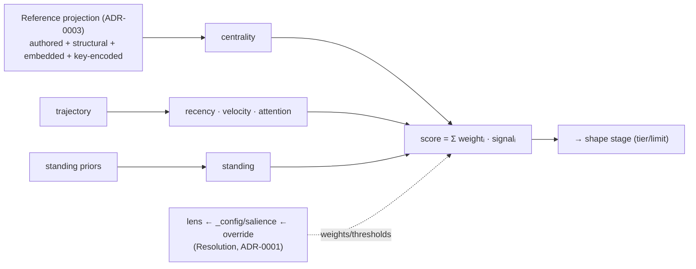

# ADR-0006 — Salience as the Projection's score stage

- **Status:** Proposed (two-forward buffer)
- **Date:** 2026-06-19
- **Context:** [`breathe.md`](../breathe.md) Wave 4/14 — Salience is the `score` stage
  of the Projection; it consumes References and is tuned by a Declaration.
- **Depends on:** ADR-0003 (centrality must read the unified projection), ADR-0004
  (the pipeline), ADR-0001 (`_config/salience` as a Declaration).

---

## Context (grounded)

Salience (`_meta.score`) is a weighted blend of five signals computed in
`platform/runtime/state.ts` (`scoreParts`): recency, velocity, attention, **standing**,
**centrality**. Today:

- **centrality** is fed by `buildSignals(events, [...authored, ...deriveBackboneEdges], …)`
  — i.e. authored + *structural* edges only. After ADR-0003, `deriveBackboneEdges` also
  emits **embedded + key-encoded** edges, so centrality already widens to the full
  projection *for the read paths that pass `typeRules`* — but the feed should be stated as
  an invariant, not an accident of threading.
- **lens** + **`_config/salience`** parameterise the blend per read (ADR-0001 makes the
  config a Declaration).

## Decision

Name Salience the **`score` stage** of the Projection (ADR-0004), with **one structural
feed — the Reference projection (ADR-0003)** — and its parameters resolved as a
Declaration (lens preset ← `_config/salience` ← per-call override, ADR-0001 Resolution).

**Invariant:** `centrality` is fed by the **whole** Reference projection — once ADR-0003
lands, a claim's `supports` and a doc's `inDoc` edges count toward centrality exactly like
authored links (discounted by `BACKBONE_STRENGTH`). No other structural signal exists.

## Migration (sketch)
1. Confirm/guarantee every read path that computes salience passes `typeRules` (so the
   embedded/key-encoded edges always feed centrality, not just when a handler remembers to).
   Audit `recall`/`query`/`neighbors`; `attention`/`neighbors` currently score on instance
   defaults — align or document.
2. Express the salience parameters purely through ADR-0001 Resolution (already true for
   `_config/salience`; fold `lens` presets into the same merge).
3. Optionally expose the score *breakdown* (`scoreParts`) on `_meta` under a debug flag, so
   the score stage is inspectable (it already returns parts internally).

## Consequences
- Centrality stops being "authored + backbone" and becomes "the graph" — embedded evidence
  and doc membership make the right facts salient (a heavily-cited claim rises).
- Salience tuning is one Resolution (defaults ← config ← lens ← override), no special cases.

## Open questions
- Should `BACKBONE_STRENGTH` be per-rule (structural vs embedded vs key-encoded), so e.g.
  authored > embedded `supports` > structural `instanceOf` in centrality weight?
- `attention`/`neighbors` scoring on instance defaults vs the per-scope config — unify, or
  keep incidental?
