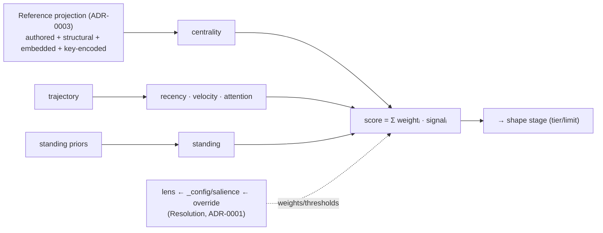
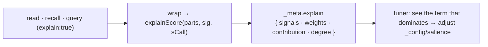

# ADR-0006 — Salience as the Projection's score stage

- **Status:** Accepted — the invariant is audited and locked, parameter resolution is
  already one merge, and the score stage is now **inspectable** via a per-read `explain`
  flag. Remaining open items (per-rule `BACKBONE_STRENGTH`) tracked below.
- **Date:** 2026-06-19
- **Context:** [`breathe.md`](../breathe.md) Wave 4/14 — Salience is the `score` stage
  of the Projection; it consumes References and is tuned by a Declaration.
- **Depends on:** ADR-0003 (centrality must read the unified projection), ADR-0004
  (the pipeline), ADR-0001 (`_config/salience` as a Declaration).

---

## Context (grounded)

Salience (`_meta.score`) is a weighted blend of five signals computed in
`platform/runtime/state.ts` (`scoreParts`): recency, velocity, attention, **standing**,
**centrality**. Today:

- **centrality** is fed by `buildSignals(events, [...authored, ...deriveBackboneEdges], …)`
  — i.e. authored + *structural* edges only. After ADR-0003, `deriveBackboneEdges` also
  emits **embedded + key-encoded** edges, so centrality already widens to the full
  projection *for the read paths that pass `typeRules`* — but the feed should be stated as
  an invariant, not an accident of threading.
- **lens** + **`_config/salience`** parameterise the blend per read (ADR-0001 makes the
  config a Declaration).

## Decision

Name Salience the **`score` stage** of the Projection (ADR-0004), with **one structural
feed — the Reference projection (ADR-0003)** — and its parameters resolved as a
Declaration (lens preset ← `_config/salience` ← per-call override, ADR-0001 Resolution).

**Invariant:** `centrality` is fed by the **whole** Reference projection — once ADR-0003
lands, a claim's `supports` and a doc's `inDoc` edges count toward centrality exactly like
authored links (discounted by `BACKBONE_STRENGTH`). No other structural signal exists.

## Implemented

1. **The centrality-feed invariant, audited + locked.** `signalsFor` is the single
   chokepoint: it always feeds `buildSignals` `authored ∪ deriveBackboneEdges(recs,
   typeRules)`. `deriveBackboneEdges` parses a scope's own `_types/<type>` facts
   autonomously, so **slice**-declared embedded/key-encoded rules feed centrality on every
   path; **canonical** (cell-published) rules feed it on the ranked surfaces (`recall`,
   `query`, `neighbors`, `members`), all of which thread `typeRules`. A regression test
   proves an embedded `support` ref raises the cited fact's `degree`. **Deliberate
   exception:** `attention.unlinked` reads authored edges only — the backbone must not mask
   the weave signal (its own test guards this); `attention` computes no per-fact salience.

2. **Parameters are one Resolution.** Scoring resolves `callSalience(baseSalience(cfg),
   lens, override)` = defaults ← `_config/salience` ← lens preset ← per-call `salience`.
   The lens presets are already folded into the same merge — no separate code path.

3. **The score stage is inspectable** (`ReadOptions.explain`). A read/recall/query with
   `explain:true` attaches `_meta.explain = { signals, weights, contribution, degree }` to
   each entry — each normalized signal, the weight it was blended by (post-Resolution), and
   its weighted contribution. The contributions sum (pre-clamp) to the published `score`,
   so a tuner sees *why* a fact scored and which weight to turn. Off by default (no cost on
   normal reads). This directly serves the original "tune recall" intent.

## Consequences
- Centrality stops being "authored + backbone" and becomes "the graph" — embedded evidence
  and doc membership make the right facts salient (a heavily-cited claim rises).
- Salience tuning is one Resolution (defaults ← config ← lens ← override), no special cases.
- The score stage is no longer a black box: `explain` turns the blend into data, so tuning
  `_config/salience` is evidence-driven rather than guesswork.

## Open / deferred
- Should `BACKBONE_STRENGTH` be per-rule (structural vs embedded vs key-encoded), so e.g.
  authored > embedded `supports` > structural `instanceOf` in centrality weight? (This is
  the natural ADR-0009 — strength as a per-rule facet of the Reference projection.)
- `neighbors`/`members` score on instance defaults rather than the scope's `_config/salience`
  (only `recall`/`query` load the config) — unify, or keep incidental?
