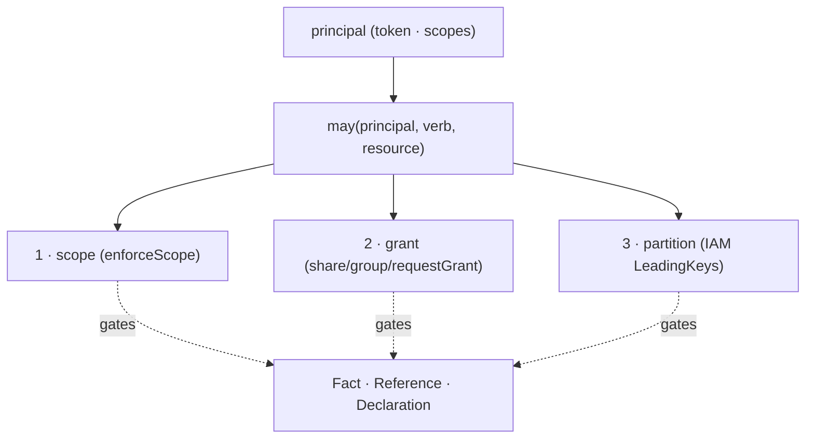

# ADR-0007 — The Grant axis, made explicit

- **Status:** Accepted — `read("$grants")` ships the authority self-model (the fourth
  surface beside `$catalog`/`$types`/`$graph`). Enforcement is unchanged; `may(...)` stays
  a documented contract over the existing three checks.
- **Date:** 2026-06-19
- **Context:** [`breathe.md`](../breathe.md) Wave 11 — Grant/Scope is the orthogonal
  authority axis that *gates* the nouns; it is not one of them.
- **Depends on:** nothing (orthogonal); informs every read/act.

---

## Context (grounded)

Authority is enforced at **three** layers, in three places:

1. **Token scope** — `enforceScope` at the gateway (`services/gateway/service.ts:275`)
   checks a capability's required scope against the caller's.
2. **Grant visibility** — `share`/`group`/`requestGrant` (`handlers.ts:1016–1187`) decide
   what appears in a viewer's `recall` (own slice ∪ granted subsets) and who may
   write-through (`requireWriteThrough`).
3. **Partition isolation** — DynamoDB `LeadingKeys` per scope (`substrate-table.ts`) — IAM
   can't read another scope's partition at all.

These are correct but *implicit*: there's no single place that answers "who may do what to
this fact?", and the three layers are reasoned about separately. The breathe map names Grant
an axis but the code doesn't expose it as one.

## Decision (sketch — to detail when it reaches the front)

Name the **Grant axis** as the one authority surface that gates **Fact · Reference ·
Declaration**, with a single conceptual check `may(principal, verb, resource)` resolving the
three layers in order (scope → grant → partition). No new enforcement — a *naming +
surfacing* contraction so authority is inspectable, not a fourth scattered concern.



- A read like `read("$grants")` (mirroring `$catalog`/`$types`/`$graph`) returns *what the
  caller may see and do* — the authority self-model surface, completing the set.
- `requestGrant`/`approveGrant` already make the axis *negotiable* as data; this just names it.

## Implemented

`read("$grants")` → `workspace.grants` returns the authority self-model, a pure projection
over the existing machinery (identity scopes + the grant store) — no enforcement changed:

```jsonc
{
  "principal": "<you>",
  "scope":  { "active": [...], "ceiling": [...] },   // layer 1 — token (enforced / ceiling)
  "slice":  "<you>",                                  // layer 3 — your own partition (full authority)
  "grant":  { "shared": [...], "receiving": [...], "groups": [...] }, // layer 2 — grant subsets
  "hint":   "may(you, verb, resource) holds when all three gates pass: scope ∧ grant ∧ partition…"
}
```

`may(principal, verb, resource)` is **documented as the contract** the three layers compose
to (in `hint`), not re-implemented — the existing checks (`enforceScope`, `applicableGrants`/
`requireWriteThrough`, IAM `LeadingKeys`) remain the single enforcement path. The gateway
aliases `$grants` exactly as it does `$graph`. So the four self-model surfaces now line up:
`$catalog` · `$types` · `$graph` · `$grants`.

## Consequences
- The four self-model surfaces line up: `$catalog` (capabilities), `$types` (vocabulary),
  `$graph` (references), `$grants` (authority).
- A reviewer can answer "why can/can't X touch Y?" from one place instead of three.

## Out of scope / open
- No change to the enforcement itself (it works); this is inspectability + naming.
- Whether `may(...)` becomes a real shared function or stays a documented contract over the
  existing three checks — decide when it reaches the front.
- Cells' `ssrReads`/`callerWrites` (declared, bounded substrate access) are a Grant-adjacent
  facet of the **Cell** axis — relate them here vs. in a Cell ADR.
- **Scope granularity gap (observed 2026-06-20):** ownership-gated (`scope: null`) ops are
  *invisible* to the scope layer, so they can't be delegated at fine grain. Concretely, only
  `cells.create` carries a scope (`cells:create`); `writeFile`/`deploy`/`configure`/`delete`
  on an owned cell gate on partition+ownership alone. There is therefore no *minimal* scope
  for "deploy my cells" — a deploy token must over-ask (`cells:create`, semantically wrong, or
  a wildcard). The three layers collapse cell-edit authority into partition, leaving Layer 1
  unable to express it. Fix: granular cell-lifecycle scopes (`cells:write`, `cells:deploy`)
  distinct from `cells:create`. (Tracked: `kb/scope-cell-lifecycle-granularity`.)
