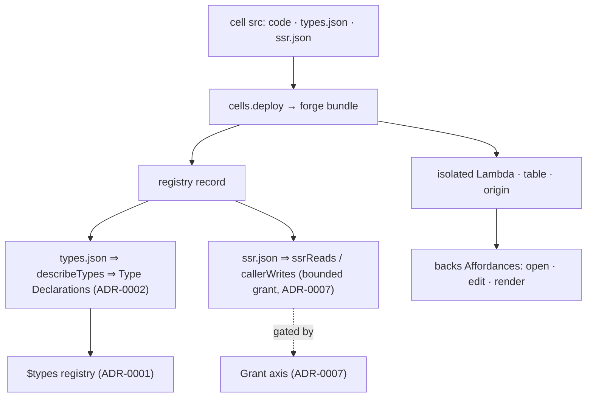

# ADR-0008 — The Cell axis: the infra that *supplies* Declarations

- **Status:** Proposed (two-forward buffer)
- **Date:** 2026-06-20
- **Context:** [`breathe.md`](../breathe.md) Wave 12 — a Cell is the orthogonal **infra**
  axis that supplies Declarations and backs Affordances; like Grant (ADR-0007) it is not
  one of the nouns (Fact · Reference · Declaration), it *produces* and *gates* them.
- **Depends on:** ADR-0001 (Declaration registry — `describeTypes` fills it),
  ADR-0002 (Type-as-one-object — the published shape), ADR-0007 (Grant — `ssrReads`/
  `callerWrites` are the Cell-side of the authority axis).

---

## Context (grounded)

A **Cell** is a self-contained unit of capability: code + an isolated Lambda + its own
table/scope + a publish seam. The substrate already treats cells as data, but the *axis*
is implicit — its three faces live in three places:

1. **Lifecycle** — `cells.create`/`deploy` (forge bundle → registry record + isolated
   Lambda/table/origin), `writeFile`/`readFile`/`listFiles`, `putData`/`getData` (blobs),
   `callCellTool` (`services/cells/service.ts`). Git is the source of truth; `cell-sync`
   and the MCP `writeFile`+`deploy` path are two doors to the same registry record.
2. **The publish seam** — a deployed cell publishes Declarations through **one path**:
   - `types.json → describeTypes` ⇒ **Type Declarations** (canonical, global vocabulary —
     ADR-0002), aggregated into `$types` so every consumer reads one registry instead of
     re-parsing each cell.
   - `ssr.json → ssrReads / callerWrites` (`service.ts:950–985`) ⇒ the cell's **bounded
     substrate access** — which keys it may read during SSR and which prefixes its callers
     may write through. Dispatch enforces these (`registry.ts:1265`).
3. **Backing for Affordances** — a Type's `manager` (ADR-0002 `present`/`handlers`) names
   the cell whose Lambda backs the open/edit/render surfaces; `_types/<T>.manager
   —managedBy→ cell` is a derived backbone edge (ADR-0003).

These are correct but reasoned about separately; the breathe map names Cell an axis while
the code exposes only its verbs.

## Decision (sketch — to detail when it reaches the front)

Name the **Cell axis** as the one infra surface that *supplies* Declarations and *backs*
Affordances, with a single conceptual model:

> **Cell = code · table · scope · a publish seam (`describeTypes`) · a backing for
> Affordances · a bounded substrate grant (`ssrReads`/`callerWrites`).**

- `describeTypes` stays **the one publish path** — the Wave-2 contraction "every consumer
  reads the registry this seam fills." No consumer re-parses a cell's `types.json`.
- `ssrReads`/`callerWrites` are declared as a **Cell** facet but *enforced* as a **Grant**
  facet — the two axes meet exactly here (ADR-0007's deferred question, answered: declared
  cell-side, gated grant-side).
- **Transformers** (`models`, `run`, `viewers`) are a Cell *kind*, not a new primitive
  (breathe Wave 13): their outputs are Facts by construction (`agent-run`, `transcript`,
  `output`) via `remember(out, …, via) + produces`.

## Consequences
- The orthogonal axes line up: **Grant** gates the nouns (authority), **Cell** supplies
  them (infra). Neither is a noun; both wrap Fact · Reference · Declaration.
- "Where does a Type come from?" has one answer: a Cell's publish seam — inspectable via
  `managedBy` in `$graph` (ADR-0003) and `$types[T].manager`.
- A reviewer can read a cell's whole contract — vocabulary it adds, surfaces it backs,
  substrate it may touch — from the registry record, not three call sites.

## Out of scope / open
- No change to deploy mechanics or isolation; this is naming + surfacing (like ADR-0007).
- Whether a `read("$cells")` self-model surface (mirroring `$catalog`/`$types`/`$graph`/
  `$grants`) is worth adding, or whether `$catalog` already covers it — decide at the front.
- The git-vs-registry dual source of truth (cell-sync vs `writeFile`+`deploy`): document
  the reconciliation rule (git wins on deploy) as part of this axis or separately.
