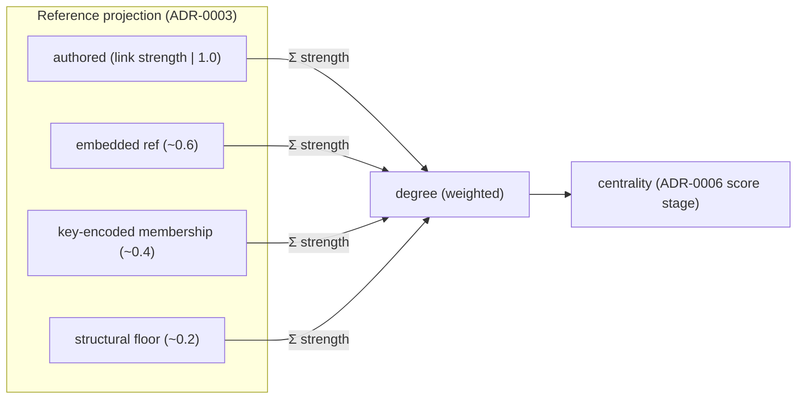

# ADR-0009 — Edge strength as a per-rule facet of the Reference projection

- **Status:** Accepted — centrality is now weighted degree (`Σ strength`), and the single
  `BACKBONE_STRENGTH` is replaced by per-rule strengths (authored 1.0 > embedded 0.6 >
  membership 0.4 > structural 0.2). Authored-edge centrality is unchanged; only derived
  contribution is graded.
- **Date:** 2026-06-20
- **Context:** [`breathe.md`](../breathe.md) Wave 7/14 — References are not all equal;
  an authored `grounds` is stronger evidence than a derived `instanceOf`. Salience's
  centrality stage (ADR-0006) should weight the graph, not just count it.
- **Depends on:** ADR-0003 (the Reference projection — the edges being weighted),
  ADR-0006 (Salience's `centrality` is the consumer of strength).

---

## Context (grounded)

Every edge already carries a `strength` field (`EdgeRecord.strength: number | null`):
authored edges store the strength passed to `link` (or `null`), and derived backbone
edges are stamped `BACKBONE_STRENGTH = 0.25` (`state.ts:582,750`). **But centrality
ignores it.** `buildSignals` computes degree as a flat count:

```ts
for (const ed of edges) {
  sig(ed.from).degree++;          // state.ts:537–538 — strength unused
  if (ed.to !== ed.from) sig(ed.to).degree++;
}
```

So today a derived `instanceOf` floor-edge and an authored `grounds` edge move centrality
by the *same* amount, and the `0.25` on backbone edges is dead weight in the score — it is
stored and surfaced (in `neighbors`/`$graph`) but never felt by salience. The ADR-0006
deferred question — "should `BACKBONE_STRENGTH` be per-rule?" — only bites once strength is
actually consumed.

## Decision (sketch — to detail when it reaches the front)

Make **centrality strength-weighted** and give strength a **per-rule** default, so the
Reference projection carries graded evidence:

1. **Consume strength in centrality.** `degree` becomes `Σ strength` (with `null` authored
   strength defaulting to `1`) instead of a raw count. `centralitySaturation` re-scales to
   the new units. A heavily-grounded claim outranks a merely-typed fact.
2. **Per-rule strength** (replacing the single `BACKBONE_STRENGTH`): each Reference rule
   class carries a default — e.g. authored `1.0`, embedded `ref` (`supports`/`grounds`)
   `~0.6`, structural `instanceOf`/`rendersWith` `~0.2`, key-encoded membership `~0.4`.
   These live beside the rule (ADR-0002 `Type` facets / `TypeRules`), not as one constant.



3. **Inspectable** — the `explain` breakdown (ADR-0006) already surfaces raw `degree`; it
   gains the weighting so a tuner sees graded contribution, not a count.

## Consequences
- `BACKBONE_STRENGTH` stops being inert: the floor edges that keep an unlinked fact above
  elision contribute *less* than real authored evidence, as the `0.25` always intended.
- Centrality becomes a measure of *weighted* connectedness — evidence-bearing edges
  (`grounds`, `supports`) drive it; structural plumbing (`instanceOf`) barely does.
- One more facet moves onto the `Type`/`TypeRules` declaration (ADR-0002), keeping the
  projection's behaviour in the vocabulary rather than in constants.

## Out of scope / open
- Re-tuning `centralitySaturation` and the per-rule defaults against the live corpus is a
  calibration pass (do it with `explain` data, not by guess) — keep defaults conservative
  so the change is behaviour-preserving at first.
- Whether authored `link` strength should also feed `neighbors` ranking (it surfaces the
  number today but doesn't sort by it) — relate here or leave to a neighbors ADR.
- Negative/▽ evidence (a `refutes` edge): does it *reduce* centrality, or is signed
  evidence a separate concern from structural importance? Defer.
