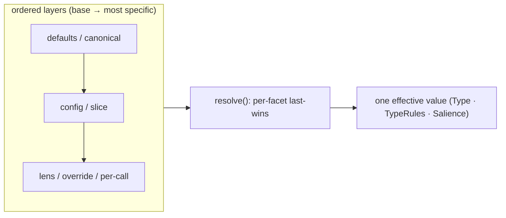

# ADR-0010 — Resolution: the layered per-facet merge, named once

- **Status:** Accepted — `layer(...parts)` ships as the named primitive; the two object-merge
  sites (`mergeTypeDecl`, `effectiveRules`) fold onto it (behaviour-preserving). The numeric
  (salience) and set (grant) siblings stay documented-as-Resolution, not forced through it.
- **Date:** 2026-06-20
- **Context:** [`breathe.md`](../breathe.md) — the read primitives are **Resolution ·
  Projection**. Projection got its ADR (0004); Resolution is the other half and is
  currently an *unnamed* pattern instantiated three times.
- **Depends on:** ADR-0002 (`mergeTypeDecl` is one instance), ADR-0006 (salience
  resolution is another); informs anywhere a "default ← override" stack appears.

---

## Context (grounded)

The same shape — *a value resolved by layering overrides over a base, facet by facet,
most-specific-wins* — appears in at least three places, each hand-rolled:

| Instance | Layers (base → winner) | Code |
|---|---|---|
| **Type vocabulary** | canonical (cell) ← slice `_types/<T>` | `mergeTypeDecl` (`type-schema.ts:27`) — per-facet shallow merge |
| **Reference rules** | canonical `typeRules[T]` ← slice rules | `effectiveRules` (`state.ts`) — per-facet, slice wins |
| **Salience** | instance defaults ← `_config/salience` ← lens ← per-call override | `baseSalience` + `callSalience` (`state.ts:427,1061`) |
| **Grant** | own slice ∪ direct ∪ public ∪ group grants | `applicableGrants` (`grants.ts:98`) — a *union*, the set-valued cousin |

These are the same primitive: **Resolution** — fold an ordered stack of partial layers
into one effective value, where a later layer overrides earlier ones **per facet** (not
wholesale). The bug ADR-0002 fixed (the gateway's old *wholesale* type merge dropped
canonical handlers when a slice overrode only `icon`) was precisely a Resolution done at
the wrong granularity. Each site re-derives the rule; nothing names it.

## Decision (sketch — to detail when it reaches the front)

Name **Resolution** the read primitive that pairs with Projection, with one documented
contract and (optionally) one shared helper:

> `resolve(layers, { facets })` — fold `[base, …, winner]` so each facet takes its value
> from the **last** layer that supplies it. Scalars/leaf facets: last wins. The existing
> sites are presets over this: type-decl facets, type-rule facets, salience weights.



- **Contract first, helper second.** The immediate move is to *name* the three sites as
  Resolution and align their precedence wording (defaults → config → call). Whether they
  collapse onto a literal shared `resolve()` is a judgment call — `mergeTypeDecl` is a
  one-line spread, `callSalience` clamps and re-derives `Resolved*`; a forced merge could
  obscure more than it saves. Decide per-site when it reaches the front.
- **Grant is the set-valued sibling.** `applicableGrants` resolves a *union* not an
  override — same "layered, most-specific-aware" shape, different monoid (∪ vs last-wins).
  Document it as Resolution-over-sets so the family is complete, but don't force it into
  the scalar helper.

## Implemented

`platform/runtime/resolution.ts` exports the primitive:

```ts
layer<T>(...parts: Array<Partial<T> | undefined | null>): T
// folds an ordered stack, later wins per facet; `undefined` is silent (never clobbers)
```

The two genuine object-merge sites now share it (the ADR's "≥2 sites" bar for a real helper):

- `mergeTypeDecl(canonical, slice)` → `layer(c, s)` (was a `{...c, ...s}` spread — `layer`
  additionally treats an explicit `undefined` facet as silent, which is the ADR-0002 fix made
  defensive).
- `effectiveRules(t)` → `layer(typeRules[t], sliceRules[t])` (was four hand-written
  `slice?.X ?? canon?.X` lines).

Left as **documented Resolution, not folded** (different monoids — forcing them through
`layer` would obscure more than it saves):

- **Salience** — `callSalience(baseSalience(cfg), lens, override)` clamps and re-derives a
  `ResolvedSalience` (numeric), so it resolves *values* not *facets*.
- **Grant** — `applicableGrants` resolves a **union** of layers, not last-wins.

311 tests green; the `mergeTypeDecl`/backbone suites are the behaviour-preservation gate.

## Consequences
- The read side has both halves named: **Resolution** (how a layered value is computed)
  and **Projection** (how facts + rules become the derived view) — ADR-0004's sibling.
- New layered settings (a future per-cell salience, per-board renderer overrides) have a
  pattern to reach for instead of a fourth bespoke merge at a fourth granularity.
- The ADR-0002 wholesale-merge bug class is named, not just fixed: "resolve per facet."

## Out of scope / open
- Don't over-abstract: a shared `resolve()` is worth it only if ≥2 sites genuinely share
  code after it; otherwise this stays a *named contract* (the cheaper, honest outcome).
- Where Resolution meets Projection: `effectiveRules` is *resolved* (this ADR) and then
  *projected* into edges (ADR-0003/0004). Keep the boundary crisp — Resolution yields the
  rules, Projection consumes them.
- Lens presets currently live in a `LENS` table folded by `callSalience`; if a future lens
  becomes a stored `_config` Declaration, it slots in as just another layer — note it.
