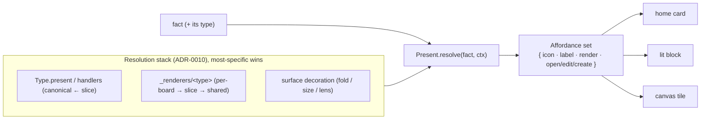

# ADR-0012 — Present: the affordance stage of the Projection

- **Status:** Accepted (first increment) — `resolvePresent(fact, decl) → Affordance`
  ships as the named present resolver. Routing home/lit/canvas through it (deleting their
  bespoke default-viewer logic) is the Eliminate-phase follow-on (ADR-0014).
- **Date:** 2026-06-20
- **Context:** [`breathe.md`](../breathe.md) Wave 4/12 — the Projection is
  `select → score → shape → present`. `select` (ADR-0004) and `score` (ADR-0006) are
  named; `present` — how a fact becomes a *surface* (icon, label, renderer, open/edit
  affordances) — is the last unnamed stage.
- **Depends on:** ADR-0002 (`Type.present` is the per-type facet), ADR-0003 (`rendersWith`
  is the derived edge to a renderer), ADR-0010 (the per-type/per-surface override is a
  Resolution).

---

## Context (grounded)

"How do I show this fact, and what can I do with it?" is answered in several places that are
really one stage:

- **`Type.present`** — `resolveType(decl).present = { icon, label, render }`
  (`type-schema.ts`), resolved canonical ← slice via `layer` (ADR-0010).
- **`Type.handlers`** — `$types[T].handlers[intent]` (open/edit/render/create): a templated
  surface URL, an act target, or a render hint (`${id}`/`${match}`/`${value.path}`).
- **`_renderers/<type>`** facts — the renderer ladder (a viewer's source/kind); the
  `rendersWith` backbone edge (ADR-0003) points a type at its renderer.
- **Per-surface overrides** — a board's `_canvas/<board>/<key>` or a doc's
  `_doc/<id>/<key>` decoration can carry presentation (fold, size), and `_renderers` can be
  per-board → slice-global → shared (dotlit's plugin scope ladder).

Each consumer re-derives this: `home` has its own default-viewer/`FactBody` logic, `lit`
renders blocks via "the same renderer ladder," `canvas` reads `_renderers`. The *resolution*
("for this fact, in this surface, what icon/label/renderer/affordances?") is one computation,
implemented three times.

## Decision (sketch — to detail when it reaches the front)

Name **Present** the final Projection stage: a pure function from *(fact, surface context)*
to an **Affordance set** — `{ icon, label, render, handlers }` — resolved (ADR-0010) over an
ordered stack:

- **One resolver, three surfaces.** `home`/`lit`/`canvas` call `Present.resolve` instead of
  each hand-rolling "default viewer." The renderer ladder + `Type.present` + decoration become
  one Resolution, not three lookups per cell.
- **`present` completes the pipeline.** Projection is now fully named end to end:
  `select`(0004) → `score`(0006) → `shape`(0004) → `present`(0012).
- **Affordances are data.** The Affordance set is exactly what `$types[T].handlers` already
  serves; this names *the act of resolving it for a concrete fact* (with renderer + surface
  overrides folded in), so an agent handed a fact resolves "open/edit/render" uniformly.

## Implemented (first increment)

`platform/runtime/present.ts` — `resolvePresent(fact, decl): Affordance` where
`Affordance = { icon, label, render, handlers }`. It resolves the per-fact present: the
Type's `present` facet (via `resolveType`, ADR-0002/0010) + the `label` path evaluated
against the fact (`value.title` envelope-rooted, or a bare `titlePath` value-rooted), with
the **key as the floor** when no label resolves and no handlers for an undeclared type. So
`select`→`score`→`shape`→**`present`** is now named end to end, each a pure function.

Consumer migration — home's `FactBody`/default-viewer, the kernel's fact presentation,
lit/canvas renderers calling `resolvePresent` and deleting their own copies — is the
Eliminate-phase work (ADR-0014); this increment provides the resolver they converge on.
322 tests green.

> **Status note (2026-07, coherence audit).** The Eliminate-phase convergence above
> did **not** happen. `resolvePresent` has no non-test, non-reexport caller: it ships
> only as exported cell-SDK surface. The server's live per-fact affordance path is
> `affordancesForTypes` → `resolveType` (`services/workspace/shared.ts`), the gateway
> `$types` facet is resolved by `buildTypeVocabulary` (`services/gateway/service.ts:490-509`),
> and canvas/lit still hand-roll their own `present.{icon,label,render}` composition. The
> present *facet convention* is single-sourced; the present *function* is not. Resolve by
> either (a) wiring `affordancesForTypes` and the clients onto `resolvePresent`, or
> (b) retiring `resolvePresent` and naming `affordancesForTypes` as the present stage.
> See `docs/platform-reference/coherence-audit.md` — present-affordance seam (DIVERGENT).

## Consequences
- The "default viewer for an orphaned/undefined type" problem (the early floor-renderer work)
  becomes one branch of `Present.resolve` (no type → the generic floor), not per-cell code.
- A renderer override (per board, per doc) is just another layer in the same Resolution —
  dotlit's plugin scope ladder expressed without bespoke precedence logic.
- `$types` stays the publish seam (ADR-0008); Present is its *read-time application*.

## Out of scope / open
- The renderers themselves (viewer code in `@c15r/viewers`) are unchanged — this names the
  *selection + layering*, not the rendering.
- Whether `Present.resolve` runs server-side (SSR, in the managing cell) or client-side (the
  kernel) — likely both share the pure function; decide the home when it reaches the front.
- Per-surface presentation (`fold`, canvas `{x,y,w,h}`) lives in decorations today; whether it
  folds into the same Affordance set or stays a sibling "placement" channel — defer.
