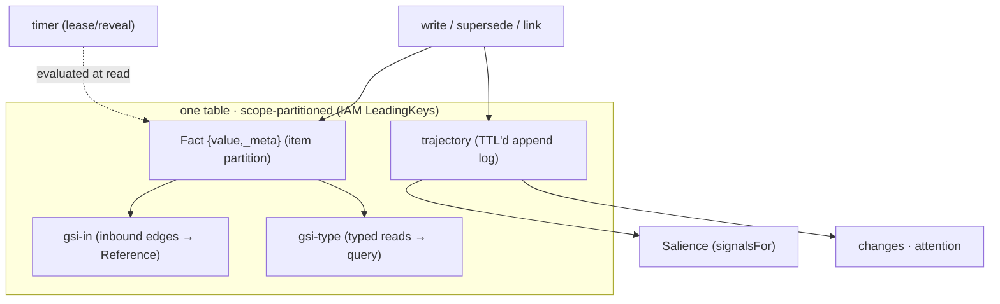

# ADR-0013 — Fact: the monotonic floor

- **Status:** Proposed (two-forward buffer)
- **Date:** 2026-06-20
- **Context:** [`breathe.md`](../breathe.md) Wave 16 — the base noun. Reference (0003) and
  Declaration (0001) have ADRs; **Fact** — the observed-state primitive everything else
  sits on — is named here, completing the triad.
- **Depends on:** nothing (it is the floor); every other primitive depends on it.

---

## Context (grounded)

A **Fact** is a wrapped value at a key: `{ value, _meta }`, where `_meta` is
server-stamped provenance + read-time salience (`platform/runtime/state.ts`,
`EntryMeta`): `revision · seq · writer · via · createdAt · updatedAt · writers[] ·
superseded · supersededBy · type · tags · timer` plus the computed `score · velocity ·
standing · centrality`. Its contract:

- **Monotonic, never destructive.** A write bumps `revision` and appends to the
  trajectory; `supersede` retires (sets `superseded`/`supersededBy`) but never deletes —
  the revision chain *is* the history (the `pat_supersede` tenet, in the engine).
- **Optimistic concurrency.** `ifRevision` / `ifAbsent` (CAS) gate a write on the stored
  revision; an expired-`delete` timer reads as absent, which is the crash-safe claim.
- **Timers (lease / reveal).** `timer:{expiresAt, effect}` is evaluated *at read*:
  `delete` = live-now-then-vanishes (a lease), `enable` = dormant-until (a reveal).
- **The trajectory is the Fact's temporal shadow.** Every read/write/supersede/link
  appends a TTL-bounded `TrajectoryEvent`. It is read by **two** consumers — Salience
  (`signalsFor` → recency/velocity/attention/standing) and `changes`/`attention` (tail +
  tending) — over one append-only log.

The storage floor is **one table**: the item partition, `gsi-in` (inbound edges),
`gsi-type` (typed reads), and the trajectory partition — scope-partitioned with IAM
`LeadingKeys` (the partition layer of the Grant axis, ADR-0007).

## Decision (sketch — to detail when it reaches the front)

Name **Fact** the monotonic floor: a keyed `{value, _meta}` with server-stamped
provenance, supersede-not-delete, CAS, read-time timers, and a TTL-bounded **trajectory**
as its temporal shadow — over a single-table store. Everything else is built *on* Facts:
Declarations are Facts in `_`-namespaces; References are edges between Fact keys (authored
rows or derived, ADR-0003); Salience is a read-time score *of* a Fact from its trajectory.

- **One representation, named.** The Fact contract (the `EntryMeta` shape + the write/read
  rules) is stated once here; no component re-defines "what a fact is."
- **The trajectory is one primitive with two readers** — state that as an invariant so a
  future "what changed" or "how salient" never grows a second event log.

## Consequences
- The three nouns are all named: **Fact** (this) · **Reference** (0003) · **Declaration**
  (0001) — the whole expressive surface, each with one representation + one resolver.
- "Where does history live?" has one answer (revision chain + trajectory), not per-feature
  audit tables.

## Out of scope / open
- No storage change — this names the existing floor (`docs/substrate-storage.md`).
- Whether the read-time salience fields belong *in* `_meta` (they are computed, not stored)
  or in a sibling envelope — they ride `_meta` today for ergonomics; revisit only if a
  consumer needs the stored/computed split (the `explain` flag, ADR-0006, already separates
  the breakdown).
- `import` (migrated timestamps + seed counts) is a Fact-creation facet — document its
  interaction with `createdAt`/standing here when it reaches the front.
