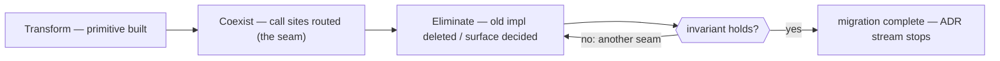

# ADR-0014 — Eliminate: completing the strangler fig

- **Status:** Proposed (two-forward buffer) — the **convergence** ADR. Unlike 0001–0013
  (each *names + builds* a primitive), this one *removes* the transitional duplication and
  defines the **stopping condition**, so the migration ends rather than buffers forever.
- **Date:** 2026-06-20
- **Context:** [`breathe.md`](../breathe.md) Wave 17 — the invariant is ~80% met; the
  residue is double-representation left by an in-flight migration.
- **Depends on:** the primitives being named (0001–0013); this strangles out their old
  call sites.

---

## The pattern, named

This migration is a **strangler fig** (Fowler). Its phases:

1. **Transform** — build the new primitive beside the old code (`layer`, `matchesSelector`,
   `resolvePresent`, `$graph`, the Declaration registry).
2. **Coexist** — route call sites through the primitive while the old shape still works
   (a *seam* / parallel-run; this is where most of 0001–0013 leaves things).
3. **Eliminate** — delete the strangled-out implementation and reconcile any duplicated
   *surface*. **This ADR is that phase.** (Sometimes called decommissioning / teardown.)

The lit cleanup already ran one Eliminate step end-to-end: migrate every doc to `_doc/`
decorations → delete the inline-`blocks` fallback. That is the template for the rest.

## The teardown checklist (each item: behaviour-preserving, with its gate)

| # | Strangled-out seam | Action | Gate |
|---|---|---|---|
| 1 | ~~`actions.ts` not wrapped in `createDeclarationRegistry` (ADR-0001 exception)~~ | ✅ **DONE** — storage (validate→put→list→get→supersede) routed through the registry; contested detection, `ActionInvokeError`, and the interpreter stay bespoke | action tests green (329) |
| 2 | lit/canvas/home **bespoke membership + ordering** loaders | route through `workspace.members` (ADR-0005); delete the copies | doc/board render parity (live diff) |
| 3 | home/kernel/lit/canvas **default-viewer / label** logic | 🟡 **core done** — the *duplication* (legacy `{icon,titlePath}`→`{icon,label}` normalisation) is eliminated at the source: the gateway resolves `present` once (`resolveType`) and serves it on `$types`; **home consumes it** (deployed). lit/canvas/kernel are analogous consumers of the same served facet (their deploys pending). The per-fact `pathInto(value, label)` is the irreducible client half — Present resolves where the value is. | home SSR 200 + behaviour-identical (present.label == old titlePath) |
| 4 | ~~`neighbors`/`members` score on instance defaults, not the scope's `_config/salience` (ADR-0006 open item)~~ | ✅ **DONE** — both load `baseSalience(loadSalienceConfig(scope))` and score under it; intensional `members` already honored it via `query` | new test: neighbors/members score == read score under a config |
| 5 | Declaration **CRUD surface** — `registerView/Action/Subscription` + `views/actions/subscriptions` + `delete*` are 9 verbs over one registry | ✅ **DECIDED — keep.** The per-kind verbs are ergonomic and behaviour-preserving; the *implementation* is already one registry (rows 1 + ADR-0001), so the invariant ("one representation, one resolver") holds at the model level. A surface unification (`declare(kind)`) is client-breaking and out of scope for a model refactor. | recorded as resolved |
| 6 | CEL lives only on `subscription.match`, not `query`/`view` (ADR-0011 open) | ✅ **DECIDED — keep subscription-only.** The structural Selector is the shared floor; CEL is a per-fact richer clause. A subscription runs CEL over **one** changed fact per event; a view/query runs its predicate over **many** facts (and the derived projection) — CEL-per-fact would be costly and would pull the `cel-js` dep into `platform/runtime`. Justified asymmetry. | recorded as resolved |

Items 1–4 are real code deletions; 5–6 are decisions that *close* an open question (the
honest half of "eliminate" — some seams are kept on purpose, and saying so is the cleanup).

## The stopping condition (where the buffer ends)

The two-forward buffer is a **rhythm, not a destination** — and the destination is finite,
because the primitive set is enumerated (Fact · Reference · Declaration · Resolution ·
Projection[select/score/shape/present] · Salience · Grant · Cell). After Present (0012) and
Fact (0013), **naming is essentially complete** — there is no endless 0015/0016…; the buffer
now pivots from "name the next primitive" to "strangle out the next seam," and drains as the
checklist empties.

**Done** is verifiable, not vibes: the breathe invariant — *every primitive has one
representation and one resolver; every component uses primitives but re-implements none.* The
test is a grep-able audit — no second predicate tester, no second layered-merge, no second
membership resolver, no second present/label evaluator. When the checklist is empty and that
audit is clean, `breathe.md` closes and the ADR stream stops.

## Consequences
- The migration has an explicit end and a falsifiable definition of done.
- "What's left?" is one table, not folklore — a reviewer can pick up any row.

## Out of scope / open
- Sequencing: items 1–4 are independent and can land in any order (suggest 1 → 4 → 3 → 2,
  cheapest-first; 2 touches three cells and wants live parity diffs).
- Whether to keep this as a living checklist ADR (tick rows as they land) or spawn one small
  ADR per row — lean checklist; spawn only if a row turns out to hide a design choice.
