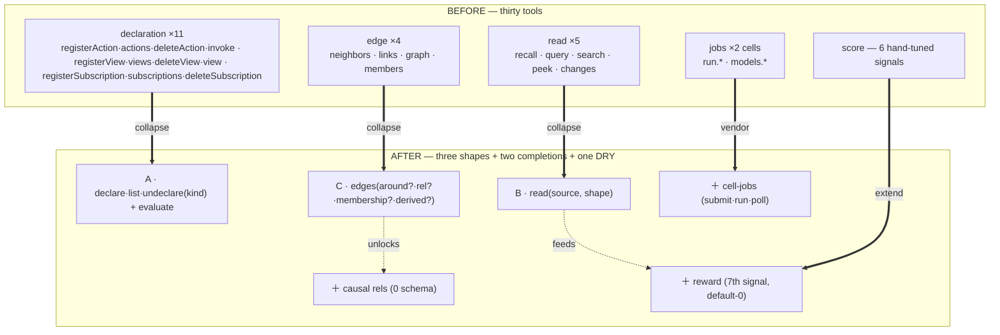

# ADR-0067 — Recompose the surface: three shapes, not thirty tools

- **Status:** Accepted 2026-07-09 — the wave it sequenced is COMPLETE (every row built,
  gated, deployed, validated live in one day's loop; see the table). Originally: (buffer — opens the second contraction wave;
  feedback welcome before build). A distillation ADR (à la ADR-0044): it decides
  *the cut and the sequence*, not the implementation of any one contraction.
- **Context doc:** [`docs/architecture/compose.md`](../compose.md) — the full
  reasoning; upstream [`cognitive-substrate.md`](../cognitive-substrate.md) (what
  the stack is) and [`cerebellar-loop.md`](../cerebellar-loop.md) (C7/C8).
- **Depends on:** ADR-0001 (the declaration registry — the storage this completes
  the surface of), ADR-0044 (the first corpus distillation; this is the second).
- **Sequence:** this ADR sequences **contractions C1–C8** of the second wave. C1
  (ADR-0068) and C3 (ADR-0069) are written now as the two-ahead buffer; the rest
  are sketched in `compose.md` and promoted as the built line advances.

  | # | Contraction | Collapses | Completes / depends | Lands as |
  |---|---|---|---|---|
  | **C1** | One declaration surface | 11 → 4 | ADR-0001 (surface) | **ADR-0068 ✓ built + live** |
  | **C2** | One read by candidate source | 3 → 1 | ADR-0004/0048/0050/0051 | **ADR-0071 ✓ built + live** |
  | **C3** | One edge query | 4 → 1 | ADR-0044 Inc 5 / 0048; feeds 0016 | **ADR-0069 ✓ built + live** |
  | **C4** | Causal relations | +1 rel family, 0 schema | depends C3 | **ADR-0075 ✓ built + live** |
  | **C5** | Vendor cell-jobs | 3 → 1 | ADR-0026/0028 (in-code TODO) | **ADR-0076 ✓ built + live** |
  | C6 | Reward — the 7th signal | +1 signal | ADR-0006/0050/0051 | **ADR-0070 ✓ built + live** |
  | C7 | The `_contested` view | new read | ADR-0040/0045; C3,C6 | **ADR-0072 ✓ built + live** |
  | C8 | The consolidation organ | new organ | ADR-0045; C6,C7 | **ADR-0073 ✓ built + live (delta +11)** |

  ***THE TABLE IS COMPLETE** (2026-07-09, eight buffer advances in one day's
  loop): C1/C3 → C6 → C7 → C8 → C2 → ADR-0074 (principal-adopted goals) → C4 →
  C5 — every row built, gated, deployed, and validated live. The three shapes
  are composed (declaration · edge · read), the self-maintenance loop is closed
  (delta +11, earned rewards), principals carry their purpose (posture), the
  graph is predictive (the walk), and the duplication is gone (the kernel SDK
  gained gateway-client + cell-jobs; ~90 hand-copied lines deleted, two latent
  drift bugs fixed at the seam). **The first post-wave entry is also built:
  ADR-0077 (the postured organ)** — the organ bootstraps and adopts its own
  goal fact, observes in parallel, backfills types, adjudicates the easy
  contested tier, and submits its own runs through the vendored jobs. The
  two-ahead buffer: **ADR-0078 (slice-declared lenses)** and **ADR-0079 (decay
  to cold — forgetting as shaping, never deletion: the plate's last gap)**.*

---

## Context (grounded)

ADR-0044 distilled the corpus once (0001–0043) and sequenced contractions. Since
then the feature stream (0045–0066) grew the **surface** faster than anyone
re-collapsed it: the MCP catalog's three verbs (`whoami`/`read`/`act`) now project
~34 workspace tools plus per-cell tools, and a large fraction are *the same runtime
operation with a parameter frozen into a distinct tool name*. The abstractions that
would collapse them already exist in `platform/runtime` — the surface has simply
drifted from them.

The evidence, per seam (`compose.md` has the full trace):

- **Declaration.** `commands-declared.ts:38-131` hand-writes 11 handlers over one
  registry (`declarations.ts:50-79`); every register/list/delete body is identical
  up to which `create*(state)` factory it calls (`actions.ts:283`, `views.ts:120`,
  `subscriptions.ts:213`).
- **Read.** `recall`/`query`/`search` re-implement the `relevance` injection and the
  own-slice-∪-grants fold three times (`commands-read.ts:362-390` vs
  `commands-search.ts:180-189`); `search` discards salience for raw cosine
  (`commands-search.ts:197`) though `query({text})` already does it correctly
  (`commands-read.ts:256`).
- **Edge.** `neighbors`/`graph`/`members`/`links` are four filters over one reduction
  `[...authored, ...deriveBackboneEdges]`, copy-pasted at `state.ts:1743/1768/1793`.
- **Duplication.** `@c15r/run` and `@c15r/models` byte-duplicate the async-job harness
  with an in-code "vendor when a second consumer lands" TODO (`cells/run/index.ts:35-42`).
- **Missing signals.** `scoreParts` (`state.ts:696-728`) is a pure weighted sum with
  no *earned* term; edge `rel` (`state.ts:313`) carries no consequence semantics.

## Decision — the cut

The surface is **three shapes** + **two completions** + **one DRY**. Expose the
shape, not the instances.

- **Shape A — Declaration** (C1, ADR-0068). Universal lifecycle
  `declare/list/undeclare(kind)` + per-kind `evaluate` (`invoke`/`view`/`match`). The
  storage is already unified (ADR-0001); only the surface collapses. The
  storage-vs-evaluate boundary (ADR-0001) is preserved verbatim.
- **Shape B — Read** (C2, sketch). `read(source, shape)` where `source ∈
  {slice,store,vector,key,changes}` and `shape ∈ {overview,projection,tiered,raw}`;
  the grant-fold + `relevance` computed once; `search` retired into
  `read(vector,…)`, gaining salience ranking (a bug fix).
- **Shape C — Edge** (C3, ADR-0069). `edges(around?,rel?,membership?,derived?)` over
  the one shared reduction; feeds ADR-0016's canvas its authored-vs-derived stream.
- **Completion — Causal rels** (C4) and **Reward** (C6): additive, default-inert,
  each following an existing precedent (free-string `rel` + `score` slot; ADR-0051's
  default-0 weight).
- **DRY — cell-jobs** (C5): vendor the harness the code already asks to vendor.

## Why now (buffer rationale)

Two contractions (C1, C3) are pure, behaviour-preserving surface collapses that
**complete decisions already accepted** (ADR-0001's storage; ADR-0044 Inc 5's split
graph verbs). Writing them as buffer ADRs now keeps the direction legible before
code and — critically — keeps the *later* additions honest: C6 (reward) and C4
(causal rels) should not be designed against a surface that is about to collapse
underneath them. Sketching the cut first is what stops the second wave from
re-drifting the way the first surface did after ADR-0044.

## Behaviour-preservation (the gate, applies to each contraction)

Every collapse ADR (C1–C3) merges only behind a **parity harness**: the composed
verb's output deep-equals the legacy verbs' outputs over a fixture slice, including
paging, shaping tiers, and grant folds. The completions (C4–C6) merge behind a
**default-inert** proof: with the new rel unused / the reward weight at 0, every
existing read is byte-identical. This is the ADR-0001 discipline reused.

## Consequences

**Positive**
- The surface tells the truth the runtime already implements; ~21 tools become ~9.
- `search`'s salience bug is fixed as a side effect of C2.
- The completions (causal rels, reward) land on a surface that won't move under them.
- One place each to reason about "a declaration," "a read," "an edge."

**Negative / risks**
- Renaming a live surface risks breaking agents mid-flight — mitigated by aliasing
  the old tool names for a deprecation window (strangler-fig), never a hard cut.
- The `declare(kind)` dispatcher must faithfully reproduce per-kind `register`
  validation (e.g. actions' contested-target detection) — the parity harness is the
  guard, exactly as in ADR-0001 step 2.

## Out of scope (this ADR)
- The implementations — each contraction is its own ADR (C1 = 0068, C3 = 0069; the
  rest sketched in `compose.md`).
- Anything touching the **evaluate** boundary, grants, or the write side
  (`link`/`unlink`, `remember`) — explicitly held stable.

## Open questions
1. Deprecation window: how long do the legacy tool names alias before removal? (One
   accepted-line advance? A fixed date?)
2. Does `read(source,shape)` (C2) subsume `peek`/`changes`, or do they stay named
   aliases for ergonomics? Proposal: keep `peek`/`changes` as named `read(key)` /
   `read(changes)` aliases; only recall/query/search collapse.
3. Order of C4 vs C6: causal rels are more visible, reward is more load-bearing for
   C7/C8. Proposal: C6 before C4 (unblocks the self-maintenance organs sooner).
