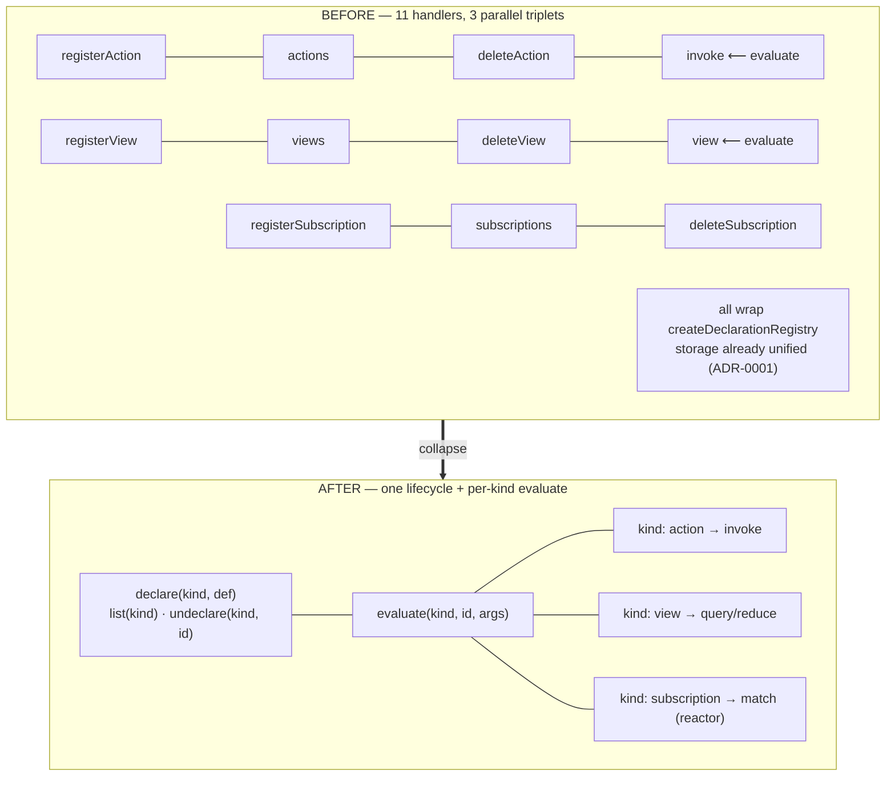

# ADR-0068 — One declaration surface: `declare` / `list` / `undeclare` + `evaluate`

- **Status:** Proposed 2026-07-09 (buffer — feedback welcome before build). C1 of
  the second contraction wave (ADR-0067). Behaviour-preserving; unblocks the rest.
- **Context doc:** [`docs/architecture/compose.md`](../compose.md) — §1 (Shape A).
- **Depends on:** ADR-0001 (the declaration registry — this completes its *surface*),
  ADR-0044 Inc 5 (which grouped the eleven handlers into `commands-declared.ts`).
- **Completes:** ADR-0001. The storage collapsed in 0001; the agent surface never did.

---

## Context (grounded)

ADR-0001 unified the *storage* of every declaration kind into one
`createDeclarationRegistry` over a `DeclarationKind<D>` descriptor
(`platform/runtime/declarations.ts:19-79`): `register → put`, `list → query`,
`remove → supersede`. Actions, views, and subscriptions are already thin wrappers
over it (`actions.ts:283`, `views.ts:120`, `subscriptions.ts:213`), and ADR-0001's
own implementation log records that even actions' storage was folded in ("every
declaration kind now shares the one storage lifecycle").

But the **agent-facing surface** was never collapsed. `commands-declared.ts:38-131`
hand-writes **eleven** handlers:

```
registerAction · actions · deleteAction · invoke
registerView   · views   · deleteView   · view
registerSubscription · subscriptions · deleteSubscription
```

Every `register`/`list`/`delete` body is identical up to which `create*(state)`
factory it names — nine near-duplicate handlers over one registry. The only
genuinely kind-specific handlers are the two **evaluate** verbs: `invoke` (the
action interpreter, `actions.ts:312-373`) and `view` (the query/reduce evaluator,
`views.ts:132-182`). Subscriptions have no direct evaluate on this surface — their
`match` runs in the reactor (`subscriptions.ts:121-189`), not by a caller.

The cost is the ADR-0001 cost, one level up: adding a declaration kind, or changing
how declarations are listed/paged/deprecated, means editing three parallel handler
triplets that should be one.



## Decision

Introduce a **`declarations` command group** in `services/workspace` that exposes
the universal lifecycle once, dispatched by a `kind` parameter over a registry map,
and keeps the two evaluate verbs as the per-kind surface. The storage-vs-evaluate
boundary from ADR-0001 is reproduced *at the surface*: lifecycle is universal,
evaluate is specific.

### Shape

```ts
// services/workspace/commands-declared.ts  (the collapse; storage untouched)

type DeclKind = 'action' | 'view' | 'subscription';

const REGISTRY: Record<DeclKind, (state) => DeclarationRegistry<unknown>> = {
  action:       (s) => createDeclarativeActions(s),   // register/list/remove only
  view:         (s) => createRegisteredViews(s),
  subscription: (s) => createSubscriptions(s),
};

declare(kind, def)        // → REGISTRY[kind](state).register(scope, def, identity)
list(kind)                // → REGISTRY[kind](state).list(scope)
undeclare(kind, id)       // → REGISTRY[kind](state).remove(scope, id, identity)

// evaluate stays per-kind (the ADR-0001 boundary, at the surface):
evaluate(kind: 'action', id, args)  // → createDeclarativeActions(state).invoke(...)   (the current `invoke`)
evaluate(kind: 'view',   id)        // → createRegisteredViews(state).evaluate(...)     (the current `view`)
```

`declare`'s return is the kind's existing register result — including actions'
`{ action, contested }` conflict surface (`actions.ts:290-298`) — so nothing about
per-kind register semantics changes; only the dispatch does.

### The eleven → four (plus aliases)

| Composed | Subsumes | Notes |
|---|---|---|
| `declare(kind, def)` | registerAction · registerView · registerSubscription | dispatch by `kind` |
| `list(kind)` | actions · views · subscriptions | one pager |
| `undeclare(kind, id)` | deleteAction · deleteView · deleteSubscription | one remove |
| `evaluate(kind, id, args)` | invoke · view | the two evaluate verbs, unified name |

The legacy names remain as **thin aliases** into the composed group for a
deprecation window (strangler-fig), so no agent breaks mid-flight.

### The boundary (do not over-unify — ADR-0001, restated)

- **Evaluate stays kind-specific.** `invoke`'s interpreter, contested-target
  detection, and `ActionInvokeError`; a view's CEL query/reduce; a subscription's
  `match` — none of these merge. `evaluate` is a *dispatch*, not a unification.
- **Types / renderers / config stay out.** They are *resolve*-shaped declarations
  (read-merged: `type-vocabulary.ts:buildTypeVocabulary`; the config is read inside
  the salience runtime, ADR-0001 impl log), not *list*-shaped. Their value is the
  layered resolve, and they carry no CRUD triplet to collapse. Folding them in would
  be the over-unification ADR-0001 explicitly warned against.
- **Grants stay out.** They are not declarations at all — their own dual-index store
  (`grants.ts:77-90`).

## Migration (strangler-fig — no big bang)

1. **Add the `declarations` command group** dispatching over `REGISTRY[kind]`, and
   `evaluate` dispatching to `invoke`/`view`. Pure addition; no removals.
2. **Re-point the eleven legacy handlers** to delegate into the new group (keeping
   their exact input/output shapes). `commands-declared.ts` shrinks from eleven
   bespoke bodies to eleven one-line aliases + the group. Handlers' tests stay green
   — this *is* the equivalence proof.
3. **Publish the composed group** in the descriptor catalog (`descriptors.ts`) with
   the legacy tools marked `deprecated` (as `search` already is), pointing at the
   composed verb.
4. **After the deprecation window**, drop the legacy descriptors (not the code —
   the aliases can stay cheap) once `changes`/telemetry show no caller uses them.

No data migration: the on-disk `_actions/*` / `_views/*` / `_subscriptions/*` facts
are untouched; only the handler surface moves.

## Behaviour-preservation test (the gate)

Merge blocked until `tests/declarations-surface.test.ts` is green:

- **Lifecycle parity** — for each `kind ∈ {action,view,subscription}`, against a
  fixture slice: `declare(kind, def)` deep-equals the legacy `register*` (including
  actions' `{ action, contested }`); `list(kind)` deep-equals the legacy plural;
  `undeclare` round-trips with the same supersede/revision effects.
- **Evaluate parity** — `evaluate('action', id, params)` deep-equals `invoke`
  (including `ActionInvokeError` and the emitted `workspace.action.invoked` /
  `workspace.fact.written` events, `commands-declared.ts:71-76`); `evaluate('view',
  id)` deep-equals `view`.
- **Alias parity** — each legacy tool name, called directly, returns byte-identical
  output to its composed form (proves the deprecation window is safe).

Parity is asserted on *outputs*, certifying behaviour-preservation regardless of the
dispatch refactor.

## Consequences

**Positive**
- One place to add a declaration kind or change list/paging/deprecation semantics —
  finishing the ADR-0001 job at the surface.
- The catalog shrinks (11 → 4 primary + aliases); the *shape* "a declaration has a
  universal lifecycle and a specific meaning" becomes legible instead of buried.
- Sets the dispatch-by-`kind` pattern the read (C2) and edge (C3) collapses reuse.

**Negative / risks**
- A `kind` enum is a new failure mode (`declare('actoin', …)`); mitigate with a
  typed enum + a clear error listing valid kinds.
- Per-kind register nuances (actions' contested detection, views' parse-at-register)
  must survive the dispatch — the parity harness is the guard.
- Deprecating live tool names risks agent breakage — mitigated by the alias window;
  never a hard cut.

## Out of scope (later ADRs / held stable)
- The **evaluate** internals (invoke interpreter, view CEL) — untouched.
- Types / renderers / config as a `resolve` kind on the surface — a separate, lower
  priority follow-on (they already resolve correctly; no CRUD pain).
- The read (C2) and edge (C3) collapses — their own ADRs.

## Open questions
1. Is `evaluate('view', id)` the right name, or keep `view` as the primary and treat
   `evaluate` as the action-only verb? Proposal: `evaluate(kind,…)` primary, `view`
   and `invoke` as aliases — symmetry wins, and it generalises if a future kind gains
   an evaluate.
2. Should `list()` (no kind) return *all* declarations across kinds (a unified
   registry view)? Attractive for a "what have I declared" surface; costs a
   multi-prefix scan. Proposal: yes, as an optional `list()` with no `kind` = union.
