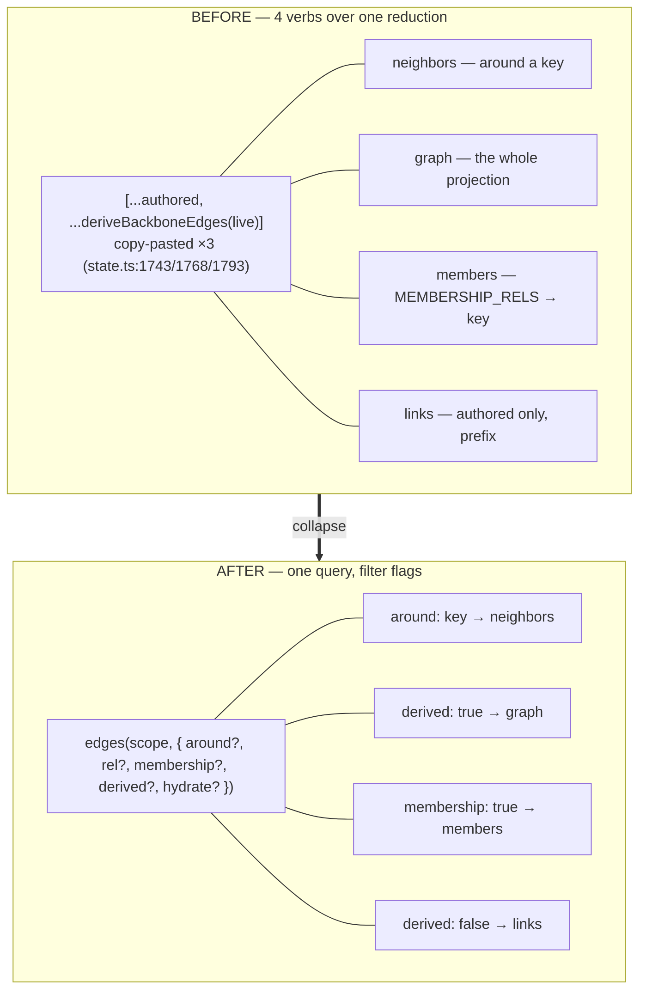

# ADR-0069 — One edge query: `neighbors` / `graph` / `members` / `links` → `edges(…)`

- **Status:** Proposed 2026-07-09 (buffer — feedback welcome before build). C3 of the
  second contraction wave (ADR-0067). Behaviour-preserving; read-side only.
- **Context doc:** [`docs/architecture/compose.md`](../compose.md) — §3 (Shape C).
- **Depends on:** ADR-0044 Inc 5 (which *split* the graph reads into four verbs),
  ADR-0048 (`scopeEdges` altitude), ADR-0003/0009 (References + edge strength).
- **Feeds:** ADR-0016 (edges first-class on the canvas — it wants exactly the
  authored-vs-derived stream this produces). **Unblocks:** C4 (causal relations).

---

## Context (grounded)

Every edge read is the same reduction — `[...authored, ...deriveBackboneEdges(live)]`
— read four ways, with the reduction copy-pasted across `state.ts:1743/1768/1793`.
At the command surface (`commands-graph.ts:38-91`, ADR-0044 Inc 5):

- **`neighbors`** — the reduction filtered to `from===key || to===key`, hydrating
  neighbor `entries`, tier-shaped (`commands-graph.ts:56-64`).
- **`graph`** — the reduction, `scopeEdges`-capped, no filter (`:75-80`).
- **`members`** — the reduction filtered to `rel ∈ MEMBERSHIP_RELS` pointing at a key
  (`:82-90`).
- **`links`** — authored edges only (`state.edges(scope)`), prefix-filtered (`:66-73`).

Four verbs differing only in `{ endpoint filter, rel filter, include-derived,
hydrate }`. Four descriptors, four handlers, four things to keep consistent as the
edge model grows — and ADR-0016 (edges first-class on the canvas) needs a *fifth*
framing anyway: the full authored-vs-derived projection, solid vs faint. The split
is the drift; the reduction underneath is already one function.



## Decision

Introduce one read — **`edges(scope, filter)`** — over the shared reduction (lifted
to a single helper), and express the four verbs as filter presets. `link` / `unlink`
(the write side) are **unchanged** — a read and a write are different shapes.

### Shape

```ts
interface EdgesInput {
  around?: string;                 // endpoint filter: from===key || to===key
  dir?: 'in' | 'out' | 'both';     // only with `around` (as neighbors today)
  rel?: string;                    // rel filter
  membership?: boolean;            // restrict to MEMBERSHIP_RELS (→ key)
  derived?: boolean;               // include backbone/derived edges (default: true)
  hydrate?: ReadShape;             // refs/card/full for endpoint entries (ADR-0048); off = edges only
  // + ADR-0048 scopeEdges: { keys?, rels?, limit } — "edges around these facts"
}

edges({ around: key, hydrate: 'card' })     // ≡ neighbors
edges({ derived: true })                     // ≡ graph
edges({ around: key, membership: true })     // ≡ members
edges({ derived: false, keys: [...] })       // ≡ links (authored only)
```

The reduction `[...authored, ...deriveBackboneEdges(live, typeRules)]` becomes one
private helper (`state.edgeSet(scope, { derived })`) that `neighbors`/`graph`/
`members`/`links` already want; `edges` is the public projection over it, with
`scopeEdges` (ADR-0048) applied once. Endpoint hydration reuses `shapeEntryMap`
(`commands-graph.ts:62`) so tiering is identical.

### The four → one (plus aliases)

Legacy `neighbors` / `graph` / `members` / `links` remain as thin aliases into
`edges(preset)` for a deprecation window (strangler-fig). No caller breaks.

### Why this feeds ADR-0016 (not just dedup)

ADR-0016 wants the canvas to render "the full Reference projection — authored edges
solid/editable, derived edges a distinct faint/dashed treatment, read-only"
(`0016` Open/to-confirm). That is precisely `edges({ derived: true })` with the
`derived` flag on each returned edge (already carried as `AnnotatedEdge.{derived,
source}`, `state.ts:905-910`). The collapse gives 0016 its render feed as a
first-class parameter instead of a bespoke fifth reader.

### Unblocking C4 (causal relations) — zero schema

`edges({ rel: 'causes' })` works the day a `causes` edge exists, because `rel` is a
free string (`state.ts:313`; `assertEdgePart` only forbids empty/`|`, `:1313-1316`)
and `link(from, rel, to, strength)` already accepts any rel
(`commands-graph.ts:40-46`). A causal edge is an authored `EdgeRecord`; its optional
confidence rides the **existing** `EdgeRecord.score` slot (today holding cosine for
`similarTo`, `state.ts:325`). So C4 needs no schema change to *store* or *traverse* —
only C3's unified query to be worth traversing, and a constant added to
`RATIFY_LINK_TYPES` (`similar-edges.ts:92`) and the strength tiers
(`STRUCTURAL/MEMBERSHIP/EMBEDDED_STRENGTH`, `state.ts:818-820`). This ADR records
that fit so C4 can be a pure follow-on.

## Migration (strangler-fig — no big bang)

1. **Extract `state.edgeSet(scope, { derived })`** — the one reduction the three
   call sites (`state.ts:1743/1768/1793`) inline today. Pure refactor; the three
   existing reads call it; their tests stay green (the equivalence proof for the
   reduction).
2. **Add the `edges` command** over `edgeSet` + `scopeEdges` + `shapeEntryMap`,
   implementing the filter flags.
3. **Re-point `neighbors`/`graph`/`members`/`links`** to `edges(preset)` aliases;
   handler tests stay green (the equivalence proof for the surface).
4. **Publish `edges` in `descriptors.ts`**, legacy four marked `deprecated`.
5. **After the window**, drop the legacy descriptors once telemetry shows no callers.

No data migration: edges on disk are untouched.

## Behaviour-preservation test (the gate)

Merge blocked until `tests/edges-query.test.ts` is green, over a fixture slice with
authored + derived + `similarTo` edges:

- `edges({ around: k, dir, rel, hydrate })` deep-equals `neighbors(k, {dir, rel,
  shape})` including the `entries` map and `types` affordances (`commands-graph.ts:61`).
- `edges({ derived: true, keys })` deep-equals `graph({ keys })` after `scopeEdges`.
- `edges({ around: k, membership: true })` deep-equals `members(k)` including the
  `MEMBERSHIP_RELS` set and hydration.
- `edges({ derived: false, prefix })` deep-equals `links({ prefix })` (authored only).
- **Alias parity** — each legacy verb returns byte-identical output to its preset.

## Consequences

**Positive**
- One reduction, one place to evolve edge reads; the copy-paste at three call sites
  is gone.
- ADR-0016's canvas gets its authored-vs-derived render feed as a parameter.
- C4 (causal rels) becomes a pure follow-on — no schema, no new read.
- Matches the C1 dispatch-by-parameter pattern; the surface stays coherent.

**Negative / risks**
- `edges` with no filter returns the whole projection — the same cost `graph` has
  today; `scopeEdges`' limit cap (ADR-0048) already bounds it, and `derived: false`
  is the cheap path.
- Four well-known verb names become aliases — deprecation window mitigates; `links`
  in particular is widely used and should alias for longer.
- Hydration defaults must match each legacy verb's default tier (neighbors=full,
  members=full) or chip/list callers change shape — pinned by the parity test.

## Out of scope (later ADRs / held stable)
- `link` / `unlink` (write side) — unchanged.
- **C4 causal relations** — their own ADR; this one only records the zero-schema fit.
- Canvas edge UX (selection, renderer ladder) — that is ADR-0016; this feeds it, it
  does not implement it.

## Open questions
1. Does `edges` subsume `links` fully, or does `links` stay as the authored-only fast
   path (no derive)? Proposal: `edges({ derived: false })` *is* `links`; keep the
   name as an alias, but it's the same code.
2. Default of `derived`: `true` (full projection, matches `graph`/`neighbors`) or
   `false` (cheap, matches `links`)? Proposal: `true` when `around` is set (you want
   context), `false` for an unfiltered whole-slice call (you want authored truth) —
   documented per preset.
3. Should `edges` carry the ADR-0016 render hint (`_types/<rel>` edge treatment)
   inline, so the canvas needs one call? Likely yes as a follow-on, gated on 0016
   landing.
