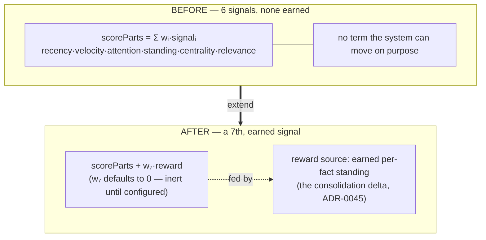

# ADR-0070 — Reward: the seventh salience signal

- **Status:** Accepted 2026-07-09 — Inc 1 shipped (default-inert gate, deployed to
  prod). C6 of the second contraction wave (ADR-0067).
- **Context doc:** [`docs/architecture/compose.md`](../compose.md) — §5.
- **Depends on:** ADR-0006 (salience as the score stage), ADR-0050 (materialize the
  score), ADR-0051 (relevance as the sixth signal — the precedent this copies).
- **Enables:** ADR-0045 / `cerebellar-loop.md` (the consolidation organ needs a
  signal it can move; this is that signal's home in the score).

---

## Context (grounded)

`scoreParts` (`platform/runtime/state.ts:696-728`) is a **pure weighted sum** of six
injected signals — recency · velocity · attention · standing · centrality (scaled by
the type prior) + relevance (added outside the prior). Each is normalised to [0,1]
and multiplied by a weight from `ResolvedSalience`. The room *is* a world model
(state = world, actions = transition, views = observation, the audit log =
trajectory) — but the one cell of that table with no term in the score is **reward**:
the substrate generates trajectories and has *no opinion about their quality*
(`adaptive-salience.md`). This is why `tend` measures chronic debt and never
converges — nothing scores debt-reduction as *better*.

ADR-0051 already showed the disciplined way to add a signal: `relevance` landed with
a **default-0 weight** (`resolveSalience`, `state.ts:477-482`), inert until
configured, so every existing read stayed byte-identical.

## Decision (sketch — tentative)

Add `reward` as the seventh signal, following ADR-0051's shape exactly:

1. **The weight.** Add `rewardWeight` to `SalienceOptions` (the weight block,
   `state.ts:434-438`) and a default `0` in `resolveSalience` (`state.ts:477-482`) —
   inert until set, exactly like `relevanceWeight`.
2. **The signal.** Add `reward?: number` to the `scoreParts` args (beside
   `relevance`, `:697`) and one term to the blend (`:718-726`). Place it **outside**
   the type-prior multiply (like `relevance`) — a reward is a *fact-specific earned*
   signal, not an ambient type bias.
3. **The source.** A durable per-fact number in the `seedReads`/`TouchCounters`
   family (`state.ts:279-286`) — the same "per-fact number folded into the score at
   read" the import-prior mechanism already is. The consolidation organ (ADR-0045)
   writes it: a fact whose ratification/linking reduced backlog earns reward; churn
   that didn't decays. Alternatively a `rewardWeights` map delivered via
   `_config/salience` (mirroring `typePriors`, `parseSalienceConfig:549-555`).
4. **Legibility.** Add the term to `ScoreExplain` (`state.ts:100-108`) and
   `explainScore` (`:1426-1457`) — the one place "add a signal" is not automatic.

## Why now (buffer rationale)

C6 is small and contained (a default-0 weighted-sum extension), but it is the
**load-bearing** completion: it is the reason the self-maintenance organs (C7
`_contested`, C8 consolidation) can *close a loop* rather than just report. Sketching
it now — ahead of C8 — keeps C8's delta-as-reward design honest: the organ should be
built against the score seam that will actually receive its signal, not retrofitted.

## Behaviour-preservation (the gate)

Default-inert proof: with `rewardWeight` at its `0` default and no `reward` source
written, every existing read is **byte-identical** — the parity harness re-runs the
salience suite (`tests/state.test.ts`, `tests/workspace.test.ts`) and asserts scores
unchanged. Then a focused test sets `rewardWeight > 0` + a fact reward and asserts the
score rises by exactly `w₇·reward`.

## Consequences

**Positive** — the substrate gains an *opinion*: the first earned term in the score;
the missing `R(s,a,s′)`; the seam C8 feeds. **Negative / risks** — a reward source
that mis-scores could distort ranking (mitigated by default-0 + explicit opt-in and
`explainScore` visibility); write-amplification if reward is recomputed per read
(mitigated by storing it as a counter, not deriving it).

## Open questions
1. Reward as a stored per-fact counter (durable, cheap read) vs a config-delivered
   `rewardWeights` map (no per-fact write). **Decided (Inc 1): per-fact stored
   number** — set via the write path (`remember`/`ingest` `reward` field, the
   seeds-style carry rule), the organ's natural output.
2. Decay: does reward evaporate like recency, or persist like standing? Proposal:
   slow decay, so stale wins don't hold rank forever. **Open — deferred to the
   consolidation-organ ADR (C8)**, which owns the write policy; Inc 1 persists
   as-written.

## Implementation log

- **2026-07-09 — Inc 1 shipped.** `rewardWeight` in `SalienceOptions` +
  `resolveSalience` default 0 + the `_config/salience` numeric whitelist
  (`SALIENCE_NUMERIC_KEYS`); `StateRecord.reward` persisted with the import-seeds
  carry rule (set/replace on write, preserved across rewrites, clamped [0,1]) +
  codec read-side; the seventh term in `scoreParts` (outside the type prior, like
  relevance) + `ScoreParts.reward`; `wrap` feeds `rec.reward` and surfaces
  `_meta.reward` when set; `ScoreExplain`/`explainScore` carry the term. Write
  path: `remember`/`ingest` accept an optional `reward` (documented in the
  descriptor as the consolidation pass's output).
- **Gate green.** `tests/reward-signal.test.ts` — default-inert twin-fact proof,
  exact `rewardWeight × reward` lift under per-read override *and*
  `_config/salience`, prior-independence, persistence + clamp, explain breakdown,
  pure-function addition. Existing salience fixtures updated (two hand-rolled
  resolved literals + the explain-keys list — the predicted "one non-automatic
  place"). Full suite 591 green.
- **Deployed to prod** via the Deploy CDK workflow on the branch head;
  live-validated with a probe fact (reward set, per-read `salience:{rewardWeight}`
  override lifts its score by exactly the weighted term; default reads unchanged).
