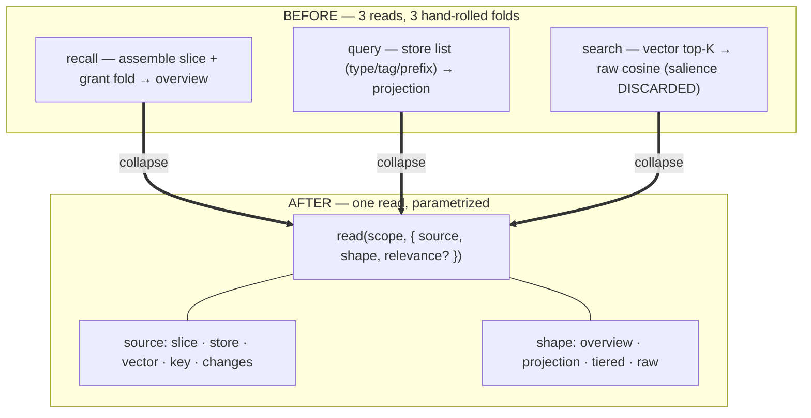

# ADR-0071 — One read by candidate source: `recall` / `query` / `search` → `read(source, shape)`

- **Status:** Accepted 2026-07-09 (built, gated, deployed run #328, validated live).
  C2 of the second contraction wave (ADR-0067).
- **Context doc:** [`docs/architecture/compose.md`](../compose.md) — §2 (Shape B).
- **Depends on:** ADR-0004 (the projection pipeline), ADR-0048 (reads answer at the
  caller's altitude), ADR-0050/0051 (materialized score + relevance). Deprecates
  `search` (already prose-deprecated, ADR-0051).

---

## Context (grounded)

Every read is the pipeline `select → score → shape → present`. `recall`, `query`,
and `search` share the `wrap`/`scoreParts` score stage **and** a `relevance`
injection (ADR-0051), but each re-implements the candidate source and the
own-slice-∪-grants fold:

- `recall` (`commands-read.ts:319-431`) assembles the full slice + folds granted
  slices (`:362-390`), then shapes once.
- `query` (`state.ts:1645-1686`) filters candidates by type/tag/prefix, sorts, pages
  — a projection, no elision.
- `search` (`commands-search.ts:146-213`) pulls the vector top-K (`:180-189`), ranks
  by **raw cosine** (`:197`), re-reads each hit — and **discards salience entirely**.
  Yet `query({ text })` is already documented as "semantic search that still respects
  earned salience" (`commands-read.ts:256`). So `search` is the deprecated shell of a
  read `query` already does correctly; the grant-fold is coded twice
  (`commands-search.ts:180-189` vs `commands-read.ts:373-390`).

The three differ only in **where candidates come from** and **how much shaping the
answer gets**.



## Decision (sketch — tentative)

One read parametrized by candidate source and output shape; the grant-fold and the
`relevance` map computed **once** in the shared path:

```
read(scope, { source, shape, relevance?, ...filters })
   source ∈ { slice (assembled + grants) | store (type/tag/prefix) | vector (top-K) | key | changes }
   shape  ∈ { overview | projection | tiered | raw }

   recall  = read(slice,  overview)
   query   = read(store,  projection)
   search  = read(vector, projection, { relevance })   ← now salience-aware (bug fixed)
   peek    = read(key,    raw)
   changes = read(changes)
```

- Retire `search` into `read(vector, …)`: it gains proper salience ranking for free,
  and the duplicate grant-fold is deleted.
- Legacy `recall` / `query` / `search` / `peek` / `changes` remain as **preset
  aliases** during the deprecation window.

**Boundary.** `attention` (the derived self-maintenance read, `state.ts:1871-1950`)
is a distinct source (settled/stale/unlinked/dangling), not a candidate list — it
stays its own verb (C7/C8 build on it). `peek`/`changes` stay named aliases for
ergonomics (open question).

**Secondary context — elided neighbours (owner direction, 2026-07-09).** Reading an
item or a set is *perception*, and perception has a periphery: the composed `read`
must be able to carry each result's **one-hop neighbourhood at the elided/refs
tier** — key, type, rel, score, no values — so a fact arrives situated, not bare.
Shape: `read(…, { context: 'none' | 'refs' })` (default `none` so parity holds),
where `refs` folds `edges({ around })` per result into a `_context` field, capped
per entry. This reuses C3's composed edge query (the reduction is already one call)
and ADR-0048's tiering — the periphery is *shaped*, never a second full read. The
salience gate already decides what a read shows; this decides what it *hints*.

**Principal-conditioned reads (forward pointer → ADR-0074).** Goals — and even
salience posture — may be properties of the **principal**, not the call: an agent
that has *adopted* a goal should have its reads automatically permuted by it
(relevance bias, lens, thresholds) without passing `text`/`salience` every call.
C2's `read` must therefore resolve its defaults through the same layered merge that
salience already uses (`defaults ← config ← principal ← lens ← override`) with a
**principal layer** slot reserved — so building C2 now does not foreclose ADR-0074.
This is the ADR-0022/0024/0025 reassessment: tokens are minted principals; a
delegation that carries an adopted goal is attenuation *of attention*, not just of
scope.

## Why now (buffer rationale)

C2 is the third of the three shapes, and the one that closes the "surface tells the
truth the runtime implements" story — but it touches salience and the grant fold, so
it follows C1/C3 (which proved the dispatch-by-parameter pattern on lower-risk
surfaces). Sketching it now keeps it in the buffer; it promotes to a full ADR once
C1/C3 are validated live and the pattern is trusted.

## Behaviour-preservation (the gate)

Parity harness: each preset's output deep-equals its legacy verb over a fixture slice
— `recall`'s overview + `_shaping`, `query`'s paging + rank, `peek`'s single fact,
`changes`' tail. The one **intended** change is called out explicitly: `search`
(→ `read(vector)`) now returns salience-ranked results, not raw cosine — a separate
test asserts the *new* ordering and documents the fix (it is a behaviour *change* for
`search` specifically, gated on the ADR, not silent).

## Consequences

**Positive** — one read to reason about; the grant-fold + relevance computed once;
`search`'s salience bug fixed; the three-shapes surface complete. **Negative /
risks** — `search`'s ordering changes (intended, but visible to callers — the
deprecation note must say so); `read`'s `source`/`shape` matrix is larger surface
area than any single verb (mitigated: presets are the documented entry points).

## Open questions
1. Do `peek`/`changes` fold into `read` or stay named aliases? Proposal: named
   aliases — `read(key)` / `read(changes)` — collapse only recall/query/search.
2. Is `source: vector` always `relevance`-driven, or can it rank by salience alone
   (a "most-salient semantically-near" read)? Proposal: `relevance` optional; absent
   = salience-only over the vector candidate set.

## Implementation log (2026-07-09)

- **The shape.** `services/workspace/commands-read.ts`: `read(input)` — a pure
  dispatch over the presets (the C1/C3 pattern), `source ∈ slice · store · vector ·
  key · changes`, inferred from the args when omitted (`inferSource`: explicit wins;
  `key` → key; `sinceSeq`/`last`/`include` → changes; store filters → store;
  `text` → vector; bare → slice). Presets (`recall`/`query`/`peek`/`changes`) stay
  first-class; `search` stays deprecated with `read({source:'vector'})` as its
  replacement — the vector source rides `query({text})`, so it is salience-ranked
  (the fix), not raw cosine.
- **Enrichment 1 — the periphery (owner steer).** `context:'refs'` attaches
  `_context` to each result: one-hop neighbour refs `{key, rel, dir, type?,
  derived?}` — NO values (the elided tier as a hint, ADR-0048) — computed from ONE
  Reference-projection pass indexed by endpoint, capped (`contextLimit`, default 8,
  max 24). Default `'none'` → byte parity. Overview and changes shapes skip it.
- **Enrichment 2 — the principal seam (ADR-0074 reservation).** `principalPosture()`
  is a typed no-op in the defaults merge (`defaults ← config ← PRINCIPAL ← lens ←
  override`); posture supplies what the call didn't say, caller args win. ADR-0074
  lands there without moving C2.
- **Gate.** `tests/read-composed.test.ts` (7): inference table; per-source parity
  (bare/full ≡ recall, type/text ≡ query, key ≡ peek, changes ≡ changes); periphery
  attach/cap/value-free; principal-layer inertness. Peek parity is **modulo
  touch-derived fields** (score/standing/velocity) — a read *touches* by design
  (ADR-0007), so two sequential reads are never byte-equal; documented in the test.
  Suite 611 green; catalog-sync gate covers the new descriptor.
- **Deploy + live validation.** Deploy CDK run #328 (commit `2b4d0cf`) → prod,
  success. Live: bare `workspace.read` ≡ recall overview; `read({key:
  'kb/cognitive-substrate', context:'refs'})` returned the fact + 8 value-free refs
  (authored `addresses`/`elaborates`/`informs`/`refines` + inferred `similarTo`,
  both directions); `read({type:'goal', context:'refs', contextLimit:4})` decorated
  each entry, correctly capped.
- **Open question 1 resolved as proposed:** peek/changes stay named presets;
  `read` subsumes them by dispatch, not by removal.
