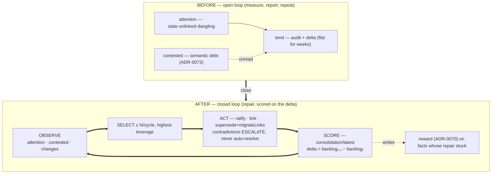

# ADR-0073 — The consolidation organ: tending scored on the delta it moves

- **Status:** Proposed 2026-07-09 (buffer — feedback welcome before build). C8 of the
  second contraction wave (ADR-0067) — the wave's terminal piece: the closed
  self-maintenance loop. Enters the buffer with every dependency built.
- **Context doc:** [`docs/cerebellar-loop.md`](../../cerebellar-loop.md) — Primitive 2
  (the full design); [`compose.md`](../compose.md) §7.
- **Depends on:** ADR-0070 (reward — the signal this organ *writes*), ADR-0072
  (contested — the semantic debt this organ *consumes*), ADR-0069 (edges), ADR-0032
  (ratify/suggestions), ADR-0066 (proof-of-read CAS for safe concurrent repair).
- **Completes:** ADR-0040/0045 (the self-maintaining wiki) — the loop that
  `adaptive-salience.md` diagnosed as missing: the substrate finally has an opinion
  about its own trajectory quality, *and acts on it*.

---

## Context (grounded)

The correction primitives all exist and are all open-loop. `attention` measures
stale/unlinked/dangling; `tend` writes an audit whose `delta` has been flat-to-
negative for weeks (`stale=195` flat, `unlinked=396` growing across three
consecutive runs — the live evidence in `cognitive-substrate.md` §5); `contested`
(ADR-0072) now measures semantic debt; `reward` (ADR-0070) gives the score a
default-0 earned term that nothing yet writes. The tending protocol
(`kb/b27cf397005a4f`) is explicitly observe-and-dispatch — "its power comes from
knowing when to hand off" — and the dispatched specialists demonstrably aren't
denting the trend. No component's *job* is to reduce the backlog, and no
component's *score* is the reduction.

## Sketch (decisions, tentative)

Per `cerebellar-loop.md` Primitive 2, refined by what the wave built:

1. **Form: a tier-2 cell (`@c15r/consolidate`)** with one `run` tool, invoked on a
   schedule (the tending machine dispatches it) or manually. Tier-2 because the
   loop calls `models` for Stage B adjudication and needs its own bounded blast
   radius; deployed via `cell-sync.mjs` (the tier-2 path, no CDK).
2. **The cycle** (bounded, ≤ N=20 items default):
   - `OBSERVE` — `workspace.attention` (structural debt) + `workspace.contested`
     (semantic debt) + `workspace.changes {sinceSeq}` (what moved since last run).
   - `SELECT` — highest leverage first: `suggestions` above a confidence bar →
     `ratify`; unlinked high-salience facts → propose/write `link`; dangling edges →
     `unlink` or `supersede + migrateLinks`; `contested` verdicts: `duplicate` →
     supersede (keep the higher-standing twin), `contradict` → **escalate only**
     (a `proposal/*` fact; never auto-resolve a contradiction).
   - `ACT` — apply the safe tier directly (with `ifVersion` CAS so concurrent
     edits lose nothing); file the rest as `proposal/*`.
   - `SCORE` — `backlogₜ = |stale| + |unlinked| + |dangling| + |contested|`;
     `delta = backlogₜ₋₁ − backlogₜ` (positive = progress); write
     `consolidation/latest {backlog, delta, actions, escalations}`.
3. **The reward hook (the point).** Facts whose repair *stuck* (the edge survived
   the next cycle; the supersession wasn't reverted) get `remember {reward}` bumps
   (ADR-0070's write path); churn that didn't stick decays toward 0. The organ's own
   `delta` history is its report card: a run reporting the same backlog twice is, by
   its own score, a failure.
4. **Autonomy ladder** (scope-gated): ratify-above-bar and link-to-obvious-anchor
   direct; supersede-duplicate direct only when the standing gap is clear, else
   propose; **contradictions always escalate**.

## Why now (buffer rationale)

This is the wave's terminal piece and every input it consumes (contested, reward,
edges, ratify, attention, CAS) is now built and live. Sketching it while C7's live
adjudication data accumulates keeps the design honest: the organ's SELECT policy
should be tuned against *real* contested verdicts and *real* attention backlog, not
hypothesized ones.

## Behaviour-preservation (the gate)

The organ only *acts through existing verbs*, so the gate is not parity but
**convergence + safety**: (a) on a fixture slice with seeded debt, three cycles
produce a monotonically positive cumulative delta; (b) idempotence — a cycle over a
clean slice writes nothing but its audit; (c) the escalation tier — a seeded
contradiction is never auto-resolved; (d) CAS safety — a concurrent edit to a
repair target aborts that item, not the run. Live acceptance: `consolidation/latest.
delta > 0` across three consecutive prod cycles on the real backlog — the exact
failure the 2026-07-08 tending audit records, reversed.

## Open questions
1. Cell vs machine-rail: a `@c15r/consolidate` cell, or a `machine/consolidation`
   DyGram with `work` rails? Proposal: cell first (simpler loop, own logs), machine
   integration after.
2. Reward decay policy (deferred from ADR-0070): proposal — multiply by ~0.9 per
   cycle-touched, floor at 0; revisit with live data.
3. Does the organ subsume the `tend` audit, or feed it? Proposal: feed —
   `tend` remains the observer of record; the organ is the actor it reports on.
