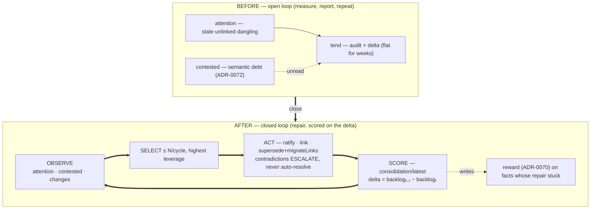

# ADR-0073 — The consolidation organ: tending scored on the delta it moves

- **Status:** Accepted 2026-07-09 — Inc 1 shipped as `@c15r/consolidate`
  (tier-2, cell-sync deployed), first live cycles run on prod: **delta +11**, the
  first positive consolidation delta on the real backlog; the reward loop fired on
  its first opportunity. C8 of the second contraction wave (ADR-0067) — the loop,
  closed.
- **Context doc:** [`docs/cerebellar-loop.md`](../../cerebellar-loop.md) — Primitive 2
  (the full design); [`compose.md`](../compose.md) §7.
- **Depends on:** ADR-0070 (reward — the signal this organ *writes*), ADR-0072
  (contested — the semantic debt this organ *consumes*), ADR-0069 (edges), ADR-0032
  (ratify/suggestions), ADR-0066 (proof-of-read CAS for safe concurrent repair).
- **Completes:** ADR-0040/0045 (the self-maintaining wiki) — the loop that
  `adaptive-salience.md` diagnosed as missing: the substrate finally has an opinion
  about its own trajectory quality, *and acts on it*.

---

## Context (grounded)

The correction primitives all exist and are all open-loop. `attention` measures
stale/unlinked/dangling; `tend` writes an audit whose `delta` has been flat-to-
negative for weeks (`stale=195` flat, `unlinked=396` growing across three
consecutive runs — the live evidence in `cognitive-substrate.md` §5); `contested`
(ADR-0072) now measures semantic debt; `reward` (ADR-0070) gives the score a
default-0 earned term that nothing yet writes. The tending protocol
(`kb/b27cf397005a4f`) is explicitly observe-and-dispatch — "its power comes from
knowing when to hand off" — and the dispatched specialists demonstrably aren't
denting the trend. No component's *job* is to reduce the backlog, and no
component's *score* is the reduction.

## Sketch (decisions, tentative)

Per `cerebellar-loop.md` Primitive 2, refined by what the wave built:

1. **Form: a tier-2 cell (`@c15r/consolidate`)** with one `run` tool, invoked on a
   schedule (the tending machine dispatches it) or manually. Tier-2 because the
   loop calls `models` for Stage B adjudication and needs its own bounded blast
   radius; deployed via `cell-sync.mjs` (the tier-2 path, no CDK).
2. **The cycle** (bounded, ≤ N=20 items default):
   - `OBSERVE` — `workspace.attention` (structural debt) + `workspace.contested`
     (semantic debt) + `workspace.changes {sinceSeq}` (what moved since last run).
   - `SELECT` — highest leverage first: `suggestions` above a confidence bar →
     `ratify`; unlinked high-salience facts → propose/write `link`; dangling edges →
     `unlink` or `supersede + migrateLinks`; `contested` verdicts: `duplicate` →
     supersede (keep the higher-standing twin), `contradict` → **escalate only**
     (a `proposal/*` fact; never auto-resolve a contradiction).
   - `ACT` — apply the safe tier directly (with `ifVersion` CAS so concurrent
     edits lose nothing); file the rest as `proposal/*`.
   - `SCORE` — `backlogₜ = |stale| + |unlinked| + |dangling| + |contested|`;
     `delta = backlogₜ₋₁ − backlogₜ` (positive = progress); write
     `consolidation/latest {backlog, delta, actions, escalations}`.
3. **The reward hook (the point).** Facts whose repair *stuck* (the edge survived
   the next cycle; the supersession wasn't reverted) get `remember {reward}` bumps
   (ADR-0070's write path); churn that didn't stick decays toward 0. The organ's own
   `delta` history is its report card: a run reporting the same backlog twice is, by
   its own score, a failure.
4. **Autonomy ladder** (scope-gated): ratify-above-bar and link-to-obvious-anchor
   direct; supersede-duplicate direct only when the standing gap is clear, else
   propose; **contradictions always escalate**.

## Why now (buffer rationale)

This is the wave's terminal piece and every input it consumes (contested, reward,
edges, ratify, attention, CAS) is now built and live. Sketching it while C7's live
adjudication data accumulates keeps the design honest: the organ's SELECT policy
should be tuned against *real* contested verdicts and *real* attention backlog, not
hypothesized ones.

## Behaviour-preservation (the gate)

The organ only *acts through existing verbs*, so the gate is not parity but
**convergence + safety**: (a) on a fixture slice with seeded debt, three cycles
produce a monotonically positive cumulative delta; (b) idempotence — a cycle over a
clean slice writes nothing but its audit; (c) the escalation tier — a seeded
contradiction is never auto-resolved; (d) CAS safety — a concurrent edit to a
repair target aborts that item, not the run. Live acceptance: `consolidation/latest.
delta > 0` across three consecutive prod cycles on the real backlog — the exact
failure the 2026-07-08 tending audit records, reversed.

## Open questions
1. Cell vs machine-rail. **Decided (Inc 1): cell** (`@c15r/consolidate`); machine
   integration (a tending rail dispatching `run`) is the follow-on.
2. Reward decay policy (deferred from ADR-0070): proposal — multiply by ~0.9 per
   cycle-touched, floor at 0; revisit with live data.
3. Does the organ subsume the `tend` audit, or feed it? Proposal: feed —
   `tend` remains the observer of record; the organ is the actor it reports on.

## Implementation log

- **2026-07-09 — Inc 1 shipped** as `cells/consolidate/index.ts` (tier-2;
  `cells.create` + `cell-sync push --deploy` under a minted, since-revoked deploy
  token). The organ acts as a **scoped principal**: `run({ token, dryRun? })` takes
  a narrowed bearer (`read:workspace write:workspace`) and reaches the substrate
  only through the gateway PEP — the ADR-0022/0024 delegation pattern in practice,
  and the seam ADR-0074 (principal-adopted goals) extends. `latest` is the one
  ambient-IAM read. Planning core (`planCycle`) is pure and exported; gate
  `tests/consolidate-plan.test.ts` (caps · delta scoring · contradictions
  escalate-only · survivor-only rewards · clean-slice idempotence).
- **First live cycles (prod).** Dry run scored the real backlog at **1025**
  (stale 311 · unlinked 409 · dangling 3 · contested 302). Cycle 1 applied 5
  ratifies + 3 dangling unlinks (and hit the default 10s cell timeout mid-cycle —
  fixed with `cells.configureCell { timeoutSeconds: 120 }` + redeploy; the audit
  had landed, so the chain held). Cycle 2 ran clean: **backlog 1014, delta +11** —
  the first positive consolidation delta on the live corpus (against the 07-08
  tending audits' frozen/growing pattern) — ratifying, among others, the four
  val-town protocol docs to their protocol facts (`fix.md ↔ kb/ae96…`,
  `weave.md ↔ kb/b3fe…`, `improve.md ↔ kb/cdd3…`) — links the weave dispatches
  never landed. **Dangling: 3 → 0** (a category zeroed on the first pass).
- **The reward loop fired on its first opportunity:** cycle 2 verified cycle 1's
  ratifications still held and wrote `reward: 0.5` onto the six surviving
  endpoints (`via: consolidate.reward`) — the organ now *writes* the signal
  ADR-0070 gave a home. `consolidation/latest` + a per-run archive carry the audit.
- **Live findings for Inc 2:** (a) top kinship pairs were *untyped* legacy `el:`
  mirrors that evade the type-based noise floor — a typing backfill (or key-prefix
  noise rule in `_config/suggestions`) sharpens SELECT; (b) contested Stage B
  in-cycle (a metered `models` call for verdicts) remains the next autonomy rung;
  (c) sequential gateway calls dominate the cycle wall-clock — batch or parallelise
  under the 120s budget.

## Inc 2 — Stage B made drivable (`machine/consolidate`, 2026-07-14)

Open question #1 resolved the other way for the *judgment* layer: the reflex
(Stage A + scoring) stays the cell, but **Stage B contested adjudication is now a
drivable DyGram machine** — `machine/consolidate` (Observe → Select → Adjudicate →
Recorded, ADR-0084 drive surface). The reason is the same medicine that revived
tending: Stage B was hard-wired to spawn `models`, which has been dead ~5 days
behind the credit wall (`kb/consolidation-anthropic-credit-exhausted`). Reframed
as a machine, **driven mode lets a capable session adjudicate the contested
backlog directly — no `models` call, no billing wall.** Verdicts land as `claim`
facts (better provenance than the old `stageB.note`), the run carries the ADR-0084
embodiment record (`run.mode` = who adjudicated), and the cell's `run` tool stays
the deterministic reflex it always was — a thin machine over a preserved organ,
not a rewrite.

- **First driven cycle** (`machine/consolidate/run/2026-07-14-first-driven-cycle`)
  — the first successful Stage B since 2026-07-09. Adjudicated 8 contested pairs;
  all `independent`, recorded to `checked/*` (they drop from the read).
- **The finding that matters more than the 8 verdicts:** the contested read
  (`total: 3492`) is dominated by **byte-identical boilerplate doc-blocks** — every
  ADR's bare `## Decisions` block shares one version hash, so the kinship pass
  pairs them combinatorially, ~N² false positives. Captured as
  `kb/contested-noise-floor-boilerplate-doc-blocks` (sibling of the lit
  placeholder-dangler bug): the fix is a noise floor excluding same-version-hash /
  heading-only blocks in the vector-indexer or lit-decomposer, which drops
  hundreds of candidates at once. **Per-pair hand-adjudication doesn't scale; the
  noise-floor fix does** — the driven cycle's job was to *surface* that, which the
  billing-blocked per-pair path never could.
- **Open (unchanged by this):** reactive Stage B still needs the credit top-up;
  the noise-floor fix is a separate `fix`-class code change; the run-lease question
  (`kb/multi-driver-run-ownership`) applies to `machine/consolidate` too.
