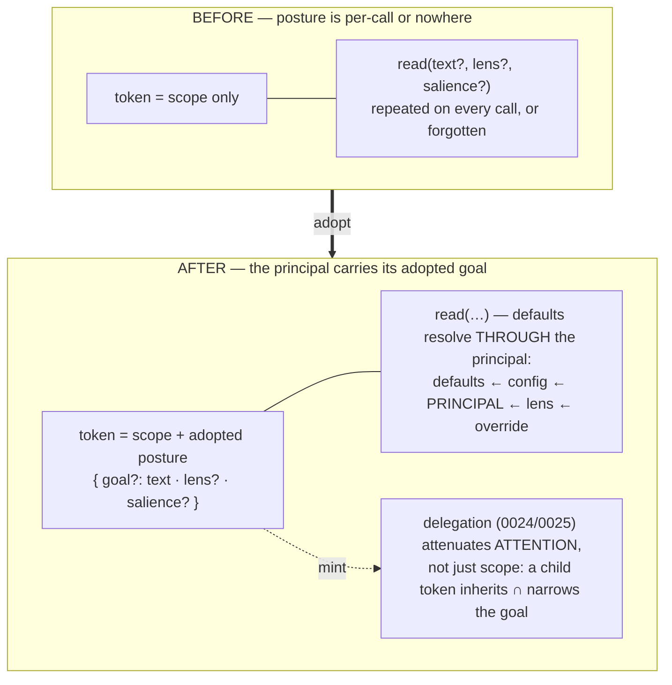

# ADR-0074 — Principal-adopted goals: attention as a property of the principal

- **Status:** Proposed 2026-07-09 (buffer — feedback welcome before build). Enters
  the buffer beside ADR-0071 (C2) now that C8 closed the wave's loop; this is the
  owner-directed reassessment of the auth track (ADR-0022/0024/0025) against the
  score stage (ADR-0050/0051/0070).
- **Context:** owner direction (2026-07-09): *"goals and even salience might be
  principal specific — an agent can adopt a goal and its queries are automatically
  permuted/perturbed by that."* Also the standing gap the plate has carried since
  the capture pass: **no persistent global goal/attention state** — `relevance`
  biases a read only when `text` is passed on that call.
- **Depends on:** ADR-0022 (tokens as minted principals), ADR-0051 (relevance),
  ADR-0070 (reward), ADR-0010 (layered resolution). **Shapes:** ADR-0071 (C2 must
  reserve the principal layer in its defaults merge — recorded there), ADR-0024/
  0025 (the delegation sketches this refines: attenuation of *attention*, not just
  of scope).

---

## Context (grounded)

Three facts already point at one seam:

- A **principal is already a first-class, stored thing**: `auth.mintToken` narrows
  a bearer to ≤ the minter's standing, with a label and an id — the consolidation
  organ (ADR-0073) *runs as one*. But a principal today carries only **scope**
  (what it may see/do), never **posture** (what it is *for*).
- The score stage is already **layered per call**: `defaults ← _config/salience ←
  lens ← override` (`resolveSalience` + `callSalience`, ADR-0010/0050), and the
  intent (`relevance`) and earned (`reward`) terms are default-inert weights. But
  every layer is either *slice-global* (config) or *per-call* (lens/override) —
  there is no layer between them.
- Agents repeat themselves: an agent working goal G passes `text: G` (or a lens)
  on every read, or forgets to — the unknown-unknowns failure `adaptive-salience.md`
  named ("an agent choosing its own curriculum").

## Sketch (decisions, tentative)

1. **Posture on the principal.** A token (and later a session principal) may carry
   an adopted posture: `{ goal?: string, lens?: SalienceLens, salience?:
   Partial<SalienceOptions> }`. Stored with the token record (auth) or as a
   substrate fact keyed by principal (`_principals/<id>/posture`) — open question;
   the fact form keeps it observable/tendable, the token form keeps it attested.
2. **Resolution gains the principal layer.** The read path resolves
   `defaults ← _config/salience ← principal.posture ← lens ← override` — one new
   slot in the existing layered merge (ADR-0010), nothing else moves. A principal
   with `goal` gets that goal embedded once and applied as the `relevance` map on
   every read (the ADR-0051 machinery, principal-conditioned instead of per-call).
3. **Adoption is a verb.** `auth.adoptGoal { tokenId?, goal, lens?, salience? }`
   (self by default) — an agent *adopts* a goal mid-session; `auth.dropGoal`
   releases it. Adoption events land in the trajectory, so tending can see what
   the fleet is attending to.
4. **Delegation attenuates attention (the 0024/0025 reassessment).** When a
   principal mints a child (0024's chain), the child inherits the parent's posture
   and may only **narrow** it (a sub-goal), exactly as scope only narrows — 0025's
   holder-side attenuation applied to *attention*. A dispatched sub-agent is then
   automatically perturbed toward its parent's purpose, without prompt plumbing.
5. **Reward stays factual, goals stay principal.** The posture biases *reads*;
   it never writes. `reward` (ADR-0070) remains earned-per-fact; a goal is a lens,
   not a score mutation — so two principals reading the same slice still see the
   same facts, differently *ranked*.

## Why now (buffer rationale)

C2 (ADR-0071) is about to rebuild the read surface; if it ships without a reserved
principal layer in its defaults merge, this ADR becomes a retrofit. Sketching it
now (per the two-ahead discipline) makes the reservation binding — ADR-0071
already records it. And C8 just demonstrated the pattern concretely: the organ
runs as a minted principal whose *purpose* is currently carried in prose; posture
makes that purpose machine-legible.

## Behaviour-preservation (the gate)

Default-inert, twice over: a principal with **no posture** resolves identically to
today (the new layer is empty); a principal **with** posture changes only ranking/
shaping, never membership of the readable set (scope untouched). Parity: reads
under a posture-free token are byte-identical before/after; a postured token's
reads equal today's reads with the equivalent per-call `text`/`lens` supplied.

## Open questions
1. Posture storage: on the auth token record vs a `_principals/*` substrate fact
   (observable, tendable, but weaker attestation)? Leaning: token record as truth,
   mirrored to a fact for observability.
2. Does a *human* session adopt goals the same way (a "focus mode"), and does the
   home UI surface the active posture?
3. Interaction with grants: does a shared slice read under the *reader's* posture
   only (proposal: yes — posture is the observer's, never the owner's)?
