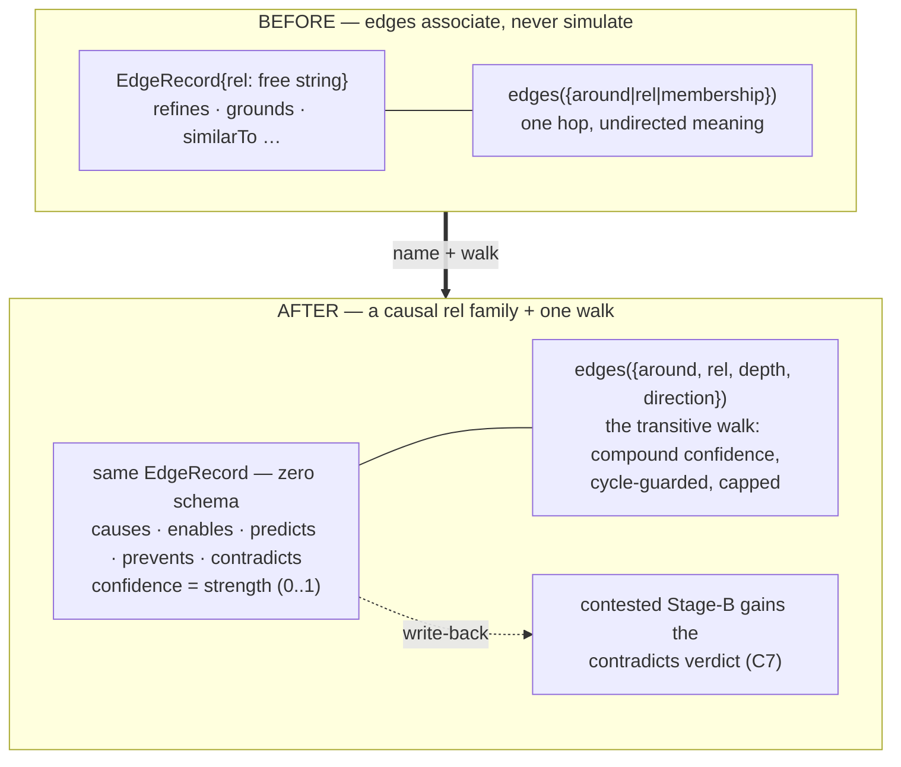

# ADR-0075 — Causal relations: the simulation affordance on existing edges

- **Status:** Accepted 2026-07-09 (built, gated, deployed run #331, validated live).
  **C4** of the second contraction wave (ADR-0067), the "completion" that costs
  no schema.
- **Context doc:** `docs/architecture/compose.md` (C4 row);
  `docs/cognitive-substrate.md` §6 proposal 4 (the counterfactual gap);
  `docs/trajectory/2026-06-18-elicit-world-models-and-the-substrate.md` §1 "Next".
- **Depends on:** ADR-0069 (C3 `edges` — the one edge query causal traversal rides),
  ADR-0009 (edge strength tiers), ADR-0072 (C7 contested — `contradicts` write-back).
- **Completes:** the world-model thesis's simulation layer — edges that support
  *"what happens if"*, not just *"what relates to"*.

---

## Context (grounded)

Edges are semantically inert today: `rel` is a **free string** (`EdgeRecord.rel`,
`state.ts:326`), and the graph machinery treats every rel identically — good for
association ("what relates to X"), useless for direction-of-consequence ("what
does X *cause*?"). Yet every slot the causal layer needs already exists:

- **`rel` is open vocabulary.** Nothing in the store, the salience stage, or the
  C3 `edges` query enumerates rels — `causes`/`enables`/`predicts`/`prevents`
  are legal *today*. This is the open-vocabulary discipline working as intended:
  the contraction is not new machinery, it is **naming a rel family and giving
  it one traversal affordance**.
- **Confidence already rides `strength`.** `link` accepts `strength?`
  (`commands-graph.ts:14,68`), stored per edge and fed into weighted centrality
  (`state.ts:786-793`, authored default 1.0). A causal claim held at 0.7
  confidence is `link({from, rel:'causes', to, strength:0.7})` — and it
  *automatically* contributes proportionally less centrality. (`score` stays
  reserved for inferred-cosine per ADR-0032 — confidence is authored, so it
  belongs in `strength`.)
- **The one-edge-query seam exists.** Post-C3, `edges({rel:'causes'})` already
  filters the family; what's missing is the **multi-hop directional walk** —
  "what does X enable, transitively, and at what compound confidence?"
- **C7 wants `contradicts`.** The contested view's Stage-B write-back
  (ADR-0072) currently supersedes or annotates; a `contradicts` edge is the
  honest middle verdict ("both stand, in tension") and it is a causal-family
  citizen (directional, confidence-weighted).

## Sketch (decisions, tentative)

1. **The family is declared, not compiled.** Causal rels are recorded as slice
   vocabulary (the `_config`/type-declaration seam, exactly like
   `_config/suggestions`), seeded with `causes · enables · predicts · prevents ·
   contradicts` as the documented floor. No code enumerates them; the walk takes
   `rel` (or a rel list) as input.
2. **Confidence is `strength`.** 0..1, authored, defaulting to 1.0 like every
   authored edge; compound confidence along a path is the product. No new field.
3. **One affordance: the directional walk.** C3's `edges` grows
   `{depth?: number, direction?: 'out'|'in'}` (default depth 1 = today,
   behaviour-preserving): `edges({around:'kb/x', rel:'enables', depth:3,
   direction:'out'})` returns paths with compound confidence, cycle-guarded,
   result-capped. This is the counterfactual read: *downstream of X* /
   *what would breaking X break*.
4. **C7 integration.** contested's Stage-B vocabulary gains the `contradicts`
   edge as a first-class verdict; the consolidation organ (C8) may then ratify
   or decay `contradicts` edges like any other repair.
5. **Nothing changes for existing reads.** Depth-1 default keeps every current
   caller byte-identical; causal rels appear in `edges`/`neighbors` like any
   authored edge (they already would today).

## Why now (buffer rationale)

C3 shipped the one edge query and C7/C8 shipped the self-maintenance loop that
can *tend* causal claims — C4 is the last cheap completion in the wave, and the
first one that makes the graph *predictive* rather than associative. Sketching
it while ADR-0074 (posture) sits beside it is deliberate: a principal postured
on a goal reads *through* relevance; a slice with causal edges lets that same
principal ask "what advances this goal" structurally, not just semantically.

## Behaviour-preservation (the gate)

`edges` with no `depth`/`direction` stays byte-identical (parity vs today's
composed and legacy verbs). New-rel writes are just authored edges — centrality
shifts only by their declared strength, exactly as any authored link does today.
The walk is a new read, gated by its own tests (path assembly, compound
confidence, cycle guard, caps).

## Open questions

1. Where does the family declaration live — `_config/relations` (slice config)
   or per-type `rels` in type declarations (the `types.json` seam)? Leaning
   config: rels are cross-type.
2. Should the walk surface as `edges({depth})` or a distinct `trace` read?
   Leaning `edges` — one shape, per C3.
3. Does compound confidence interact with salience (a low-confidence causal
   neighbourhood scoring lower), or stay a read-time annotation only? Leaning
   annotation-only until reward (C6 data) says otherwise.

## Implementation log (2026-07-09)

- **Zero schema held.** No store, salience, or write-path change. The family is
  documented as a floor (`causes · enables · predicts · prevents · contradicts`)
  in the `edges` descriptor — nothing in code enumerates it; any rel walks.
  Confidence rides the existing authored `strength` (open question... resolved
  as sketched; `score` stays inferred-only per ADR-0032).
- **The walk (open question 2 → `edges`, as leaned).**
  `edges({around, rel?, depth: 2–6, direction: 'out'|'in'})`
  (`commands-graph.ts` `walkFrom`): all maximal simple paths over AUTHORED
  edges via the `edgesFrom`/`edgesTo` indexes (the derived backbone is type
  plumbing — a simulation follows asserted claims), compound confidence =
  Π step strength (authored null = 1), cycle-guarded, capped (depth 6 ·
  200 paths · 500 expansions, `truncated` flag), sorted confidence-descending,
  steps auditable in stored from→to orientation. `depth` 1/absent keeps every
  C3 framing byte-identical.
- **Gate.** `tests/causal-walk.test.ts` (6): one-hop parity; compound
  confidence + ordering + step audit; rel-family isolation (and the no-rel
  walk); cycle guard (a c→a back-edge never revisits); upstream walk; depth
  clamp + leaf root. Suite 627 green.
- **Live validation (deploy run #331).** Authored the first real causal chain:
  `kb/contested-view —enables(0.9)→ kb/consolidation-organ —enables(0.8)→
  kb/cognitive-substrate` (both true claims: the contested read is the organ's
  Stage A input; the organ powers the substrate's self-maintenance layer).
  Downstream walk from `kb/contested-view` returned the 2-step path at
  confidence **0.72**; the upstream walk from `kb/cognitive-substrate`
  (`direction:'in'`) returned the same path mirrored, steps in stored
  orientation.
- **Open question 1 (where the family declaration lives) deferred** to the
  first consumer that needs to *enumerate* the family (a renderer-by-rel or the
  organ's Stage B) — until then the floor is documentation, which is exactly
  what the open-vocabulary discipline wants. Question 3 resolved as leaned:
  confidence stays a read-time annotation; reward data may revisit.
