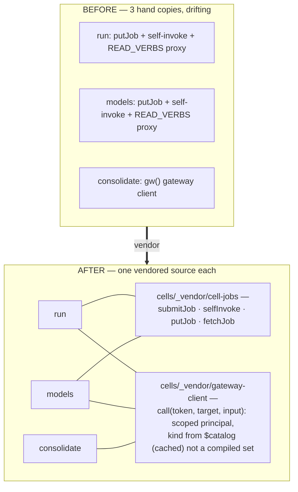

# ADR-0076 — Vendor cell-jobs: one async harness, one gateway client

- **Status:** Accepted 2026-07-09 (built, gated, deployed tier-2, validated live).
  **C5** of the second contraction wave (ADR-0067) — the DRY completion and the
  wave's last entry: **the ADR-0067 table is complete**.
- **Context doc:** `docs/architecture/compose.md` (C5 row).
- **Depends on:** ADR-0026/0028 (the run/models cells whose in-code TODO this
  honours), ADR-0073 (C8 — the third consumer), ADR-0074 (postured principals —
  the minted tokens these clients call with).

---

## Context (grounded)

Tier-2 cells that do long work or act through the gateway have hand-copied the
same two harnesses three times:

- **The async job pattern** — `submit fast → putJob(pending) → self-invoke →
  do the work → putJob(done|error) → poll via fetch` (the edge caps sync calls at
  ~30s). Duplicated verbatim: `cells/run/index.ts:165-262` and
  `cells/models/index.ts:705-750`.
- **The gateway client** — call `/mcp` as a **scoped principal** (a minted
  token), classify the target read-vs-act, unwrap the JSON-RPC envelope.
  Duplicated three times: `cells/run/index.ts:35-60` (whose comment says *"vendor
  a shared module when a second consumer lands"*), `cells/models/index.ts` (the
  original), and now `cells/consolidate/index.ts` (`gw()` — the C8 organ). The
  TODO's own condition is met twice over.
- **The vendoring precedent exists**: cells already share vendored modules
  (`cells/machine/substrate.js`, the kernel's static client) — a cell bundle is
  self-contained, so "shared" means *one source, vendored at deploy*, not a
  runtime dependency.
- **A vocabulary smell rides along**: each copy hardcodes a `READ_VERBS` set to
  classify targets read-vs-act — a compiled vocabulary that drifts from the real
  descriptors (C2's `read` isn't in models' copy, e.g.). The descriptor's `kind`
  is the truth; a client should learn it from `$catalog` (cached) or take it as
  an argument, per the open-vocabulary discipline (compose.md §8).

## Sketch (decisions, tentative)

1. **Two modules, one home.** `cells/_vendor/cell-jobs.ts` (the async harness)
   and `cells/_vendor/gateway-client.ts` (the scoped-principal caller), vendored
   into each cell's bundle at deploy exactly like the substrate.js precedent —
   no runtime coupling between cells.
2. **cell-jobs surface.** `submitJob(table, kind, input) → {jobId, poll}` ·
   `runJob(jobId, work)` (self-invoke wrapper: pending → work() → done|error) ·
   `fetchJob(table, jobId)`. The cells keep their own TOOLS/table names — the
   module owns only the choreography.
3. **gateway-client surface.** `call(token, target, input)` — JSON-RPC envelope,
   error unwrap, and read-vs-act from a **cached `$catalog` lookup** with the
   compiled verb set demoted to a fallback floor (open-vocabulary rule). Timeout
   + single retry knobs, since organ wall-clock is dominated by these calls
   (ADR-0073 impl log).
4. **Behaviour-preserving.** run/models/consolidate keep byte-identical tool
   results; the only change is where the code lives. Gate: existing cell tests +
   a jobs-module unit gate (pending→done, pending→error, poll shape).
5. **Postured principals plug in.** The client takes the minted token as-is; a
   parent that postures a child token (ADR-0074) changes nothing here — the bias
   is applied by the workspace read path, invisibly to the client.

## Why now (buffer rationale)

C5 is the wave's last row. Every earlier contraction either composed a surface
(C1/C2/C3) or completed a loop (C6/C7/C8); C5 is pure debt — and it grew a third
copy while the wave ran. Landing it closes ADR-0067's table and hands the next
wave a clean seam: any future organ (goal-driven agents on postured tokens are
the obvious next) starts from the vendored client instead of a fourth copy.

## Open questions

1. Vendor at deploy (cell-sync copies `_vendor/` into the bundle) vs a build-time
   import path — which does the current esbuild bundling make cheaper?
2. Should `gateway-client` also own token minting/revocation choreography
   (mint-per-run, revoke-after), or stay call-only? Leaning call-only — minting
   policy is the organ's, not the transport's.
3. Does the `$catalog` kind cache live per-invocation (simple) or in the cell's
   table (fewer catalog reads)? Leaning per-invocation until measured.

## Implementation log (2026-07-09)

- **Home redirected by owner aside** (*"do we not already have a shared sdk?"*):
  yes — `@c15r/kernel` IS the SDK cell (ADR-0017: `static/substrate.js`, the
  shared server-side client; machine's copy is a manual "keep in sync" vendored
  duplicate because server-side https imports hang the forge bundler). So the
  two new modules joined the EXISTING SDK — `cells/kernel/static/
  gateway-client.js` + `cell-jobs.js`, plain JS + JSDoc + injected adapters,
  exactly the substrate.js idiom — instead of opening a parallel `cells/_vendor`
  lane. Served at `/@c15r/kernel/{gateway-client,cell-jobs}.js`.
- **The overlay (open question 1 → resolved: vendor at deploy).** `cell-sync
  push` scans the cell's sources for `vendor/<module>.js` references and
  materializes each from `cells/kernel/static/` into the cell as
  `vendor/<module>` (the forge rejects a leading-underscore segment); `pull`
  skips `vendor/` so no copy ever lands in git. This is the machine cell's
  manual keep-in-sync note, automated. Jest maps `vendor/*.js` to the canonical
  source (the `@parc/runtime/cell` virtual-module precedent).
- **gateway-client.** `gwCall(token, target, input?, {kind?, url?, fetchImpl?})`
  — throws `GatewayError`; `{error}`-contract consumers wrap. Classification:
  `READ_VERB_FLOOR` (the union of the three drifted copies + C2's `read`) as a
  floor, with **wrong-verb self-healing** — the gateway's own mismatch error
  names the right verb and the call retries once — so classification can't
  drift per copy again (sketch item 3's $catalog cache replaced by something
  cheaper and truer: the PEP is the oracle). `gwCallMany` = bounded-concurrency
  batching (default 4; ADR-0073's wall-clock finding fixed at the seam —
  open question 3 resolved: it belongs here). Open question 2 resolved as
  leaned: call-only, minting stays the organ's policy.
- **cell-jobs.** `cellJobs({put, get, invokeSelf})` — the JOB# row shape, TTL,
  `submit` (pending + `{__job}` self-invoke), and chunking (`JOB_CHUNK` under
  the DDB item cap). SDK-free by injected ops, like substrate.js.
- **Consumers.** run (copy #1: proxy + jobs), models (the original, and the most
  drifted — its verb set was missing six read verbs and it had DROPPED the
  tool-isError check, so a failed proxied tool returned to the agent loop as a
  success payload; both fixed at the seam), consolidate (copy #3: `gw()` is now
  a one-line wrapper). ~90 duplicated lines deleted across the three.
- **Gate.** `tests/kernel-sdk-jobs.test.ts` (7): envelope/token/classification,
  isError + HTTP throw, wrong-verb self-heal both directions (+ explicit-kind
  bypass), callMany order/concurrency/failure-isolation, JOB# row shape,
  submit envelope, chunk round-trip. Suite 634 green.
- **Live validation (tier-2 deploys: consolidate, run, models, kernel).**
  `@c15r/run.exec` with `parc.call` peeked a fact AND ran the C4 walk (0.72)
  through the vendored client; an async exec round-tripped submit → self-invoke
  → `fetch {status:'done', out:{n:42}}` through the vendored jobs; the organ's
  full dryRun observe cycle (backlog 1021, 5 ratify candidates, 6 reward
  survivors, 308 contradictions escalated) ran through `gwCall`; models'
  `fetch` answers correctly; both SDK URLs serve 200 `application/javascript`.
