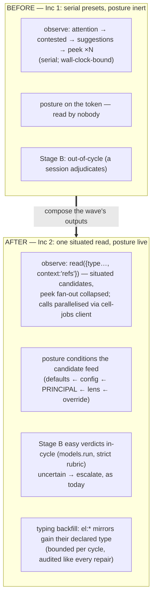

# ADR-0077 — The postured organ: consolidate Inc 2, observing through the composed read

- **Status:** Accepted 2026-07-09 (built, gated, deployed tier-2, validated live).
  First entry *after* the second contraction wave's table — the wave's outputs,
  composed: the organ (C8) observes in parallel through the vendored client (C5)
  under its self-adopted posture (ADR-0074), adjudicates the easy contested tier
  with the C4 `contradicts` verdict, and submits its own runs through the
  vendored jobs choreography.
- **Depends on:** ADR-0073 (the organ + its Inc 2 log), ADR-0071 (C2 `read` +
  `context:'refs'`), ADR-0074 (posture — the organ's token is already the first
  postured principal, currently declarative), ADR-0076 (C5 — build that first:
  this ADR consumes the vendored gateway client rather than growing copy #4).

---

## Context (grounded)

ADR-0073's implementation log left three findings from the organ's first live
cycles, and ADR-0074 left one activation pending:

1. **The organ reads via five separate presets** (`attention`, `contested`,
   `suggestions`, `peek` ×N) — sequential gateway calls dominate its wall-clock
   (the 120s `configureCell` bump exists *because* of this). C2's `read` with
   `context:'refs'` can collapse the per-candidate `peek` fan-out: a store read
   that arrives **situated** (each entry carrying its one-hop refs) answers
   "is this still unlinked / who neighbours it" without N follow-up calls.
2. **Its posture is declarative.** The organ's token carries its purpose
   (ADR-0074 impl log) but nothing reads through it — the moment observe moves
   to `read`, the posture conditions what the organ notices *for free* (the
   goal text ranks repair-relevant facts up its candidate feed).
3. **Untyped `el:` mirrors evade the type-based noise floor** (ADR-0073 Inc 2
   note): the organ keeps re-surfacing them as unlinked debt. A bounded typing
   backfill (`remember {key, type}` on facts whose key pattern declares their
   type) is repair work squarely in the organ's remit.
4. **Contested Stage B stays out-of-cycle** — candidates surface, but
   adjudication waits for a session. The next autonomy rung (ADR-0073 log):
   in-cycle adjudication of the *easy* verdicts via `@c15r/models.run` with a
   strict rubric, escalating everything uncertain (never auto-superseding).

## Sketch (decisions, tentative)

1. **Observe through `read`.** Replace the attention/peek fan-out with
   `read({source:'store', …, context:'refs'})` batches: candidates arrive with
   their periphery, so unlinked-ness and neighbour types are read off `_context`
   instead of peeked per key. `attention`/`contested` stay for what they
   uniquely derive (the debt taxonomy, the pair candidates).
2. **Activate the posture.** No code in the organ: its token's posture (already
   adopted) starts biasing the moment observe uses `read`. Sharpen the adopted
   goal to a `goal/<id>` fact (file the consolidation goal in `@c15r/tasks`) so
   the adoption is graph-visible, per ADR-0074's grounding.
3. **Parallelise via the vendored client.** ADR-0076's `gateway-client` gains a
   `callMany` (bounded concurrency, e.g. 4) — the organ's serial-call wall-clock
   finding, fixed at the shared seam, not in one consumer.
4. **Typing backfill as a repair class.** A new capped action (like ratify/
   unlink): for untyped facts whose key matches a declared type's `keyPattern`,
   `remember {key, type}` (CAS-guarded). Bounded (e.g. 10/cycle), audited,
   reward-eligible like every repair.
5. **Stage B, the easy tier only.** `models.run` with a strict rubric over each
   contested pair (same common-ground data the read returns): verdicts
   `duplicate` (supersede+migrate) and `unrelated` (checked marker) may act
   in-cycle; `contradicts` and anything below a confidence floor escalate to
   the session, exactly as today. Uses the C4 `contradicts` edge for the middle
   verdict when the model is confident both stand in tension.

## Behaviour-preservation (the gate)

`planCycle` stays pure and its existing gate holds (caps, contradictions never
auto-resolve, idempotence markers). New gates: observe-via-read produces the
same candidate set as the preset path over a fixture slice; the typing backfill
only ever *adds* a type to an untyped fact matching a declared pattern; Stage B
in-cycle acts only on verdicts above the floor, and every action lands the same
audit trail as Inc 1.

## Open questions

1. Does the organ adopt the goal fact itself (it holds `write:workspace` — it
   could file `goal/consolidation` on first run) or does the owner file it?
   Leaning owner-files-once; the organ references.
2. Stage B model spend: per-cycle cap (pairs adjudicated) and the confidence
   floor — start 5 pairs / 0.9?
3. Does `callMany` belong in ADR-0076's client from the start (build it there)
   or as this ADR's extension? Leaning: build it in 0076 — a concurrency knob
   is transport, not policy.

## Implementation log (2026-07-09)

- **Open question 1 → resolved by owner steer: the organ bootstraps its own
  goal fact** — the cell-owned-facts precedent (a cell's `types.json`
  bootstraps its `_types/*` at deploy; machine.bootstrap ensures its rails).
  Each non-dry run ensures `goal/consolidation` (the `@c15r/tasks` goal shape,
  linked `addresses → kb/consolidation-organ`) and adopts it onto the running
  principal via `auth.adoptGoal` when `whoami` shows no posture. Live: cycle 1
  logged `bootstrapped goal/consolidation` + (after the gwWhoami fix)
  `adopted goal/consolidation onto this principal`; cycle 2 logged nothing —
  idempotent. Every composed read the organ makes now resolves through its
  goal (ADR-0074), for free.
- **The SDK grew `gwWhoami`** — the first live cycle exposed that `whoami` is
  the third MCP verb, not a read target; the kernel gateway-client now covers
  all three.
- **Observe parallelised** (sketch items 1/3): the five base reads go out
  through `gwCallMany`; the survivor re-check collapsed from a serial per-pair
  loop to ONE `links {keys:[…]}` call.
- **Typing backfill** (sketch item 4): `matchTypeByKey` over `$types`
  keyPatterns, unambiguous matches only, adds-only CAS re-write, capped 10.
  Live finding: `unlinkedSampled: 25, untypedMatched: 0` — the sampled debt is
  typed or pattern-less; the `el:` mirrors need canvas to DECLARE their
  keyPattern (the real ADR-0073 fix — follow-up for the canvas cell, not the
  organ).
- **Stage B, the easy tier** (sketch item 5): capped 5 pairs, floor 0.9, the
  CONTESTED_HINT vocabulary (`duplicate` → older-is-canonical supersede +
  migrateLinks; `independent` → checked marker; `contradict` → contested fact
  + the ADR-0075 `contradicts` edge (strength = confidence) + marker;
  `subsumes`/`uncertain`/below-floor → escalate, NO marker so the pair stays
  visible). Scope denials skip the stage gracefully; the first failure reason
  lands in the audit. Live: the machinery reached `@c15r/models.run` correctly
  — and surfaced an environmental blocker, *"anthropic: Your credit balance is
  too low"*; all 10 pairs escalated. Stage B goes fully live the moment the
  provider account is funded; no code change needed.
- **The organ eats its own cooking**: a full cycle outruns the ~30s edge cap,
  so `run` gained `{async:true}` → the vendored cell-jobs submit/self-invoke/
  `fetch` choreography (AWS clients lazy-loaded per the platform convention —
  the jest gate imports the pure core SDK-free). Live: async submit → poll →
  `done` with the audit; delta +3, 8 repairs applied.
- **Gate.** `tests/consolidate-inc2.test.ts` (6): keyPattern regex + exactly-
  one-match discipline, retype capping, rubric content, verdict validation
  (closed set, 0..1 confidence, prose-wrapped JSON tolerated), contradictions-
  never-actions. Suite 640 green.
- Two consecutive live cycles: delta +7 (11 repairs) and +3 (8 repairs) —
  the backlog keeps moving under the composed machinery.

## Follow-ups round (2026-07-09, same day — owner-directed)

- **`models.run` gained provider failover** (mirroring the agent path): a
  pinned `provider` is honoured exactly; unpinned walks the enabled chain
  (text: anthropic → openai → google; image: openai → google) and aggregates
  failures verbatim. Validated live: the chain walked correctly — and revealed
  that **both** enabled providers are currently blocked at billing (anthropic:
  credit balance; openai: quota exceeded). Stage B activates the moment either
  account is funded; no code change remains.
- **Canvas declared `canvas-element`** (`el:{id}` keyPattern) — the type its
  client already defaults new writes to; the declaration lets the substrate
  recognise the legacy untyped mirrors. Pattern semantics sharpened in the
  matcher: a TRAILING capture is greedy (element ids and placement fact-keys
  nest — `el:inbox/…`, `_canvas/<board>/<factKey>`); interior captures stay
  single-segment.
- **Backfill candidate source fixed**: sampling attention's alphabetical
  unlinked page never reaches past the plumbing prefixes — observe now queries
  each patterned type's key PREFIX directly (one `query {prefix}` per declared
  pattern, via gwCallMany). Validated live: **10 retypes applied** (the cap) —
  the exact `el:inbox/arch-*` mirrors from the ADR-0073 finding →
  `canvas-element`, six `_canvas/*/edge:*` placements → `canvas-placement`.
  The typing-backfill loop is closed.
- **machine migrated off its manual copy**: `import './vendor/substrate.js'`,
  the hand-synced `cells/machine/substrate.js` deleted (only its header
  comment had diverged), the overlay materializes the canonical kernel source
  at push. Validated live: `machine.bootstrap` runs through the vendored
  client.
