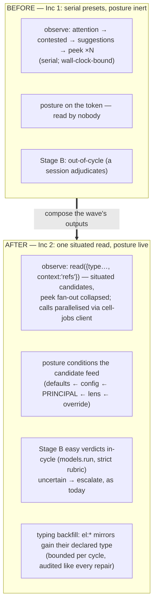

# ADR-0077 — The postured organ: consolidate Inc 2, observing through the composed read

- **Status:** Proposed 2026-07-09 (buffer — feedback welcome before build). Enters
  the buffer beside ADR-0076 as ADR-0075 (C4) moves to built. First entry *after*
  the second contraction wave's table — the wave's outputs, composed: the organ
  (C8) reads through the one read (C2) under its adopted posture (ADR-0074),
  via the vendored client (C5).
- **Depends on:** ADR-0073 (the organ + its Inc 2 log), ADR-0071 (C2 `read` +
  `context:'refs'`), ADR-0074 (posture — the organ's token is already the first
  postured principal, currently declarative), ADR-0076 (C5 — build that first:
  this ADR consumes the vendored gateway client rather than growing copy #4).

---

## Context (grounded)

ADR-0073's implementation log left three findings from the organ's first live
cycles, and ADR-0074 left one activation pending:

1. **The organ reads via five separate presets** (`attention`, `contested`,
   `suggestions`, `peek` ×N) — sequential gateway calls dominate its wall-clock
   (the 120s `configureCell` bump exists *because* of this). C2's `read` with
   `context:'refs'` can collapse the per-candidate `peek` fan-out: a store read
   that arrives **situated** (each entry carrying its one-hop refs) answers
   "is this still unlinked / who neighbours it" without N follow-up calls.
2. **Its posture is declarative.** The organ's token carries its purpose
   (ADR-0074 impl log) but nothing reads through it — the moment observe moves
   to `read`, the posture conditions what the organ notices *for free* (the
   goal text ranks repair-relevant facts up its candidate feed).
3. **Untyped `el:` mirrors evade the type-based noise floor** (ADR-0073 Inc 2
   note): the organ keeps re-surfacing them as unlinked debt. A bounded typing
   backfill (`remember {key, type}` on facts whose key pattern declares their
   type) is repair work squarely in the organ's remit.
4. **Contested Stage B stays out-of-cycle** — candidates surface, but
   adjudication waits for a session. The next autonomy rung (ADR-0073 log):
   in-cycle adjudication of the *easy* verdicts via `@c15r/models.run` with a
   strict rubric, escalating everything uncertain (never auto-superseding).

## Sketch (decisions, tentative)

1. **Observe through `read`.** Replace the attention/peek fan-out with
   `read({source:'store', …, context:'refs'})` batches: candidates arrive with
   their periphery, so unlinked-ness and neighbour types are read off `_context`
   instead of peeked per key. `attention`/`contested` stay for what they
   uniquely derive (the debt taxonomy, the pair candidates).
2. **Activate the posture.** No code in the organ: its token's posture (already
   adopted) starts biasing the moment observe uses `read`. Sharpen the adopted
   goal to a `goal/<id>` fact (file the consolidation goal in `@c15r/tasks`) so
   the adoption is graph-visible, per ADR-0074's grounding.
3. **Parallelise via the vendored client.** ADR-0076's `gateway-client` gains a
   `callMany` (bounded concurrency, e.g. 4) — the organ's serial-call wall-clock
   finding, fixed at the shared seam, not in one consumer.
4. **Typing backfill as a repair class.** A new capped action (like ratify/
   unlink): for untyped facts whose key matches a declared type's `keyPattern`,
   `remember {key, type}` (CAS-guarded). Bounded (e.g. 10/cycle), audited,
   reward-eligible like every repair.
5. **Stage B, the easy tier only.** `models.run` with a strict rubric over each
   contested pair (same common-ground data the read returns): verdicts
   `duplicate` (supersede+migrate) and `unrelated` (checked marker) may act
   in-cycle; `contradicts` and anything below a confidence floor escalate to
   the session, exactly as today. Uses the C4 `contradicts` edge for the middle
   verdict when the model is confident both stand in tension.

## Behaviour-preservation (the gate)

`planCycle` stays pure and its existing gate holds (caps, contradictions never
auto-resolve, idempotence markers). New gates: observe-via-read produces the
same candidate set as the preset path over a fixture slice; the typing backfill
only ever *adds* a type to an untyped fact matching a declared pattern; Stage B
in-cycle acts only on verdicts above the floor, and every action lands the same
audit trail as Inc 1.

## Open questions

1. Does the organ adopt the goal fact itself (it holds `write:workspace` — it
   could file `goal/consolidation` on first run) or does the owner file it?
   Leaning owner-files-once; the organ references.
2. Stage B model spend: per-cycle cap (pairs adjudicated) and the confidence
   floor — start 5 pairs / 0.9?
3. Does `callMany` belong in ADR-0076's client from the start (build it there)
   or as this ADR's extension? Leaning: build it in 0076 — a concurrency knob
   is transport, not policy.
