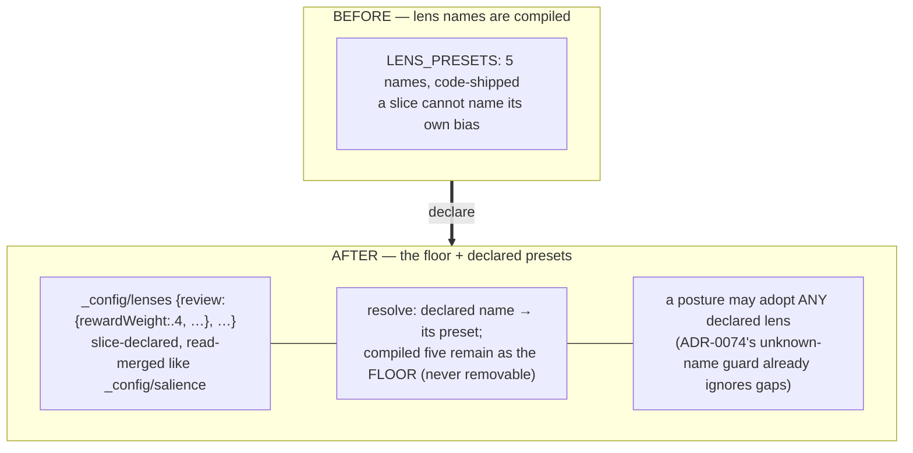

# ADR-0078 — Slice-declared lenses: `_config/lenses` over the compiled floor

- **Status:** Accepted 2026-07-09 (built, gated, deployed run #332, validated live).
  Resolves ADR-0074 open question 4; the last compiled vocabulary in the read
  seam falls to the open-world discipline.
- **Depends on:** ADR-0010 (layered salience resolution), ADR-0050 (tuned
  weights), ADR-0074 (posture — the first consumer that wants to *name* a lens
  a slice defined), compose.md §8 (the open-vocabulary rule).

---

## Context (grounded)

`SalienceLens` is a compiled union (`salience · recent · connected · durable ·
active`) with a compiled preset table (`state.ts` `LENS_PRESETS`) — the one
closed set left in the read seam. Everything around it is already open:
salience *weights* are slice-tunable (`_config/salience`), noise types are
slice-declared (`_config/suggestions`), goals are slice facts (`goal/<id>`),
rels are free strings. A posture (ADR-0074) can adopt a lens — but only one of
the five compiled names; a slice cannot define "my review lens" (reward-heavy,
recency-light) and refer to it by name.

The seam is one lookup: `callSalience` resolves `LENS_PRESETS[lens]` into the
layered merge (`defaults ← config ← principal ← lens ← override`). A
slice-declared preset layer changes only where that table comes from.

## Sketch (decisions, tentative)

1. **`_config/lenses`** — one config fact: `{ <name>: Partial<SalienceOptions> }`.
   Loaded beside `_config/salience` (same read path, same caching posture),
   validated per-name (numeric keys only, unknown weight keys ignored — the
   `resolveSalience` discipline).
2. **Resolution order:** declared name → its preset; else compiled floor; else
   ignored (exactly ADR-0074's unknown-lens guard — a bad name never breaks a
   read). Declared names may NOT shadow the floor five (least surprise).
3. **Everything that takes `lens` benefits at once** — `recall`/`query`/`read`
   per-call, and posture — because the change is inside `callSalience`, not in
   any caller.
4. **Default-inert:** no `_config/lenses` fact ⇒ byte-identical behaviour.

## Why now (buffer rationale)

ADR-0074 shipped posture with a compiled-lens guard and named this as the
natural companion; ADR-0077 (the postured organ) will want an organ-specific
bias ("repair-relevant first") that is exactly a declared lens. Small,
default-inert, and it retires the last closed vocabulary in the read path.

## Open questions

1. Does `_shaping.lens` echo the declared name (observability: yes, probably).
2. Should a declared lens be able to reference another as a base
   (`{extends: 'recent', rewardWeight: .3}`)? Leaning no — flat presets, keep
   the merge legible.

## Implementation log (2026-07-09)

- **The seam held to one function.** `parseLensesConfig` (per-preset through the
  same defensive numeric filter as `_config/salience`; floor names dropped —
  never shadowable) + `loadLensesConfig` beside the salience loader; resolution
  in `callSalience` (floor first, declared second, unknown ignored). The lens
  NAME echoes in `_shaping` (open question 1: yes). Option 2 (preset `extends`)
  stays out, as leaned.
- **Everything that takes `lens` benefits at once** — `recall`/`query`/`read`
  per-call AND posture (`principalPosture` now passes any lens name through;
  ADR-0074's compiled-set guard deleted). `recall` folds granted slices under
  the VIEWER's declared lenses (`state.lensesConfig`), exactly as with
  `salienceConfig`. Input types widen to `SalienceLens | (string & {})`.
- **Gate.** `tests/declared-lenses.test.ts` (5): parser sanitize + floor
  non-shadow; declared ≡ raw override (modulo the `_shaping` echo, asserted
  explicitly); floor wins its names + unknown inert; posture-adopted declared
  lens ≡ per-call; default-inert (no config ⇒ byte-identical). Suite 645 green.
- **Live validation (deploy run #332).** Declared `_config/lenses {review:
  {rewardWeight: .5, …}}` on the real slice: `query({type:'decision',
  lens:'review'})` returned entries and order IDENTICAL to the raw-weights
  call — and the reward-heavy lens surfaced exactly the facts carrying the
  organ's earned `reward: 0.5` at the top. The lens system and the reward loop
  (C6/C8) compose: "what has earned its keep" is now a one-word read.
- The `review` lens stays declared on the c15r slice — the first slice-defined
  lens, in use.
