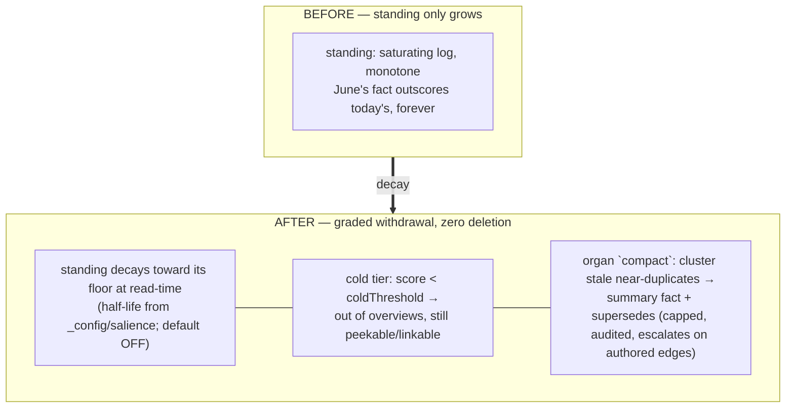

# ADR-0079 — Decay to cold: forgetting as shaping, never deletion

- **Status:** Proposed 2026-07-09 (buffer — feedback welcome before build). Enters
  the buffer beside ADR-0078 as ADR-0077 (the postured organ) moves to built.
  The last standing gap on the plate: *"No forgetting / compaction — supersede
  tombstones, the archiver retains everything, standing only grows."*
- **Depends on:** ADR-0007 (touches), ADR-0050 (score stage), ADR-0070 (reward —
  the earned counterweight), ADR-0073/0077 (the organ that would run the pass),
  ADR-0048 (tiering — cold is a TIER, not a state).

---

## Context (grounded)

The substrate never forgets, by design (supersede-not-delete; the archiver keeps
every version). What it lacks is **graded withdrawal of attention**: `standing`
is a saturating log of lifetime touches — it only grows — so a fact that
mattered in June outscores a fact that matters now, forever, unless salience's
recency term outvotes it. The plate has carried this since the capture pass; the
organ (C8/Inc 2) now exists to run exactly this kind of bounded, audited pass.

The seam is already there:
- **Cold is a shaping tier, not a mutation.** ADR-0048's elided tier already
  shows keys-without-values; "cold" is the same move at slice scale — a fact
  whose composite score decays below a floor drops out of overviews (still
  peekable, linkable, searchable by intent).
- **Reward is the counterweight.** ADR-0070's earned term marks what repairs
  and goals actually used; decay without reward would forget indiscriminately.
- **The organ is the actor.** A `compact` repair class beside ratify/unlink/
  retype: propose superseding *n* near-identical stale siblings into a summary
  fact (the inferred-kinship clusters the vector index already knows), capped,
  escalating anything with authored inbound edges.

## Sketch (decisions, tentative)

1. **Read-time decay, config-gated.** `standing` (and `attention`) decay toward
   zero with a half-life declared in `_config/salience` (`standingHalfLifeDays`)
   — computed at score time from the stored touch timestamps, no write-back, no
   migration, **default off** (absent config ⇒ today's behaviour, byte-identical).
2. **The cold tier.** A `coldThreshold` below the elide threshold: cold entries
   are absent from overviews/projections entirely (count surfaces in
   `_shaping.counts.cold`), reachable by key/text/edges as ever. A lens
   (`lens:'archive'`) inverts it for deliberate cold-diving.
3. **Organ `compact` (separate increment).** The bounded summarize-and-supersede
   repair class — never runs before decay + cold have soaked, since they may
   dissolve most of the pressure for free.
4. **Reward is exempt from decay** — earned importance persists (that is its
   point); a fact with reward > 0 can go cold only via the compact path, never
   silently.

## Why now (buffer rationale)

Every other plate gap is closed or buffered. Decay is the score program's
missing half (growth without forgetting is hoarding), the organ finally gives
it a safe actor, and posture/lenses (0074/0078) give humans the escape hatch
(`lens:'archive'`) that makes withdrawal reversible-by-glance.

## Open questions

1. Does `attention` (the tending read) treat cold as settled (excluded) or as a
   fourth debt class? Leaning excluded — cold is *resolved* attention.
2. Half-life default when the config opts in — 30/60/90 days?
3. Does the archiver need anything? Leaning no — it already keeps everything;
   decay is purely a read-side posture.
