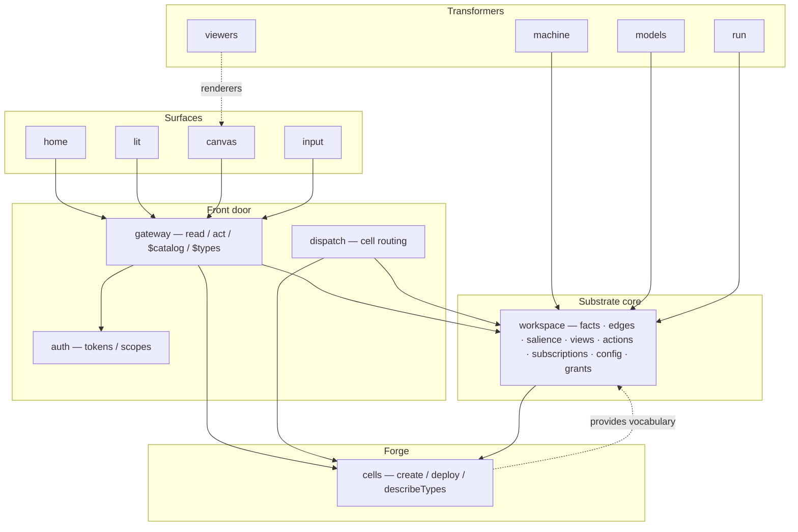
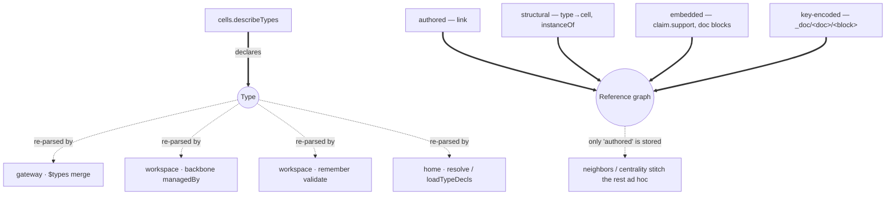
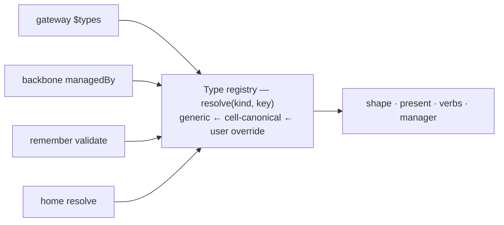
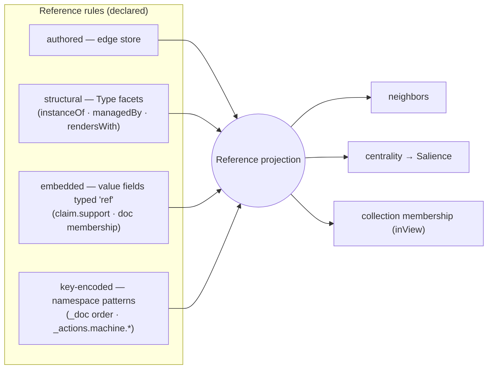
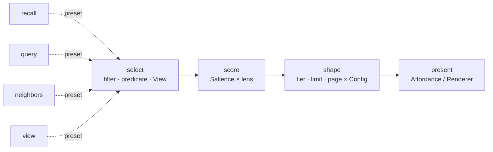
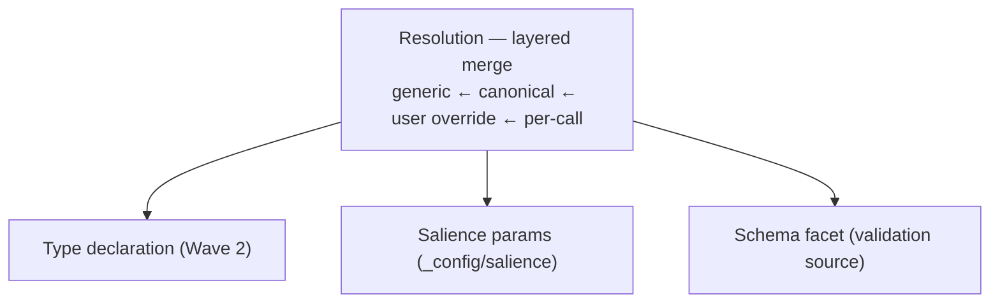
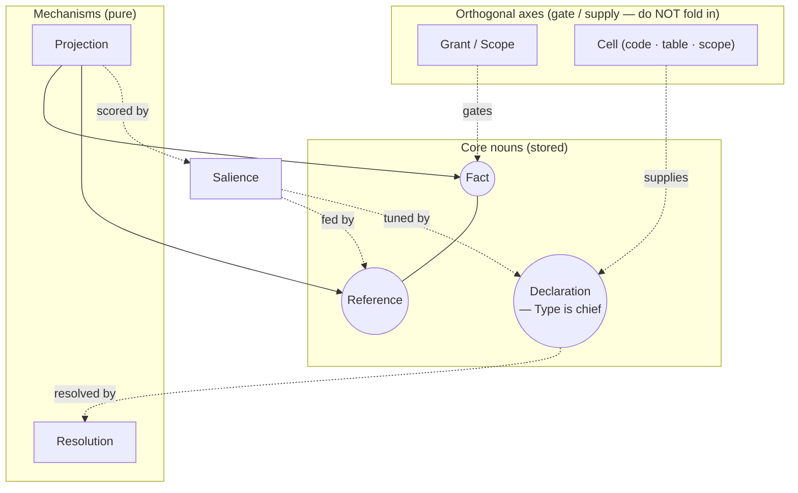
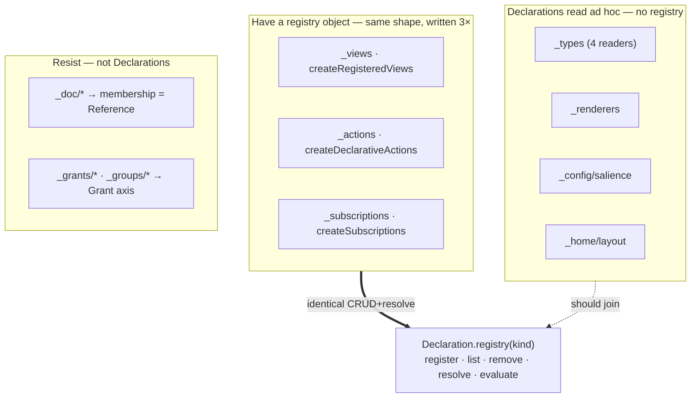
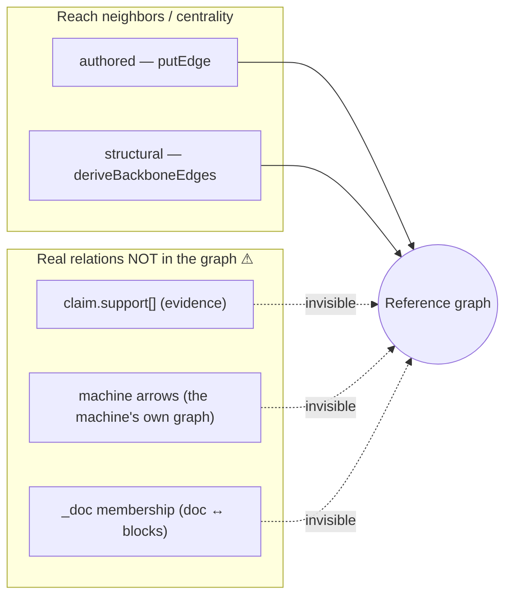
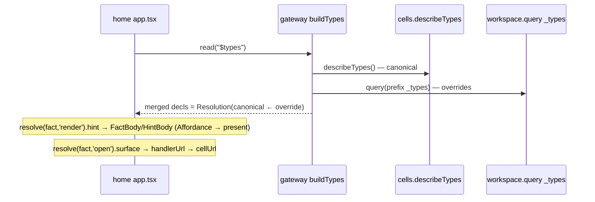

# Breathing the architecture — successive waves toward core primitives

> A living distillation. We **inhale** (expand: enumerate a layer in full, to surface
> duplication) and **exhale** (contract: collapse N near-duplicates into one primitive +
> N usages). A contraction is valid only if it is **behaviour-preserving** — a refactor of
> the *model*, never a redesign. We stop when the invariant holds:
>
> **Every primitive has exactly one representation and one resolver; every component
> *uses* primitives but *re-implements* none.** (3NF for architecture.)
>
> Each wave carries a system diagram showing the model *at that wave*. Later waves deepen
> (L2/L3 per primitive); this file grows by appending waves, not rewriting them.

Detail ladder: **L0** components × primitives spoken · **L1** per-component `exposes`/`uses`
ledger · **L2** per-primitive representations + resolver + consumers · **L3** one flow traced
end-to-end.

---

## Wave 0 — Inventory (inhale, L0)

What exists, and who calls whom. No consolidation yet — just the territory.



**Primitives spoken (raw):** Fact, Reference (edge), Salience, Type, Schema, Affordance,
View, Action, Subscription, Grant/Scope, Config, Renderer, Cell, Projection (read).

---

## Wave 1 — The ledger (inhale, L1)

For each primitive: who **declares/exposes** it, who **re-implements** its reading. The
redundancy only becomes visible once the ledger is whole.



**Finding (the two loud ⚠):**
- **Type** is declared once but its *reading* is re-implemented in **four** consumers.
- **Reference** exists in **four** representations but only one is stored; the graph is
  re-stitched per consumer (`deriveBackboneEdges`, `linkCount`, embedded refs ignored).

Everything else in the session (schema validation, render hints, the modal editor, the
census) turns out to be *a consumer of Type* or *a consumer of the Reference graph*.

**Ledger:** 13 raw primitives, 2 with N-way duplicated readers.

---

## Wave 2 — Exhale: collapse **Type**

`Type` today is smeared across `_types/*` (icon/label/manager/handlers), `_renderers/*`
(inline draw), prose `schema` strings, and hardcoded conventions in home. One object,
four homes. Contract to a single Declaration with **facets**, behind one resolver.

```mermaid
classDiagram
  class Type {
    +kind
    +shape  : schema / fields  (validate · form)
    +present: icon / label / render / embed
    +verbs  : open / edit / create  → a cell
    +manager: the owning cell
  }
  Type <|-- t1["_types decl"]
  Type <|-- t2["_renderers"]
  Type <|-- t3["prose schema"]
  Type <|-- t4["home conventions"]
```

One registry, one resolution; the four consumers become *callers*, not parsers:



**Validity:** the L3 "render a fact" / "validate on remember" traces must yield identical
results before and after — a pure re-home of parsing.

**Ledger delta:** Type's 4 readers → 1 resolver + 4 usages. The census's "unmanaged /
undeclared" tiers reduce to "**Types missing a facet**" (no manager / no shape).

---

## Wave 3 — Exhale: collapse **Reference**

Make the graph a **projection** fed by declared *rules*, one per representation. Authored
edges are just the rule whose source is the edge store.



**Validity:** `deriveBackboneEdges` becomes *one rule*; `neighbors`/centrality read the
projection, so their output is unchanged for facts that had structural edges — and
*newly* correct for embedded refs (`claim.support` lights up for free), which is additive,
not behaviour-changing for existing edges.

**Ledger delta:** 4 ad-hoc stitchers → 1 projection + 4 rules. `linkCount` and the
backbone stop being special cases.

---

## Wave 4 — Exhale: collapse **Projection** (the read paths)

`recall`, `query`, `neighbors`, `view` are four code paths that are really one pipeline
with different stage settings.



- a **View** is a saved `select`; `_config/salience` parameterises `score`+`shape`; the
  Reference projection feeds `score` (centrality); the Type's renderer is `present`.
- `recall` = select-all + shape; `query` = filter + limit; `neighbors` = select-by-edge;
  `view` = select-by-saved-predicate. Same pipeline, different presets.

**Ledger delta:** 4 read entry points → 1 pipeline + 4 presets.

---

## Wave 5 — Exhale: extract **Resolution** (the shared mechanism)

The layered merge appears in salience, types, and schema. It is one mechanism.



**Ledger delta:** 3 hand-written precedence ladders → 1 `Resolution`. Wave 2's registry is
`Resolution` applied to the Type kind.

---

## Consolidated target (after this round of breathing)



**The expressive surface reduces to three nouns — Fact, Reference, Declaration — read
through two mechanisms — Resolution, Projection — over one signal, Salience.** Views,
Actions, Subscriptions, Config, Renderers, Schema, Affordances are all **Declarations**;
the backbone, links, `claim.support`, membership are all **References**;
recall/query/neighbors/view are all **Projection**.

### Deliberately *not* unified
- **Grant / Scope** — an orthogonal authority axis; it *gates* Facts/References/Declarations,
  it is not one of them.
- **Cell** — infrastructure that *supplies* Declarations and *backs* affordances; not a
  primitive in the expressive surface.
- **Salience** — a genuine computed signal; it *consumes* References but must not be folded
  into them.

---

## Wave 6 — L2 · Declaration (inhale, grounded)

Every reserved `_`-namespace, read from the source. Three already share an **identical
registry object** (`register · list · remove · [evaluate/invoke]` over a fact at `_ns/<id>`);
the rest are read **ad hoc** — the same idea, hand-rolled per consumer.

| Namespace | Constant / file | How it's read today | Registry? |
|---|---|---|---|
| `_views/<id>` | `services/workspace/views.ts:22` | `createRegisteredViews(state)` · register/list/remove/**evaluate** | ✅ object |
| `_actions/<id>` | `services/workspace/actions.ts:30` | `createDeclarativeActions(state)` · register/list/remove/**invoke** | ✅ object |
| `_subscriptions/<id>` | `services/workspace/subscriptions.ts:22` | register/list/remove (reaction match) | ✅ object |
| `_types/<type>` | `platform/runtime/state.ts:547` | plain `remember`; read 4× — `describeTypes` + `query _types` + backbone + `remember` | ⚠ none |
| `_renderers/<type>` | `platform/runtime/state.ts:548` | facts read by canvas + backbone `rendersWith` | ⚠ none |
| `_config/salience` | `platform/runtime/state.ts:333` | `state.loadSalienceConfig` (direct get) | ⚠ none |
| `_home/layout` | `cells/home/client/app.tsx:2445` | home `peek`/`remember` (direct) | ⚠ none |



**Exhale:** one `Declaration.registry(kind)` — the three registry objects collapse into one
parameterised by kind, the four ad-hoc readers become callers. **Two genuine hold-outs**
confirm the orthogonal axes: `_doc/*` is *membership* (→ **Reference**, Wave 7),
`_grants/_groups` is the **Grant** axis. So the namespace zoo is exactly: most → Declaration,
`_doc` → Reference, `_grants` → Grant. No fourth thing.

**Ledger delta:** 3 registries + 4 ad-hoc readers → 1 registry + 7 usages.

---

## Wave 7 — L2 · Reference (inhale, grounded — the graph is *lossy* today)

From the source: only **two** of the four representations actually reach
`neighbors`/`centrality`. The other two are real relations **invisible to the graph**.

| Representation | Where it lives | In the graph? |
|---|---|---|
| authored | `workspace.link` → `store.putEdge` | ✅ stored |
| structural | `deriveBackboneEdges` (read-time, `state.ts`) | ✅ derived |
| **embedded** | `claim.support[]` in the value (`cells/machine/index.ts:435`); `machine` `el.arrows` | ❌ **absent** |
| **key-encoded** | `_doc/<id>/<key>` = `{seq,fold}` (`cells/lit/index.ts:137`) | ❌ **absent** |



The sharpest grounded finding: a **claim's evidence**, a **machine's arrows**, and a
**doc's membership** are genuine references the substrate already stores — as value arrays
and key patterns — yet `neighbors`/centrality can't see them. The Wave-3 contraction
(declared reference *rules* → one projection) isn't just tidier; it **recovers relations
currently dropped on the floor.**

**Exhale:** one projection, four rules — `authored` (store), `structural` (Type facets),
`embedded` (value fields typed `ref` — `support`, `arrows`), `key-encoded` (namespace grammar
— `_doc/<id>/<key>`). Behaviour-preserving for stored + structural; **additive** for the two
absent classes.

**Ledger delta:** 2 effective stitchers + 2 stranded representations → 1 projection + 4 rules,
**0 stranded**.

---

## Wave 8 — L3 · two flows, traced through real code (proof of composition)

The primitives are only real if the actual flows decompose into them. Both do.

**Flow A — "home renders a fact"** (`cells/home/client/app.tsx` + `services/gateway/service.ts` `buildTypes`):



Decomposes to **Declaration**(Type) via **Resolution**(canonical←override) → **Affordance** →
the `present` stage of **Projection**. No new concepts.

**Flow B — "remember validates"** (`services/workspace/handlers.ts` `remember`):

```mermaid
sequenceDiagram
  participant C as caller
  participant WS as workspace.remember
  participant ST as state.put
  participant CY as cells.describeTypes (cached)
  C->>WS: remember(key, value, type)
  WS->>ST: put(...) — the write ALWAYS lands (Fact)
  WS->>CY: typeDeclsFor() — canonical decl
  WS->>ST: get(_types/&lt;type&gt;) — slice override
  Note over WS: schemaHints(parseTypeSchema → missingRequired) — Type.shape
  WS-->>C: { value, _meta, hints? }
```

Decomposes to **Fact** (unconditional write) + **Declaration**(Type.shape) via
**Resolution**(canonical←override) → advisory. The write path is untouched by the type
layer — exactly the behaviour-preservation a contraction requires.

---

## Next waves (todo)

- **L2 · Reference grammar** — specify the `ref` field-type marker and the key-encoded
  pattern grammar (`_doc/<id>/<key>`, `_actions/machine.<name>.*`) so rules are declarative
  data, not code.
- **L3 · invoke / react** — trace `invoke` (Action) and a subscription firing, to confirm
  Action/Subscription are Declarations whose *evaluate* runs through one path.
- **Salience inputs** — confirm `centrality` is the only structural feed and that it reads the
  Wave-7 projection (so embedded/key-encoded edges start counting once projected).
- **Cell ↔ Declaration seam** — formalise "a cell *supplies* Declarations on deploy"
  (`describeTypes`) as the one publish path, retiring per-consumer parsing.
