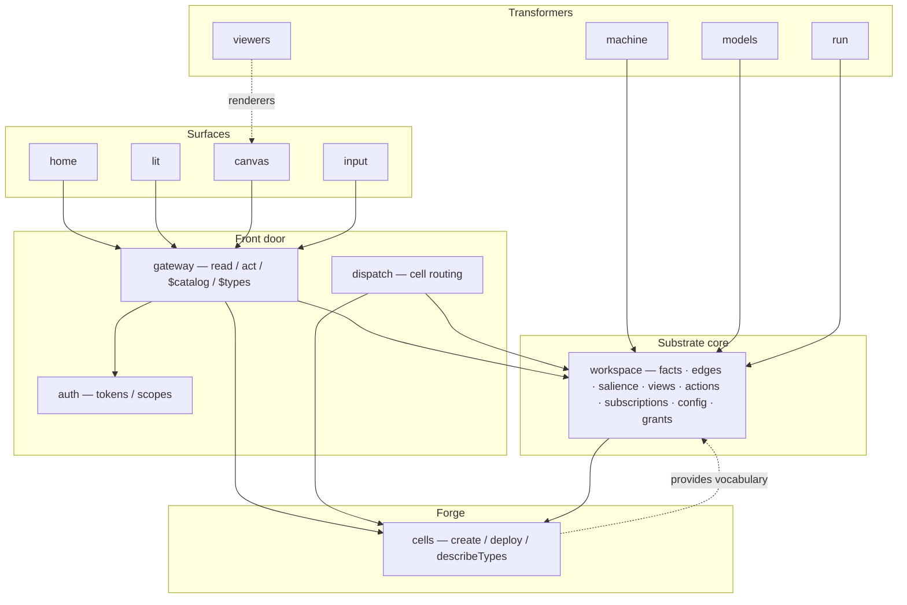
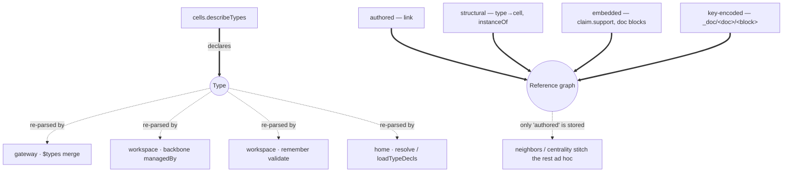
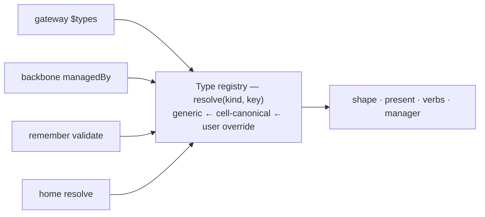
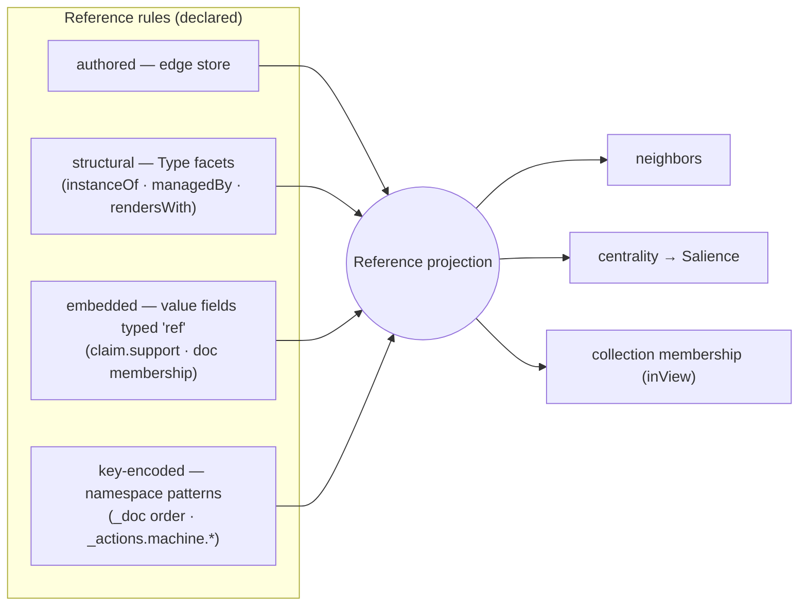
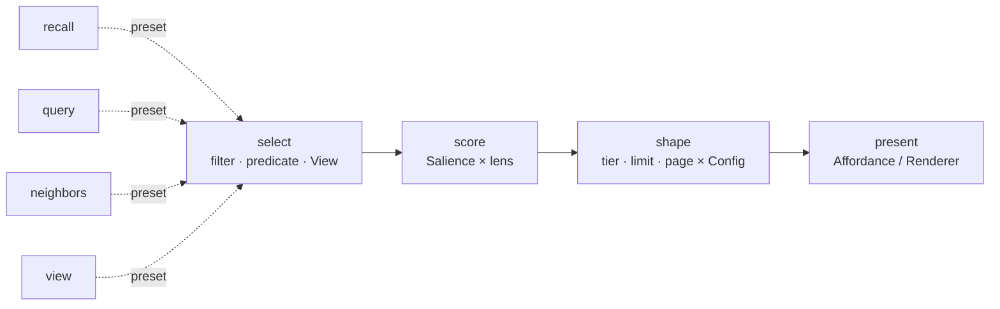
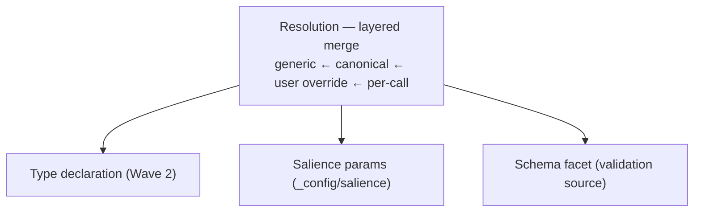
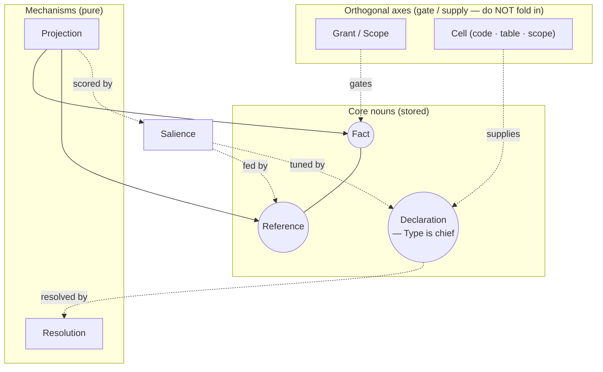

# Breathing the architecture — successive waves toward core primitives

> A living distillation. We **inhale** (expand: enumerate a layer in full, to surface
> duplication) and **exhale** (contract: collapse N near-duplicates into one primitive +
> N usages). A contraction is valid only if it is **behaviour-preserving** — a refactor of
> the *model*, never a redesign. We stop when the invariant holds:
>
> **Every primitive has exactly one representation and one resolver; every component
> *uses* primitives but *re-implements* none.** (3NF for architecture.)
>
> Each wave carries a system diagram showing the model *at that wave*. Later waves deepen
> (L2/L3 per primitive); this file grows by appending waves, not rewriting them.

Detail ladder: **L0** components × primitives spoken · **L1** per-component `exposes`/`uses`
ledger · **L2** per-primitive representations + resolver + consumers · **L3** one flow traced
end-to-end.

---

## Wave 0 — Inventory (inhale, L0)

What exists, and who calls whom. No consolidation yet — just the territory.



**Primitives spoken (raw):** Fact, Reference (edge), Salience, Type, Schema, Affordance,
View, Action, Subscription, Grant/Scope, Config, Renderer, Cell, Projection (read).

---

## Wave 1 — The ledger (inhale, L1)

For each primitive: who **declares/exposes** it, who **re-implements** its reading. The
redundancy only becomes visible once the ledger is whole.



**Finding (the two loud ⚠):**
- **Type** is declared once but its *reading* is re-implemented in **four** consumers.
- **Reference** exists in **four** representations but only one is stored; the graph is
  re-stitched per consumer (`deriveBackboneEdges`, `linkCount`, embedded refs ignored).

Everything else in the session (schema validation, render hints, the modal editor, the
census) turns out to be *a consumer of Type* or *a consumer of the Reference graph*.

**Ledger:** 13 raw primitives, 2 with N-way duplicated readers.

---

## Wave 2 — Exhale: collapse **Type**

`Type` today is smeared across `_types/*` (icon/label/manager/handlers), `_renderers/*`
(inline draw), prose `schema` strings, and hardcoded conventions in home. One object,
four homes. Contract to a single Declaration with **facets**, behind one resolver.

```mermaid
classDiagram
  class Type {
    +kind
    +shape  : schema / fields  (validate · form)
    +present: icon / label / render / embed
    +verbs  : open / edit / create  → a cell
    +manager: the owning cell
  }
  Type <|-- t1["_types decl"]
  Type <|-- t2["_renderers"]
  Type <|-- t3["prose schema"]
  Type <|-- t4["home conventions"]
```

One registry, one resolution; the four consumers become *callers*, not parsers:



**Validity:** the L3 "render a fact" / "validate on remember" traces must yield identical
results before and after — a pure re-home of parsing.

**Ledger delta:** Type's 4 readers → 1 resolver + 4 usages. The census's "unmanaged /
undeclared" tiers reduce to "**Types missing a facet**" (no manager / no shape).

---

## Wave 3 — Exhale: collapse **Reference**

Make the graph a **projection** fed by declared *rules*, one per representation. Authored
edges are just the rule whose source is the edge store.



**Validity:** `deriveBackboneEdges` becomes *one rule*; `neighbors`/centrality read the
projection, so their output is unchanged for facts that had structural edges — and
*newly* correct for embedded refs (`claim.support` lights up for free), which is additive,
not behaviour-changing for existing edges.

**Ledger delta:** 4 ad-hoc stitchers → 1 projection + 4 rules. `linkCount` and the
backbone stop being special cases.

---

## Wave 4 — Exhale: collapse **Projection** (the read paths)

`recall`, `query`, `neighbors`, `view` are four code paths that are really one pipeline
with different stage settings.



- a **View** is a saved `select`; `_config/salience` parameterises `score`+`shape`; the
  Reference projection feeds `score` (centrality); the Type's renderer is `present`.
- `recall` = select-all + shape; `query` = filter + limit; `neighbors` = select-by-edge;
  `view` = select-by-saved-predicate. Same pipeline, different presets.

**Ledger delta:** 4 read entry points → 1 pipeline + 4 presets.

---

## Wave 5 — Exhale: extract **Resolution** (the shared mechanism)

The layered merge appears in salience, types, and schema. It is one mechanism.



**Ledger delta:** 3 hand-written precedence ladders → 1 `Resolution`. Wave 2's registry is
`Resolution` applied to the Type kind.

---

## Consolidated target (after this round of breathing)



**The expressive surface reduces to three nouns — Fact, Reference, Declaration — read
through two mechanisms — Resolution, Projection — over one signal, Salience.** Views,
Actions, Subscriptions, Config, Renderers, Schema, Affordances are all **Declarations**;
the backbone, links, `claim.support`, membership are all **References**;
recall/query/neighbors/view are all **Projection**.

### Deliberately *not* unified
- **Grant / Scope** — an orthogonal authority axis; it *gates* Facts/References/Declarations,
  it is not one of them.
- **Cell** — infrastructure that *supplies* Declarations and *backs* affordances; not a
  primitive in the expressive surface.
- **Salience** — a genuine computed signal; it *consumes* References but must not be folded
  into them.

---

## Next waves (todo)

- **L2 · Declaration** — enumerate every `_`-namespace (`_types _views _actions _subscriptions
  _config _renderers _home _doc _groups`) and confirm each is `Declaration(kind)` under one
  registry; find any that resist.
- **L2 · Reference** — pin the `ref` field-type and the key-encoded rule grammar; check
  `machine` arrows/rails and `_doc` order fold in cleanly.
- **L3 · flows** — trace "home renders a fact" and "remember validates" through the target
  primitives to prove behaviour-preservation before any code moves.
- **Salience inputs** — confirm centrality-from-projection is the only structural feed.
