# Breathing the architecture — successive waves toward core primitives

> A living distillation. We **inhale** (expand: enumerate a layer in full, to surface
> duplication) and **exhale** (contract: collapse N near-duplicates into one primitive +
> N usages). A contraction is valid only if it is **behaviour-preserving** — a refactor of
> the *model*, never a redesign. We stop when the invariant holds:
>
> **Every primitive has exactly one representation and one resolver; every component
> *uses* primitives but *re-implements* none.** (3NF for architecture.)
>
> Each wave carries a system diagram showing the model *at that wave*. Later waves deepen
> (L2/L3 per primitive); this file grows by appending waves, not rewriting them.

Detail ladder: **L0** components × primitives spoken · **L1** per-component `exposes`/`uses`
ledger · **L2** per-primitive representations + resolver + consumers · **L3** one flow traced
end-to-end.

---

## Wave 0 — Inventory (inhale, L0)

What exists, and who calls whom. No consolidation yet — just the territory.

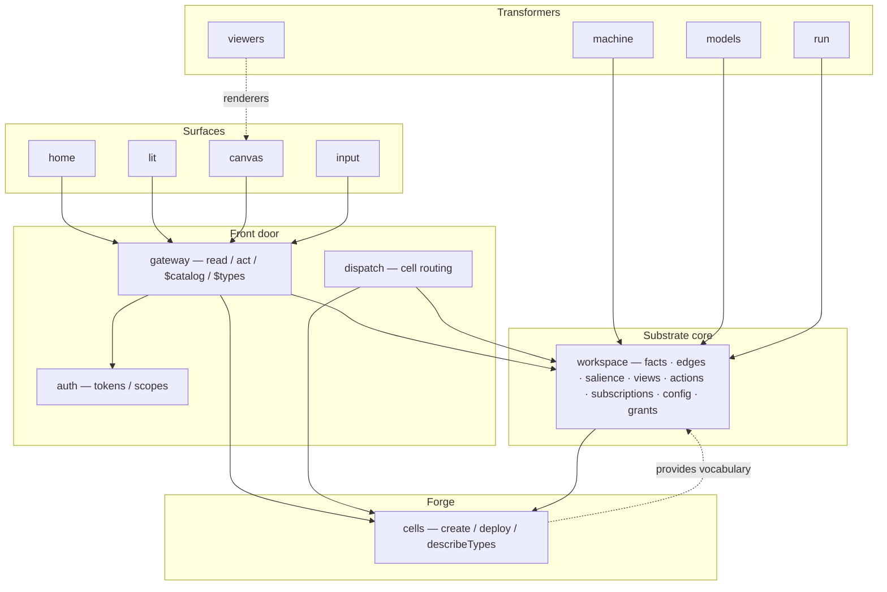

**Primitives spoken (raw):** Fact, Reference (edge), Salience, Type, Schema, Affordance,
View, Action, Subscription, Grant/Scope, Config, Renderer, Cell, Projection (read).

---

## Wave 1 — The ledger (inhale, L1)

For each primitive: who **declares/exposes** it, who **re-implements** its reading. The
redundancy only becomes visible once the ledger is whole.

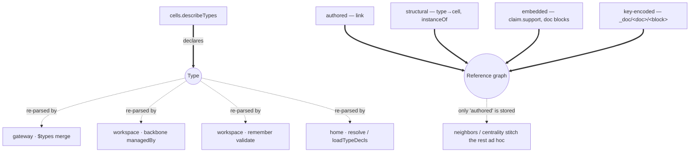

**Finding (the two loud ⚠):**
- **Type** is declared once but its *reading* is re-implemented in **four** consumers.
- **Reference** exists in **four** representations but only one is stored; the graph is
  re-stitched per consumer (`deriveBackboneEdges`, `linkCount`, embedded refs ignored).

Everything else in the session (schema validation, render hints, the modal editor, the
census) turns out to be *a consumer of Type* or *a consumer of the Reference graph*.

**Ledger:** 13 raw primitives, 2 with N-way duplicated readers.

---

## Wave 2 — Exhale: collapse **Type**

`Type` today is smeared across `_types/*` (icon/label/manager/handlers), `_renderers/*`
(inline draw), prose `schema` strings, and hardcoded conventions in home. One object,
four homes. Contract to a single Declaration with **facets**, behind one resolver.

```mermaid
classDiagram
  class Type {
    +kind
    +shape  : schema / fields  (validate · form)
    +present: icon / label / render / embed
    +verbs  : open / edit / create  → a cell
    +manager: the owning cell
  }
  Type <|-- t1["_types decl"]
  Type <|-- t2["_renderers"]
  Type <|-- t3["prose schema"]
  Type <|-- t4["home conventions"]
```

One registry, one resolution; the four consumers become *callers*, not parsers:

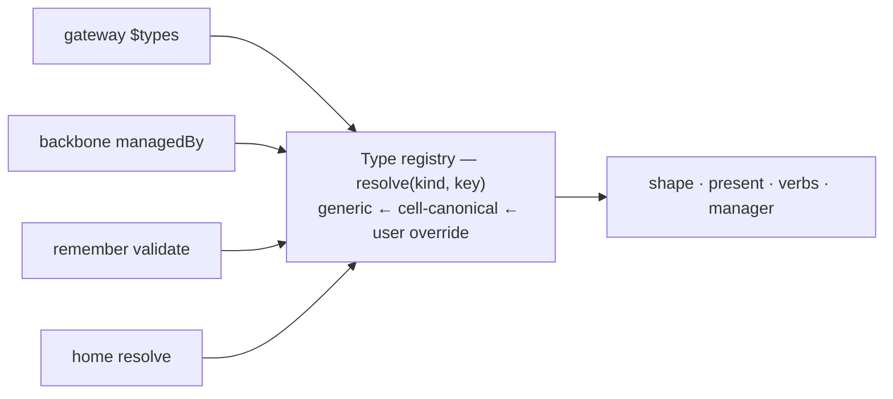

**Validity:** the L3 "render a fact" / "validate on remember" traces must yield identical
results before and after — a pure re-home of parsing.

**Ledger delta:** Type's 4 readers → 1 resolver + 4 usages. The census's "unmanaged /
undeclared" tiers reduce to "**Types missing a facet**" (no manager / no shape).

---

## Wave 3 — Exhale: collapse **Reference**

Make the graph a **projection** fed by declared *rules*, one per representation. Authored
edges are just the rule whose source is the edge store.

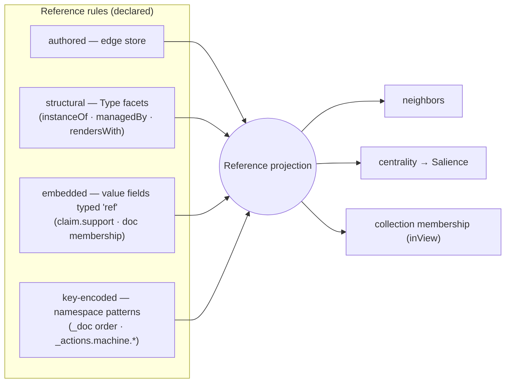

**Validity:** `deriveBackboneEdges` becomes *one rule*; `neighbors`/centrality read the
projection, so their output is unchanged for facts that had structural edges — and
*newly* correct for embedded refs (`claim.support` lights up for free), which is additive,
not behaviour-changing for existing edges.

**Ledger delta:** 4 ad-hoc stitchers → 1 projection + 4 rules. `linkCount` and the
backbone stop being special cases.

---

## Wave 4 — Exhale: collapse **Projection** (the read paths)

`recall`, `query`, `neighbors`, `view` are four code paths that are really one pipeline
with different stage settings.

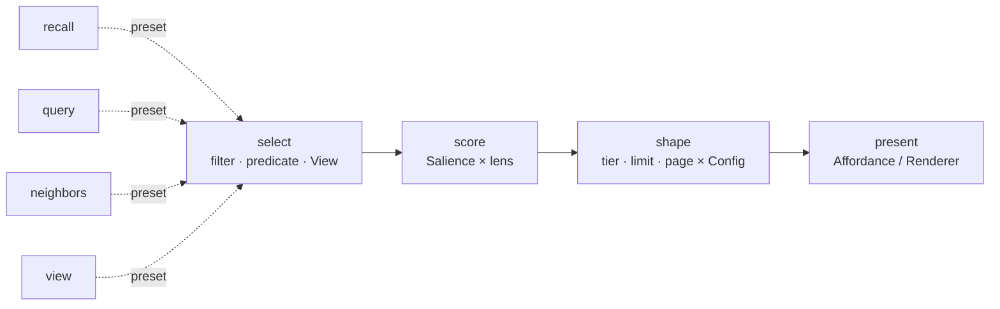

- a **View** is a saved `select`; `_config/salience` parameterises `score`+`shape`; the
  Reference projection feeds `score` (centrality); the Type's renderer is `present`.
- `recall` = select-all + shape; `query` = filter + limit; `neighbors` = select-by-edge;
  `view` = select-by-saved-predicate. Same pipeline, different presets.

**Ledger delta:** 4 read entry points → 1 pipeline + 4 presets.

---

## Wave 5 — Exhale: extract **Resolution** (the shared mechanism)

The layered merge appears in salience, types, and schema. It is one mechanism.

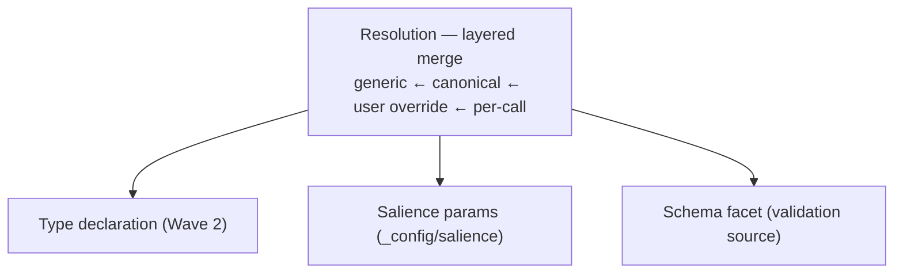

**Ledger delta:** 3 hand-written precedence ladders → 1 `Resolution`. Wave 2's registry is
`Resolution` applied to the Type kind.

---

## Consolidated target (after this round of breathing)

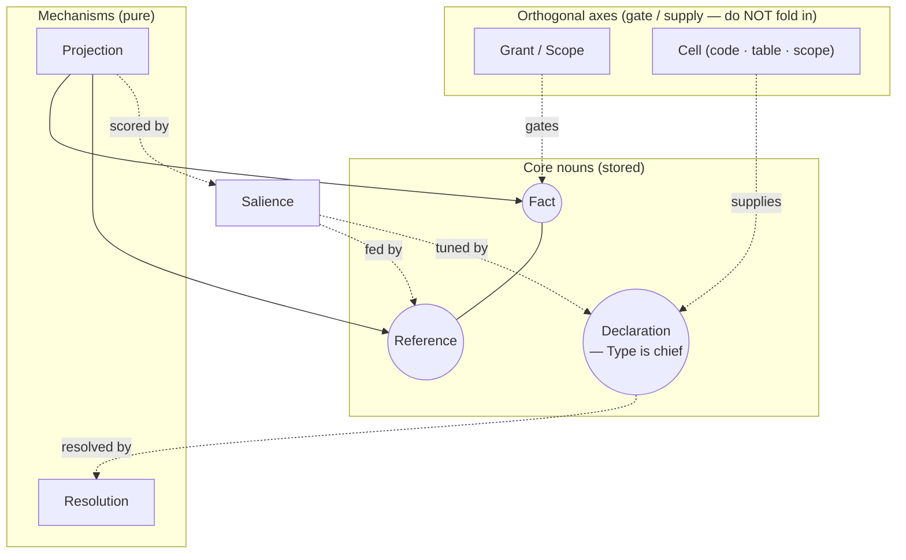

**The expressive surface reduces to three nouns — Fact, Reference, Declaration — read
through two mechanisms — Resolution, Projection — over one signal, Salience.** Views,
Actions, Subscriptions, Config, Renderers, Schema, Affordances are all **Declarations**;
the backbone, links, `claim.support`, membership are all **References**;
recall/query/neighbors/view are all **Projection**.

### Deliberately *not* unified
- **Grant / Scope** — an orthogonal authority axis; it *gates* Facts/References/Declarations,
  it is not one of them.
- **Cell** — infrastructure that *supplies* Declarations and *backs* affordances; not a
  primitive in the expressive surface.
- **Salience** — a genuine computed signal; it *consumes* References but must not be folded
  into them.

---

## Wave 6 — L2 · Declaration (inhale, grounded)

Every reserved `_`-namespace, read from the source. Three already share an **identical
registry object** (`register · list · remove · [evaluate/invoke]` over a fact at `_ns/<id>`);
the rest are read **ad hoc** — the same idea, hand-rolled per consumer.

| Namespace | Constant / file | How it's read today | Registry? |
|---|---|---|---|
| `_views/<id>` | `services/workspace/views.ts:22` | `createRegisteredViews(state)` · register/list/remove/**evaluate** | ✅ object |
| `_actions/<id>` | `services/workspace/actions.ts:30` | `createDeclarativeActions(state)` · register/list/remove/**invoke** | ✅ object |
| `_subscriptions/<id>` | `services/workspace/subscriptions.ts:22` | register/list/remove (reaction match) | ✅ object |
| `_types/<type>` | `platform/runtime/state.ts:547` | plain `remember`; read 4× — `describeTypes` + `query _types` + backbone + `remember` | ⚠ none |
| `_renderers/<type>` | `platform/runtime/state.ts:548` | facts read by canvas + backbone `rendersWith` | ⚠ none |
| `_config/salience` | `platform/runtime/state.ts:333` | `state.loadSalienceConfig` (direct get) | ⚠ none |
| `_home/layout` | `cells/home/client/app.tsx:2445` | home `peek`/`remember` (direct) | ⚠ none |

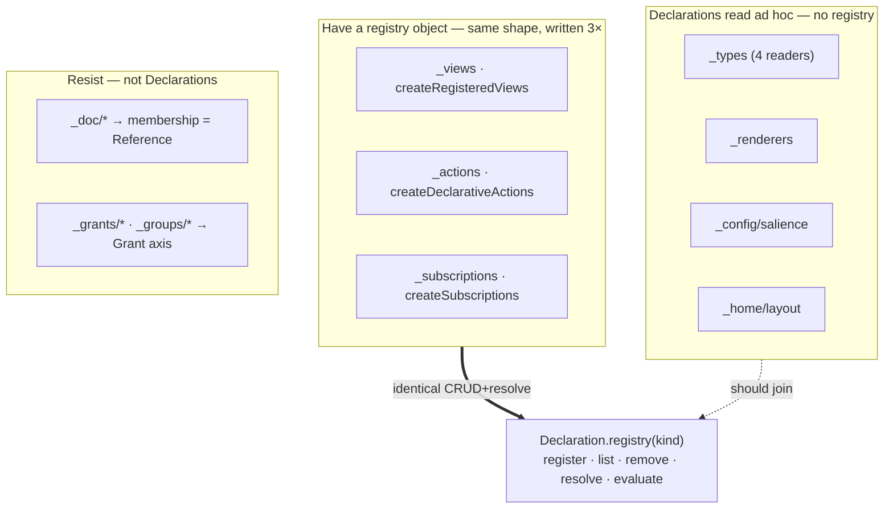

**Exhale:** one `Declaration.registry(kind)` — the three registry objects collapse into one
parameterised by kind, the four ad-hoc readers become callers. **Two genuine hold-outs**
confirm the orthogonal axes: `_doc/*` is *membership* (→ **Reference**, Wave 7),
`_grants/_groups` is the **Grant** axis. So the namespace zoo is exactly: most → Declaration,
`_doc` → Reference, `_grants` → Grant. No fourth thing.

**Ledger delta:** 3 registries + 4 ad-hoc readers → 1 registry + 7 usages.

---

## Wave 7 — L2 · Reference (inhale, grounded — the graph is *lossy* today)

From the source: only **two** of the four representations actually reach
`neighbors`/`centrality`. The other two are real relations **invisible to the graph**.

| Representation | Where it lives | In the graph? |
|---|---|---|
| authored | `workspace.link` → `store.putEdge` | ✅ stored |
| structural | `deriveBackboneEdges` (read-time, `state.ts`) | ✅ derived |
| **embedded** | `claim.support[]` in the value (`cells/machine/index.ts:435`); `machine` `el.arrows` | ❌ **absent** |
| **key-encoded** | `_doc/<id>/<key>` = `{seq,fold}` (`cells/lit/index.ts:137`) | ❌ **absent** |

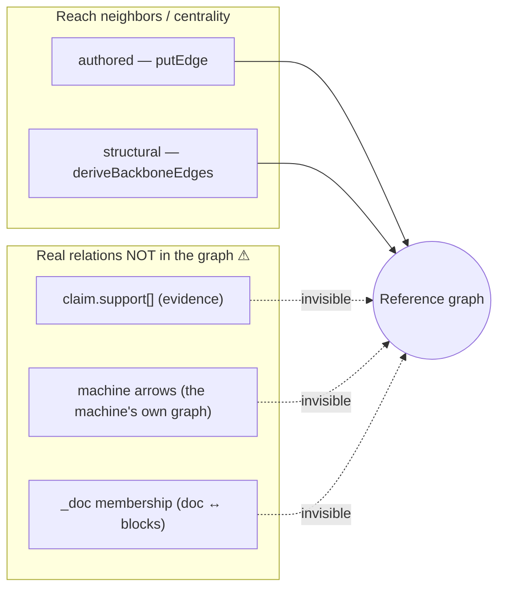

The sharpest grounded finding: a **claim's evidence**, a **machine's arrows**, and a
**doc's membership** are genuine references the substrate already stores — as value arrays
and key patterns — yet `neighbors`/centrality can't see them. The Wave-3 contraction
(declared reference *rules* → one projection) isn't just tidier; it **recovers relations
currently dropped on the floor.**

**Exhale:** one projection, four rules — `authored` (store), `structural` (Type facets),
`embedded` (value fields typed `ref` — `support`, `arrows`), `key-encoded` (namespace grammar
— `_doc/<id>/<key>`). Behaviour-preserving for stored + structural; **additive** for the two
absent classes.

**Ledger delta:** 2 effective stitchers + 2 stranded representations → 1 projection + 4 rules,
**0 stranded**.

---

## Wave 8 — L3 · two flows, traced through real code (proof of composition)

The primitives are only real if the actual flows decompose into them. Both do.

**Flow A — "home renders a fact"** (`cells/home/client/app.tsx` + `services/gateway/service.ts` `buildTypes`):

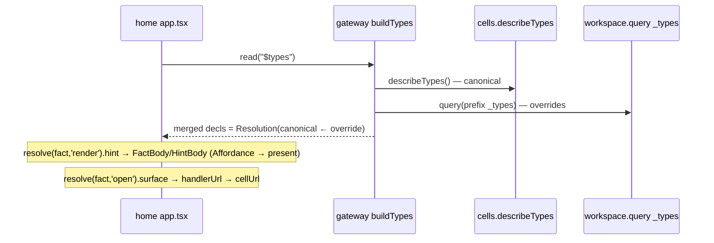

Decomposes to **Declaration**(Type) via **Resolution**(canonical←override) → **Affordance** →
the `present` stage of **Projection**. No new concepts.

**Flow B — "remember validates"** (`services/workspace/handlers.ts` `remember`):

```mermaid
sequenceDiagram
  participant C as caller
  participant WS as workspace.remember
  participant ST as state.put
  participant CY as cells.describeTypes (cached)
  C->>WS: remember(key, value, type)
  WS->>ST: put(...) — the write ALWAYS lands (Fact)
  WS->>CY: typeDeclsFor() — canonical decl
  WS->>ST: get(_types/&lt;type&gt;) — slice override
  Note over WS: schemaHints(parseTypeSchema → missingRequired) — Type.shape
  WS-->>C: { value, _meta, hints? }
```

Decomposes to **Fact** (unconditional write) + **Declaration**(Type.shape) via
**Resolution**(canonical←override) → advisory. The write path is untouched by the type
layer — exactly the behaviour-preservation a contraction requires.

---

## Wave 9 — L2 · Reference grammar (the rules as data)

The Wave-7 rules become a small **declarative grammar** — a rule is data a Type carries, not
code. Four rule kinds, each a `(from, rel, to)` extractor:

| Rule | Source | Extraction | Example |
|---|---|---|---|
| `authored` | edge store | the row itself | `link(a, grounds, b)` |
| `structural` | Type facets | `key —instanceOf→ _types/<type>`; `_types/<T>.manager —managedBy→ cell`; `—rendersWith→ _renderers/<T>` | every typed fact |
| `embedded` | value field marked `ref`/`ref[]` in the Type **shape** | `key —<rel>→ value[field][]` | `claim.support: ref[]` → `supports`; `machine.arrows: [{from,rel,to}]` |
| `key-encoded` | a Type's **key pattern** with capture groups | parse `key`, map groups → `(from, rel, to)` | `_doc/<doc>/<block>` → `block —inDoc→ doc` |

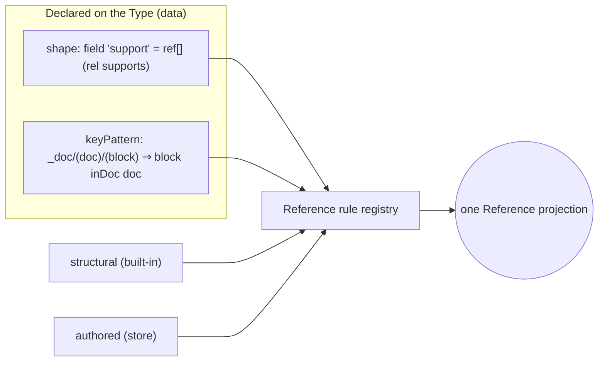

So the **same Type primitive** that defines shape/affordances *also* declares which of its
fields and key-shape are references — and the graph falls out. `deriveBackboneEdges` is the
`structural` rule; nothing is hand-coded per relation.

---

## Wave 10 — L3 · Execution & reaction (the active side is Declarations over the feed)

Grounded in `services/workspace/subscriptions.ts` (*"a subscription is **data, not code**:
`{match, invoke, params}`"*) and `actions.ts` (`{id, if?, writes[], params?}`), wired by
`lib/platform-stack.ts` (`workspace.fact.written → FactReactionRoute`).

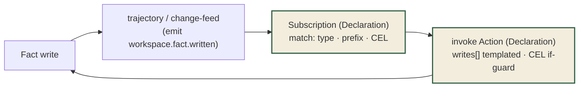

- **Action** = a Declaration whose `evaluate` is *templated Fact writes, guarded by `if`*.
- **Subscription** = a Declaration whose `evaluate` is *match a change-feed event → invoke an
  Action*. The reactor re-emits the write, so rails chain (machine's auto-rails are exactly an
  Action + a Subscription; `models.decide` resolves the agent rails).
- The EventBridge bus (`substrate.write.requested`, `workspace.fact.written`,
  `workspace.tend.requested`, `cell.deploy.requested`) is **transport** — semantically this is
  the **trajectory** (a **Projection** of Facts over time) driving Subscriptions.

**No new noun.** "Trigger/event/reaction/rail" all reduce to **Declaration.evaluate over a
Projection of the trajectory.** Tending (`attention`/`tend`) is the same shape: a scheduled
Projection emitting an audit Fact.

---

## Wave 11 — Grant / Scope (the orthogonal authority axis — complete)

`share/unshare/shared`, `group/groups`, `requestGrant/grantRequests/approve/deny`
(`handlers.ts:1016–1187`), `enforceScope` at the gateway (`gateway/service.ts:275`),
`requireWriteThrough` (`handlers.ts:1196`), and IAM `LeadingKeys` per scope partition
(`substrate-table.ts`).

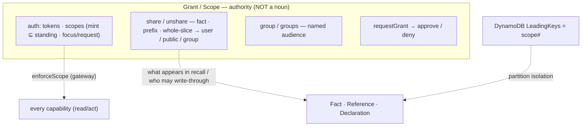

It *gates* the nouns at three layers (token scope → grant visibility → IAM partition) but is
none of them. Confirmed orthogonal; nothing here wants to fold into Fact/Reference/Declaration.

---

## Wave 12 — Cell (the infra axis that *supplies* Declarations — complete)

`cells.create/deploy` (forge bundle), `writeFile`, `callCellTool`, `putData/getData` (blobs),
and the **publish seam**: `types.json → describeTypes` (Type Declarations) + `ssr.json →
ssrReads/callerWrites` (`service.ts:950–985`).

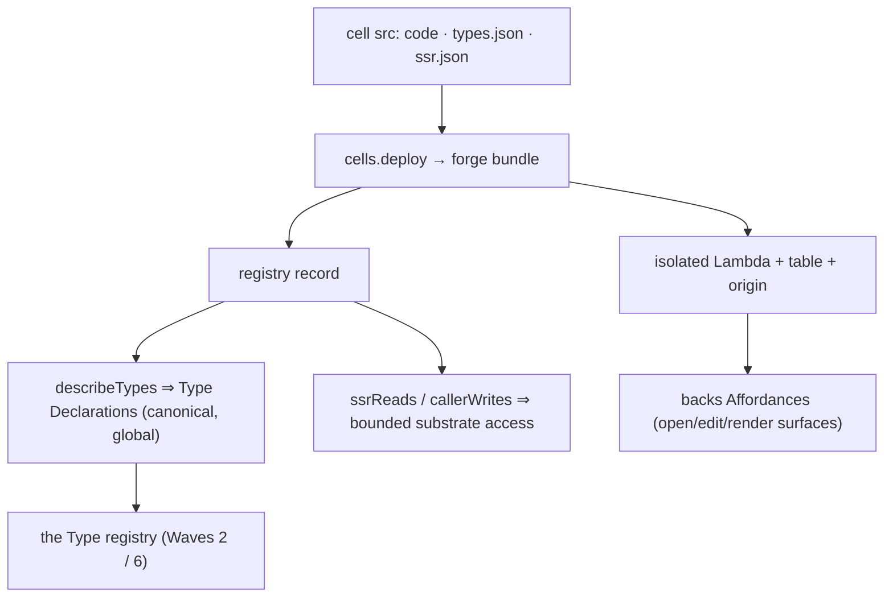

A Cell = **code · table · scope · a publish seam for Declarations · a backing for
Affordances.** `describeTypes` is *the one publish path* — the contraction of Wave 2 is "every
consumer reads the registry that this seam fills," so cells stop being re-parsed per consumer.
Infra, not part of the expressive surface.

---

## Wave 13 — Transformers (a Cell *kind*, not a new primitive)

`models.agent` is *"a tool-use loop whose tools are the substrate itself"* —
`substrate_query/read/emit` (`models/index.ts:187`); `run.exec` is server JS with substrate
access; both produce **outputs that are Facts by construction** (`agent-run`, `transcript`,
`output`); `viewers` are pure render.

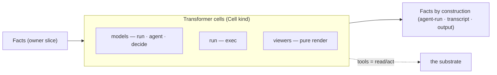

A Transformer reads Facts and writes Facts; the substrate is its toolbox. It is **read + act
over the nouns**, packaged as a Cell — no new primitive. (Generative/code/pure are just
which engine the Cell wraps.)

---

## Wave 14 — Storage floor (how the nouns are physically realised)

One DynamoDB table, scope-partitioned (`substrate-table.ts`, `dynamo-state-store.ts`):

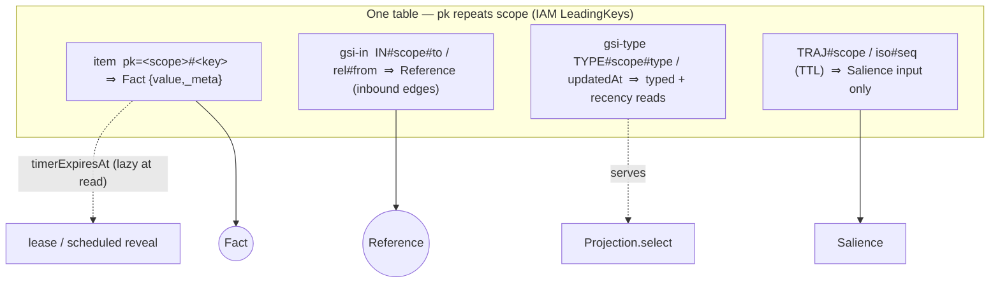

The nouns are not an abstraction over storage — they *are* the storage shape: an item is a
Fact, the inbound GSI is the Reference index, the TTL'd trajectory is the only Salience feed,
the type GSI serves `Projection.select`. Facts are durable (supersede ≠ delete); only the
trajectory is ephemeral. Timers are the lease/reveal primitive, evaluated lazily at read.

---

## Wave 15 — The verbs & the self-model (the discovery surface closes the loop)

The gateway exposes exactly three verbs — `whoami`, `read`, `act` (`gateway/service.ts:5`) —
plus two discovery targets, `$catalog` and `$types`.

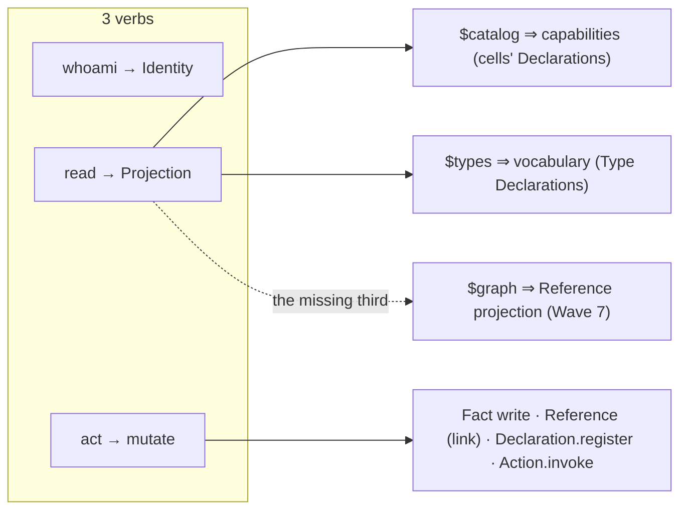

`read` is **Projection**; `act` is **mutation of a noun** (write a Fact, a Reference, register
a Declaration, or invoke an Action — which is itself a Declaration that writes Facts);
`whoami` is **Identity** (the Grant axis). The self-model is already two-thirds built:
`$catalog` and `$types` are **Declarations projected back as data** — and the grounded gap from
Wave 7 names the missing third surface, **`$graph`** (the unified Reference projection). When
it exists, the substrate fully describes itself in its own primitives.

---

## The complete map

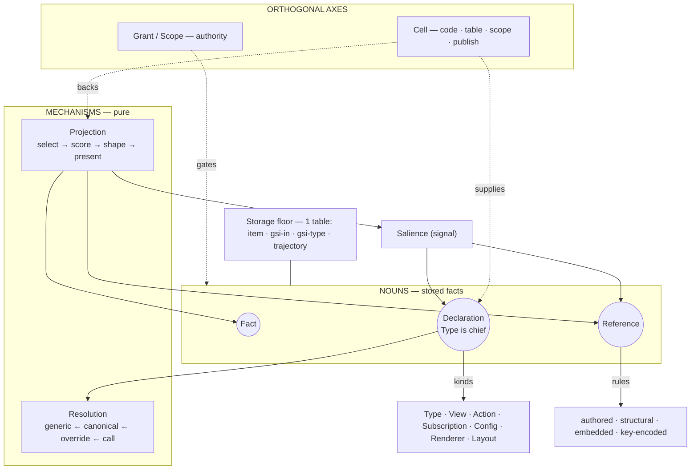

### Coverage — every part accounted for

| System part (grounded) | Reduces to |
|---|---|
| `remember` / `peek` / facts | **Fact** |
| `link` / `neighbors` / `links` / backbone / `claim.support` / `machine.arrows` / `_doc` | **Reference** (4 rules) |
| `_types _renderers _config _home/layout` · `_views _actions _subscriptions` | **Declaration** (one registry) |
| `recall` / `query` / `neighbors` / `view` / `$catalog` / `$types` | **Projection** |
| salience config · type merge · schema resolve | **Resolution** |
| `_meta.score` (recency/velocity/attention/standing/centrality) | **Salience** |
| `invoke` / subscriptions / events / machine rails / tend | **Declaration.evaluate over a Projection of the trajectory** |
| `share/group/requestGrant` · auth tokens/scopes · IAM LeadingKeys | **Grant** (orthogonal) |
| `cells.create/deploy/describeTypes` · dispatch · isolation · ssr/data | **Cell** (orthogonal) |
| `models` / `run` / `viewers` | **Cell** that reads+writes **Facts** |
| DynamoDB table · GSIs · trajectory · timers | **Storage floor** for the nouns |
| `whoami` | **Identity** (Grant axis) |

**Nothing unmapped.** The expressive surface is **three nouns** (Fact · Reference ·
Declaration), read through **two mechanisms** (Resolution · Projection) over **one signal**
(Salience), with **two orthogonal axes** (Grant · Cell) on a **single-table storage floor** —
and the active/reactive system is not a separate machine but `Declaration.evaluate` over a
Projection of the trajectory.

### The three things the mapping *changes* (not just renames)

1. **The Reference graph is lossy** (Wave 7) — `claim.support`, `machine.arrows`, `_doc`
   membership are stored but unseen; the rule-grammar recovers them.
2. **`$graph` is missing** (Wave 15) — the self-model has `$catalog`/`$types` but no Reference
   surface; it's the same unification.
3. **Six concepts are one registry** (Wave 6) — three hand-written registries + four ad-hoc
   readers collapse to `Declaration.registry(kind)`.

Everything else is behaviour-preserving re-homing. This completes the system map; the next
artifact is the migration ADR (which contraction lands first, and its behaviour-preservation
test), not more mapping.

---

## Wave 17 — Migration status (the audit, L1)

The mapping became ADRs and the ADRs became code. This wave records *where the breathe
contraction actually stands in the running system* — the exhale, measured. (Companion to the
ADR set `docs/architecture/adr/0001–0012`.)

```mermaid
flowchart TD
  subgraph DONE["LANDED + live (behaviour-verified)"]
    D1["Declaration registry · ADR-0001"]
    D2["Type as one object · ADR-0002"]
    D3["Reference projection — 4 rules · ADR-0003<br/>(lossy graph recovered)"]
    D4["$graph / Projection.select · ADR-0004<br/>(missing surface added)"]
    D5["Collections × {intensional,extensional} · ADR-0005"]
    D6["Salience = score stage + explain · ADR-0006"]
    D7["Grant axis — $grants · ADR-0007"]
    D8["Cell axis — $cells · ADR-0008"]
    D9["Per-rule edge strength → centrality · ADR-0009"]
  end
  subgraph FLIGHT["in flight (drafted, not folded)"]
    R10["Resolution — layer() primitive · ADR-0010"]
    R11["Reactivity = Collection over the change stream · ADR-0011"]
    R12["Present — the affordance stage · ADR-0012"]
  end
  DONE -->|~80% of the invariant| INV["one representation · one resolver · re-implement nothing"]
  FLIGHT -.last 20%.-> INV
```

### The three substantive changes — all landed

The map named three changes that were *not* mere renames (Wave 16). Status:

1. **Lossy Reference graph recovered** — `claim.support`, `_doc` membership, `machine.arrows`
   are now derived edges in `$graph` **and feed centrality** (ADR-0003/0009). Verified live.
2. **`$graph` added** — the self-model's Reference surface ships, beside `$catalog`/`$types`
   (ADR-0004). Verified live.
3. **Six concepts → one registry** — `createDeclarationRegistry(kind)` backs views,
   subscriptions, (and the pattern for) the rest (ADR-0001). Landed.

### Is the surface more or less complicated?

Three axes, moving in different directions — the honest answer:

| Axis | Direction | Grounding |
|---|---|---|
| **Verbs (entry cost)** | unchanged | still `whoami`/`read`/`act`; still "start at `$catalog`" |
| **Conceptual model** | **simpler** | N near-duplicates → 1 primitive each (collections, references, declarations, reactivity, lit blocks) |
| **Legibility** | **more** | self-model 2 → 5 surfaces (`$catalog · $types · $graph · $grants · $cells`); each replaces reverse-engineering with a read |
| **Command count** | +3 | workspace 36 cmds; added `graph`/`members`/`grants` (behaviour-preserving, so additive) |

Net: **no harder to enter or use; the model underneath is simpler; the system is markedly
more legible.** The +3 reads and +3 surfaces each pay for themselves by making something
previously implicit answerable as data.

### The honest remaining gap (the last 20%)

A strangler-fig in flight carries transient double-representation:

- **Resolution is still three hand-rolled merges** — `mergeTypeDecl`, `effectiveRules`,
  `callSalience` — of one pattern (per-facet, last-wins). ADR-0010 folds the two object-merge
  sites onto a shared `layer()`; the numeric (salience) and set (grant) siblings stay
  documented-as-Resolution, not forced.
- **The Declaration *surface* did not contract with its implementation** — `registerView` /
  `registerAction` / `registerSubscription` remain three MCP verbs over one registry. Kept
  for ergonomics + behaviour-preservation; a surface unification would be a client-breaking
  change, deliberately out of scope for the model refactor.
- **Projection.present is unADR'd** — `select`→`score`→`shape` are named (0004/0006); the
  affordance stage (how a fact resolves to open/edit/render via its Type's handlers + the
  renderer ladder) is ADR-0012.

Invariant met at ~80%. The exercise's claim — *expressive surface = three nouns, two
mechanisms, one signal, two axes* — holds in the running system; the residue is naming the
two mechanisms (Resolution, Reactivity) and the present stage.

## Wave 18 — The exhale completes (the migration closes)

The last 20% of Wave 17 is gone. Resolution (`layer()`, ADR-0010), Reactivity (the shared
`matchesSelector`, ADR-0011), and Present (`resolvePresent`/`resolveLabel`, ADR-0012) landed;
Fact (0013) closed the naming set; and ADR-0014 (the **Eliminate** phase) strangled out the
transitional double-representation. What that took, concretely:

- **lit** stopped re-implementing the membership resolver — its client `loadDoc` now routes
  through `workspace.members` (the `_doc/` scan + per-key fetch deleted); the `members` API
  was extended to surface each member's placing decoration `{seq, fold}` so one read returns
  membership + order + content. **Verified live** (deployed `app.js` makes one `members` call,
  no `queryPrefix`).
- **presentation** converged on the gateway-served `present` facet: `home` and `kernel` read
  `$types`' resolved `{icon,label}` instead of re-normalising legacy `{icon,titlePath}`;
  `canvas` inherits it for free (it imports kernel's `titleOf`/`hrefOf` by URL). The only
  client residue is the irreducible per-fact `pathInto` — Present resolves where the value is.
- **honest keeps** (the other half of *eliminate*): the per-kind Declaration verbs, CEL on
  `subscription.match` only, and **canvas membership** (it *composes* `query`+`links`+a generic
  decoration scan — there was never a second resolver to delete; boards carry spatial placement,
  not linear `seq`). Recorded as decisions, not debt.

### The grep audit, clean

> *every primitive has one representation and one resolver; every component uses primitives but
> re-implements none.*

| Primitive | The one resolver | Second one? |
|---|---|---|
| Resolution | `resolution.ts` `layer()` | none — `effectiveRules`/`mergeTypeDecl`/`$types` all call it |
| Selector (Reactivity floor) | `selector.ts` `matchesSelector` | none — view-match · query · `subscription.matches` share it |
| Present | `present.ts` `resolvePresent`/`resolveLabel` | none — home/kernel are consumers (client `pathInto` only) |
| Membership | `state.ts` `workspace.members` | none — lit routed in; canvas composes `query`+`links` |

### Is the surface simpler than where Wave 1 started?

Yes, and now provably: the conceptual model is the enumerated set (3 nouns · 2 mechanisms ·
1 signal · 2 axes), each with exactly one resolver; the verbs are still `whoami`/`read`/`act`;
legibility went 2 → 5 self-model surfaces. The agent/human interface is **no harder to enter,
simpler underneath, and markedly more legible** than the pre-breathe system — the +N reads each
turn an implicit thing into data you can ask for. The exhale is complete; the ADR stream
(0001–0014) closes here, and further work is feature work on a settled substrate.

## Wave 19 — Re-audit (the residue the fig itself left)

After 0014 closed, a second pass re-walked 0001–0013 against the *current* code (four parallel
audits: Resolution/Type/Reference · Selector/Collections/Reactivity · Present/Declaration/Salience
· Grant/Cell/Fact). The premise: a strangler fig *extracts* new shared resolvers, and the act of
extracting can leave a near-duplicate just out of the seam's reach. Two were found and folded —
both behaviour-preserving, both a primitive consuming itself one layer late:

- **`extractTypeRules`** — `state.ts:rulesFromDecl` and `workspace:typeRulesFor` extracted the
  Reference rules (refs · manager · key-edges) from a resolved `Type` with *identical* code (the
  `state.ts` comment admitted it: "Mirrors the handler's `typeRulesFor`"). Now one exported
  extractor; each site keeps only its resolve + empty-gate. The Reference primitive (0003/0009)
  gains a single rule-extraction point alongside its single edge-derivation point.
- **`FACT_ICONS`** — canvas hardcoded a type→glyph map that `$types` already serves as
  `present.icon` (0012). Deleted; canvas reads `present.icon ?? icon ?? '•'`. This completes
  0014 row 3 for canvas's *icon* path (its label/href already came from kernel) — a new type now
  ships its glyph as data, no cell recompile.

Everything else audited **clean**: one `layer`, one `mergeTypeDecl`/`resolveType`, one
`matchesSelector` (3 CEL sites each in their correct pipeline position), one `resolvePresent`,
one `workspace.members`, one grant grammar (`auth.ts`), one cell registry, one `{value,_meta}`
envelope. The fig leaves no further residue worth a deletion. **Closing observation:** the
re-audit is itself the maintenance ritual the invariant buys — "is there a second resolver?" is
now a grep, not an archaeology dig.
