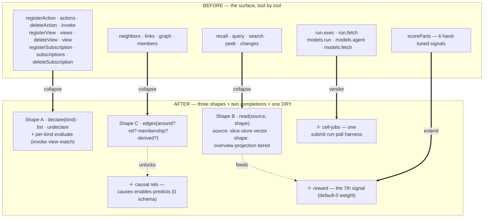

# The composition — the substrate distilled to three shapes

> A distillation doc, in the lineage of [`breathe.md`](./breathe.md). Where
> `breathe.md` mapped the pre-substrate sprawl down to primitives and handed off to
> the migration ADRs 0001–0014, this maps the *post-substrate* surface — everything
> built since — down to the small set of shapes it is actually made of, and hands
> off to a second contraction wave (ADR-0067 → …). Upstream thinking:
> [`cognitive-substrate.md`](../cognitive-substrate.md) (what the stack *is*) and
> [`cerebellar-loop.md`](../cerebellar-loop.md) (the self-maintenance organs).
>
> *Fable · July 2026*

## 0. Why this doc exists

The substrate is sound but it accreted. ADR-0001 collapsed six declaration
concepts into one storage registry; ADR-0044 distilled the corpus once and
sequenced contractions; and then two years of feature ADRs (0015–0066) grew the
*surface* faster than anyone re-collapsed it. The MCP catalog now lists three
verbs (`whoami`/`read`/`act`) projecting ~34 workspace tools plus per-cell tools —
and a large fraction of those tools are **the same operation with a different
parameter frozen into a different name**.

This is not a call to add abstraction. It is the opposite: the abstractions
already exist *underneath* (in `platform/runtime`), and the surface has drifted
away from them. The work is to make the surface tell the truth the runtime already
implements. Every contraction below is behaviour-preserving and **completes a
decision already on the books**, not a new one.

The claim, precisely:

> **The whole read/write/declare surface is three recurring shapes** — a
> **declaration**, a **read**, and an **edge** — plus two *completions* (a signal
> the score can learn from; a relation the map can be run forward through) and one
> piece of pure de-duplication. Thirty tools are instances of three shapes with
> parameters nailed shut.



## 1. Shape A — Declaration

**What it is.** A declaration is *a fact at `_<ns>/<id>` the runtime reads to
configure itself*, with a lifecycle `validate → put → list → get → remove` and a
per-kind **evaluate**. ADR-0001 already built exactly this: `createDeclarationRegistry`
over a `DeclarationKind<D>` descriptor (`platform/runtime/declarations.ts:19-79`),
and actions/views/subscriptions are already thin wrappers over it
(`actions.ts:283`, `views.ts:120`, `subscriptions.ts:213`). The storage is one
thing.

**Where it drifted.** The *agent surface* never collapsed. `commands-declared.ts:38-131`
hand-writes **eleven** handlers — `registerAction/actions/deleteAction/invoke`,
`registerView/views/deleteView/view`, `registerSubscription/subscriptions/deleteSubscription`
— and every register/list/delete body is identical up to which `create*(state)`
factory it calls. Three kinds × (register/list/delete) is nine near-duplicate
handlers over one registry.

**The refinement (not just dedup).** The register/list/delete triplet is
*universal* — it belongs to the registry, not the kind. What is genuinely
kind-specific is **evaluate**: an action's `invoke` (guarded writes), a view's
`view` (query+reduce), a subscription's `match` (against the change stream). ADR-0001
drew this exact line — "the registry unifies storage + resolution; it does **not**
unify evaluate" (`0001` Decision). So the composed surface is that line made
visible:

```
declare(kind, def)      list(kind)      undeclare(kind, id)     — universal lifecycle
evaluate(kind, id, args)                                        — the per-kind essence
   · kind=action → the invoke interpreter
   · kind=view   → the query/reduce evaluator
   · kind=subscription → match (runs in the reactor, not called directly)
```

Eleven tools become four, and the *shape of the system* — "a declaration has a
universal lifecycle and a specific meaning" — stops being buried in eleven
lookalike handlers. Contraction **C1** (ADR-0068).

**The boundary (do not over-unify).** Types (`_types/*`), renderers
(`_renderers/*`), and config (`_config/salience`) are declarations too, but they
are **read-merged, not listed** (`type-vocabulary.ts:buildTypeVocabulary`; the
config is read inside the salience runtime, ADR-0001 impl log). Their value is the
layered resolve, not a CRUD surface — they stay a *resolve* kind, out of the
`declare/list/undeclare` triplet. Grants are not declarations at all (their own
dual-index store, `grants.ts:77-90`). Naming what stays out is as load-bearing as
naming what collapses.

## 2. Shape B — Read

**What it is.** Every read is the pipeline `select → score → shape → present`
(`selector.ts` · `state.ts:scoreParts` · `state.ts:shapeEntries` · `present.ts`).
The reads differ only in **where the candidates come from** and **how much shaping
the answer gets**.

**Where it drifted.** `recall`, `query`, and `search` each hand-roll the same two
things — the `relevance` injection (ADR-0051) and the own-slice-∪-grants fold — and
then diverge only in candidate source: `recall` assembles the full slice + grant
fold (`commands-read.ts:362-390`), `query` lists by type/tag/prefix
(`state.ts:1650`), `search` pulls the vector top-K (`commands-search.ts:180-189`).
Worse, `search` *bypasses the score stage entirely* and returns raw cosine
(`commands-search.ts:197`) — so a semantic hit ignores earned salience, a latent
bug. `query({text})` is already documented as "semantic search that still respects
salience" (`commands-read.ts:256`) — i.e. the right version of `search` already
exists; `search` is the deprecated shell.

**The refinement.** One read parameterized by candidate source and shape:

```
read(scope, { source, shape, relevance?, folds? })
   source ∈ { slice (assembled+grants) | store (type/tag/prefix) | vector (top-K) | key (one) | changes (tail) }
   shape  ∈ { overview | projection | tiered | raw }
   → recall = read(slice, overview) · query = read(store, projection)
     search = read(vector, projection, relevance)  ← now salience-aware, bug gone
     peek   = read(key, raw)         · changes = read(changes)
```

The grant-fold and `relevance` map are computed **once** in the shared path
instead of three times. `search` is retired into `read(vector, …)` and *gains*
salience ranking for free. Contraction **C2** (sketched; the second wave).

**The boundary.** `attention` is a *derived* read (settled/stale/unlinked/dangling,
`state.ts:1871-1950`) that reuses the signal/graph machinery but not score/shape —
it is a distinct source, not a candidate list, and stays its own verb (it is the
self-maintenance read, and C7/C8 build on it).

## 3. Shape C — Edge

**What it is.** One reduction — `[...authored, ...deriveBackboneEdges(live)]` — read
four ways. `neighbors` filters it to a key + hydrates entries
(`commands-graph.ts:56-64`); `graph` returns it scoped (`:75-80`); `members` filters
to `MEMBERSHIP_RELS` pointing at a key (`:82-90`); `links` is authored-only,
prefix-filtered (`:66-73`). The reduction itself is copy-pasted across
`state.ts:1743/1768/1793`.

**The refinement.** One edge query over the shared reduction:

```
edges(scope, { around?, rel?, membership?, derived?, hydrate? })
   neighbors = edges(around: key, hydrate) · graph = edges(derived: true)
   members   = edges(around: key, membership: true) · links = edges(derived: false)
```

Four framings → one, differing by filter flags. This is the direct sibling of
ADR-0044 Inc 5 (which *created* these four verbs) and the ADR-0048 altitude model
(`scopeEdges`); it hands ADR-0016's canvas the single authored-vs-derived edge
stream it wants to render (solid vs faint). Contraction **C3** (ADR-0069).

**The write side stays two verbs.** `link`/`unlink` are the write surface and are
already minimal — they don't collapse into the read query; a read and a write are
different shapes. The refinement is read-side only.

## 4. Completion 1 — Causal relations (the map runs forward)

The edge `rel` is a free string (`state.ts:313`; `assertEdgePart` only forbids
empty/`|`). So `causes` / `enables` / `predicts` / `contradicts` are **authored
`EdgeRecord`s with zero schema change** — they store and traverse today. What they
*add* is meaning at two existing seams: the `RATIFY_LINK_TYPES` recommendation set
(`similar-edges.ts:92`) gains them, and a per-rel confidence rides the **existing**
`EdgeRecord.score` slot (already used to hold cosine for `similarTo`,
`state.ts:325`) — a graded annotation, not a column. This is what lifts the map
from a card-catalogue of *association* to a model of *consequence* — the one thing a
world-model needs to answer "what if." Contraction **C4** (forward buffer; depends
on C3's query to be worth traversing).

## 5. Completion 2 — Reward (the score learns)

`scoreParts` is a **pure weighted sum** of injected signals
(`state.ts:696-728`): recency · velocity · attention · standing · centrality
(scaled by a type prior) + relevance (added outside the prior). ADR-0051 added
`relevance` as the sixth by the disciplined move of a **default-0 weight** — inert
until configured. A seventh, `reward`, drops in the same way: one field in
`SalienceOptions`, one default-0 in `resolveSalience`, one term in the blend, one
fold in `wrap`, one line in each `explain` structure. Its **source** is the thing
the substrate has never had — an *earned* per-fact number: the delta the
consolidation organ (C8) moves, or a standing bump in the `seedReads`/`TouchCounters`
family (`state.ts:279-286`). This is the missing `R(s,a,s′)` named in
`adaptive-salience.md` — the reason `tend` measures drift but never converges.
Contraction **C6** (depends on nothing to *land*; depends on C8 to have a *source*).

## 6. The DRY — cell-jobs

Not a shape, just duplication with an in-code TODO. `@c15r/run` and `@c15r/models`
byte-duplicate the `putJob` / self-`Invoke{Event}` / `fetch(JOB#…)` harness *and*
the gateway proxy — `cells/run/index.ts:35-42` literally says "vendor a shared
module when a second consumer lands." It landed. A `platform/runtime/cell-jobs.ts`
exposing `submit/run/poll` over `{ ddb, tableName, selfFunctionName }` reduces each
cell to a `worker(input)` callback; the only variation points are chunking (models)
and the observability dual-write (run), passed as options. Contraction **C5**.

## 7. The sequence

`breathe.md`'s handoff line applies again: *the next artifact is the ADR, not more
mapping.* This doc spawns a second contraction wave. Per the 2-ahead buffer, the
sequencer + the first two are written now; the rest are sketched here and promoted
as the built line advances.

| # | Contraction | Collapses | Completes / depends | Lands as |
|---|---|---|---|---|
| **C1** | **One declaration surface** — `declare/declarations/undeclare(kind)` + `evaluate` | 11 → 4 | ADR-0001 (the surface it left) | **ADR-0068 ✓ built + live (07-09)** |
| C2 | One read by candidate source — recall/query/search → `read(source, shape)` | 3 → 1 (+ fixes `search` salience) | ADR-0004/0048/0050/0051; deprecates `search` | **ADR-0071** (buffer) |
| **C3** | **One edge query** — neighbors/graph/members/links → `edges(…)` | 4 → 1 | ADR-0044 Inc 5 / ADR-0048; feeds ADR-0016 | **ADR-0069 ✓ built + live (07-09)** |
| C4 | Causal relations — `causes/enables/predicts` on `EdgeRecord` | +1 rel family, 0 schema | depends C3; feeds ADR-0016 renderer-by-rel | sketch (forward) |
| C5 | Vendor cell-jobs — run/models → `platform/runtime/cell-jobs` | 2 copies → 1 | ADR-0026/0028 (the in-code TODO) | sketch |
| C6 | Reward, the 7th signal — default-0 weight into `scoreParts` | +1 signal | ADR-0006/0050/0051; `adaptive-salience.md` | **ADR-0070** (buffer) |
| C7 | The `_contested` view — two-stage contradiction read | new read | ADR-0040/0045; depends C3,C6; `cerebellar-loop.md` | sketch |
| C8 | The consolidation organ — tending scored on the delta it moves | new organ | ADR-0045; depends C6,C7; `cerebellar-loop.md` | sketch |

> **Progress (2026-07-09):** C1 + C3 built behind parity gates, deployed to prod, and
> live-validated (`edges` ≡ neighbors/links/graph/members; `declare/declarations/evaluate/
> undeclare` ≡ the legacy declaration verbs). The two-ahead buffer is now **ADR-0070 (C6
> reward)** and **ADR-0071 (C2 read)**.

**Sequencing logic.** C1 and C3 are pure, behaviour-preserving surface collapses
that complete open decisions — the safe, high-legibility start (and the two written
now). C2 is the same shape but touches salience + the grant fold, so it follows
once C1/C3 prove the pattern. C4–C6 are the *completions* (they add, they don't
collapse) and unlock the self-maintenance organs C7–C8, which are already specced in
`cerebellar-loop.md`. The dependency spine: **C3 → C4**, **C6 → (source) C8**, **C3 +
C6 → C7 → C8**.

## 8. What this is *not*

- **Not new abstraction.** Every shape already exists in `platform/runtime`; this
  aligns the surface to it. The behaviour-preservation gate (parity harness) is the
  merge condition for C1–C3, exactly as in ADR-0001.
- **Not "unify everything."** The evaluate boundary (ADR-0001) holds: `invoke` /
  `view` / `match` stay kind-specific. Grants, types, renderers, and config are
  *resolve*-shaped, not *list*-shaped, and stay out of the declaration triplet.
  `link`/`unlink` (write) don't fold into `edges` (read).
- **Not a rewrite.** Strangler-fig throughout: the composed verb wraps the existing
  ones, the old names alias for a deprecation window, the parity tests are the
  proof. No data migration — the on-disk facts and edges are untouched.
